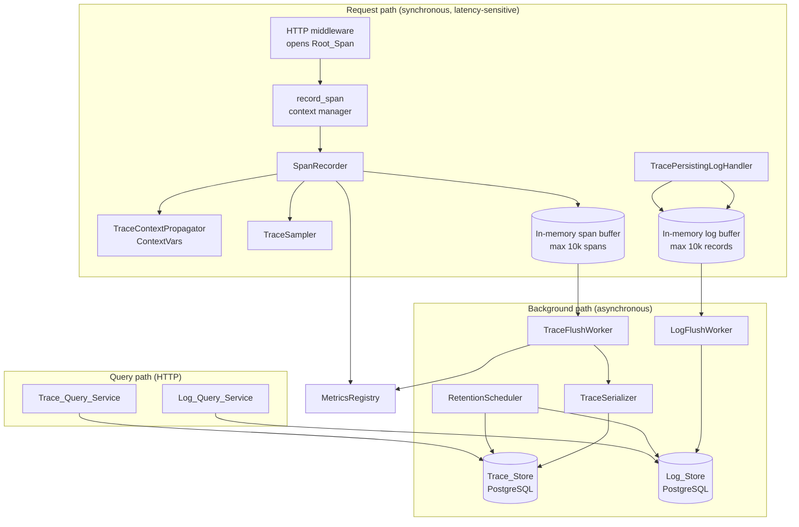
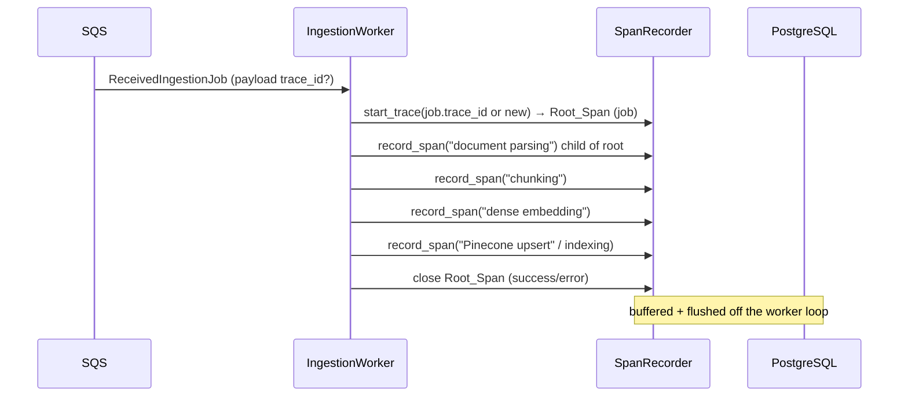

# Design Document

## Overview

This feature adds an **end-to-end request-tracing and log-persistence platform** to the existing
production RAG system in `src/rag_system/`. It introduces a hierarchical trace model (one `Trace`
per logical request, composed of nested `Span`s), durable and queryable persistence backed by the
existing PostgreSQL database (psycopg), and HTTP query APIs for traces and logs. The platform is
designed to be **additive and non-invasive**: it reuses the existing `trace_id` `ContextVar`, the
`timed()` helper's operation labels, the in-process `MetricsRegistry`, and the structured JSON
logging formatter, and it never changes their observable behaviour.

The central design tension is **observability without latency**. Every requirement that touches the
live request path (Requirements 9 and 17) demands that persistence happen *off* the request-response
path and that store unavailability never fail or meaningfully slow a request. The design satisfies
this by capturing spans and logs into bounded in-memory buffers and draining them to PostgreSQL on
background worker threads, mirroring the pattern the codebase already uses for
`_persist_query_trace_async` in `service.py`.

### Goals

- Capture a hierarchical trace (root span + child spans) for every sampled request and ingestion job.
- Annotate spans with stage-specific attributes (model id, token usage, retrieval mode/scores,
  citation counts, document ids) coerced to scalar types.
- Persist traces and logs durably and atomically to PostgreSQL, off the request path.
- Expose query APIs to fetch a trace by id, search traces by filters, fetch logs by trace id, and
  search logs by filters.
- Add ≤ 1 ms per span and ≤ 1 ms to the request path when the store is unavailable.
- Preserve all existing logging, metrics, and `/metrics` output unchanged.

### Non-Goals

Dashboards, alerting, drift detection, cost management, and external log aggregators are out of
scope, consistent with the requirements' Introduction.

### Alignment with the Existing Codebase

| Existing asset | How the design reuses it |
| --- | --- |
| `observability._TRACE_ID` (`ContextVar`) | The `Trace_Context_Propagator` adds a sibling `ContextVar` for the active `span_id` and resolves both consistently (R2.1, R2.2). |
| `observability.timed()` | A new `record_span()` context manager wraps the same operation labels and continues to emit `rag_operation_total` / `rag_operation_duration_ms` (R1.7, R11.5, R11.6). |
| `observability.metrics` (`MetricsRegistry`) | New counters (`rag_traces_persisted_total`, `rag_spans_dropped_total`, `rag_trace_store_write_failures_total`, etc.) are registered on the same registry, so `/metrics` keeps every prior metric (R5.6, R9.5, R10.3, R11.2). |
| `_JSONFormatter` + `_TraceContextFilter` | A logging handler captures the same `LogRecord` objects for persistence without altering the emitted JSON line (R11.1, R14.1, R17.6). |
| `api.log_requests` middleware | Extended to open/close the HTTP `Root_Span`, set `X-Trace-Id` (already done), and record response status on error (R1.1, R1.2, R4.5, R4.6, R11.3, R11.4). |
| `service.py` `timed(...)` call sites | Each becomes an instrumented `Pipeline_Stage` via `record_span()`. |
| `router._route_hybrid` `ThreadPoolExecutor` + `copy_context()` | The propagator guarantees spans from both branches attach to the originating trace (R2.6). |
| `queue.IngestionJob.trace_id` | Already carries `trace_id`; the worker uses it to build the `Ingestion_Trace` (R2.7–R2.10, R12). |
| psycopg usage in `copilot.PostgresCopilotExecutor` / `rdscon.py` | The `Trace_Store` / `Log_Store` reuse the same psycopg connection style and `COPILOT_DB_*` settings. |
| pydantic-settings `Settings` | New tracing settings are added with the existing `env_prefix=""` alias mechanism (R10.9). |

## Architecture

### Component Overview



### Layered Responsibilities

1. **Capture layer (in-process, request path).** `SpanRecorder`, `TraceContextPropagator`, and
   `TraceSampler` create and time spans, attach attributes, and propagate trace/span identity. They
   never touch the database. All persistence work is handed to bounded buffers. This layer is held to
   the ≤ 1 ms-per-span budget (R9.2).

2. **Buffering layer.** Two thread-safe ring buffers (`BoundedSpanBuffer`, `BoundedLogBuffer`), each
   capped at 10,000 entries, decouple capture from persistence. When full they drop new entries and
   increment a dropped counter (R9.4, R9.5, R17.3, R17.4).

3. **Persistence layer (background).** `TraceFlushWorker` and `LogFlushWorker` drain buffers and
   write to PostgreSQL through `TraceSerializer` / `LogSerializer`. Each trace is written in a single
   atomic transaction (R5.1, R5.5). The `RetentionScheduler` periodically deletes aged data
   (R13, R18).

4. **Query layer (HTTP).** `Trace_Query_Service` and `Log_Query_Service` expose FastAPI endpoints
   that read from PostgreSQL with validation, filtering, ordering, and limits (R7, R8, R15, R16).

### Request Lifecycle (RAG `/ask` example)

```mermaid
sequenceDiagram
    participant C as Client
    participant MW as HTTP Middleware
    participant SR as SpanRecorder
    participant Pipe as Pipeline Stages
    participant Buf as Span Buffer
    participant FW as Flush Worker
    participant PG as PostgreSQL

    C->>MW: POST /ask (optional X-Trace-Id)
    MW->>SR: start_trace(trace_id?) → Root_Span
    SR->>SR: sampler.should_record(trace_id, header_present)
    MW->>Pipe: handler runs
    Pipe->>SR: record_span("query classification")
    Pipe->>SR: record_span("dense retrieval") ...
    SR->>Buf: enqueue completed spans (non-blocking)
    MW->>SR: close Root_Span (status, response code)
    MW->>C: response + X-Trace-Id
    Note over Buf,FW: off request path
    FW->>Buf: drain spans grouped by trace
    FW->>PG: BEGIN; insert trace + spans; COMMIT
    FW->>SR: metrics.increment(rag_traces_persisted_total)
```

### Ingestion Lifecycle (worker)



### Threading and Concurrency Model

- **Active span tracking** uses two `ContextVar`s (`active_trace_id`, `active_span_id`). Because the
  current code already relies on `copy_context()` for background threads (`service._persist_query_trace_async`)
  and the hybrid `ThreadPoolExecutor` (`router._route_hybrid`), the propagator stores the active span
  in a `ContextVar` so `copy_context()` carries it automatically into child branches (R2.3, R2.6).
- **Span parent stack.** Each `record_span()` reads the current `active_span_id`, sets itself as
  active for the duration of the `with` block, and restores the parent on exit (R1.6). This makes the
  parent/child structure follow the natural call nesting.
- **Buffer access** is guarded by a lock (consistent with `MetricsRegistry`'s `RLock`).
- **Flush workers** are daemon threads with a small batch loop, matching the existing `trace-writer`
  daemon-thread pattern.

## Components and Interfaces

### TraceContextPropagator

Owns trace/span identity propagation. Reuses the existing `_TRACE_ID` `ContextVar` for the trace id
and adds a sibling for span id.

```python
# observability_tracing/context.py
_ACTIVE_SPAN_ID: ContextVar[str | None] = ContextVar("rag_active_span_id", default=None)

def get_active_trace_id() -> str | None: ...      # delegates to existing get_trace_id()
def get_active_span_id() -> str | None: ...       # returns None when no span active (R2.2)

def bind_span(span_id: str) -> Token: ...         # set active span, return reset token
def restore_span(token: Token) -> None: ...       # restore parent (R1.6)

def propagate_into_thread(fn: Callable) -> Callable:
    """Wrap a callable so the current trace/span context is copied into the
    target thread and restored afterward. On copy failure, run with null
    context, record an error metric, and proceed (R2.4, R2.5)."""
```

- R2.1/R2.2: `get_active_trace_id`/`get_active_span_id` resolve to the active values or `None`.
- R2.3/R2.4: `propagate_into_thread` uses `contextvars.copy_context()` to make identity available in
  the worker thread and naturally restores the pooled thread's prior context when the callable returns.
- R2.5: propagation failure is caught; the worker runs with null context and increments
  `rag_trace_context_propagation_failures_total`.

### TraceSampler

Decides whether a trace is recorded.

```python
class TraceSampler:
    def __init__(self, enabled: bool, sample_rate: float): ...
    def should_record(self, *, trace_id: str | None, has_trace_header: bool) -> bool: ...
```

- R10.1/R10.8: when `enabled` is False, always returns False and ignores the `X-Trace-Id` header.
- R10.7: when enabled and `has_trace_header` is True, always returns True (force-sample).
- R10.4/R10.5: otherwise records with probability `sample_rate` (default 1.0). Uses
  `random.random() < sample_rate`; deterministic hashing on `trace_id` is unnecessary because the
  decision is made once per trace at creation.
- R10.6: invalid `sample_rate` (non-numeric or outside `[0.0, 1.0]`) is rejected at startup by the
  pydantic settings validator, not by the sampler.

### SpanRecorder

The core capture API. Wraps the existing `timed()` semantics and adds span lifecycle.

```python
class SpanRecorder:
    def __init__(self, sampler, propagator, span_buffer, metrics, logger): ...

    @contextmanager
    def start_trace(self, *, trace_id: str | None, route: str,
                    is_root_http: bool = True) -> Iterator[Span]:
        """Create a Trace + Root_Span (R1.1, R1.2). Generates a unique trace_id
        when none is active (R1.2). No-op span when sampling says skip (R10.1)."""

    @contextmanager
    def record_span(self, operation: str, **attributes) -> Iterator[Span]:
        """Create a child Span of the active span, time it, emit operation
        metrics, set status success/error, re-raise on error (R1.3–R1.7, R4)."""

    def set_attributes(self, span: Span, **attributes) -> None:
        """Coerce values to str|number|bool and attach (R3.7)."""
```

Key behaviours:

- R1.3: child span gets a unique `span_id` (uuid4 hex), start timestamp, and the current active span
  as parent.
- R1.4/R1.5/R4.3: on exit duration is computed as `round((perf_counter()-t0)*1000)` ms (non-negative
  integer) regardless of success or failure.
- R1.7: `operation` uses the same labels passed to `timed()` today (e.g. `"dense retrieval"`,
  `"answer generation"`, `"copilot SQL execution"`).
- R1.8/R12.3: any exception thrown *by span creation itself* is caught, logged via the standard
  logger, and the stage proceeds with a null span (a no-op `Span` sentinel) without propagating.
- R4.1/R4.2/R4.4: on a pipeline exception, status is set to `error`, `exception.type` and a
  ≤ 4096-char truncated `exception.message` are recorded as attributes, duration is recorded, and the
  original exception is re-raised unchanged.
- R11.5/R11.6: `record_span` continues to call `metrics.increment("rag_operation_total", {...})` and
  `metrics.observe("rag_operation_duration_ms", ...)` with the same `operation`/`status` labels as
  `timed()`.

Stage-specific attribute helpers (R3) are thin wrappers that call `set_attributes` with the agreed
keys:

| Stage | Attributes (R3) | Unavailable sentinel |
| --- | --- | --- |
| generation / routing | `model_id` (str), `prompt_tokens`, `completion_tokens`, `total_tokens` (int ≥ 0) | `"unavailable"` / explicit null marker (R3.2) |
| retrieval | `retrieval_mode` (str), `hit_count` (int ≥ 0), `top_score` (number) | `top_score` = explicit "no score" when `hit_count == 0` (R3.4) |
| answer generation | `evidence_status` (str), `citation_count` (int ≥ 0) | — |
| any stage producing a doc | `document_id` (str), recorded regardless of success/validity (R3.6) | — |
| ingestion stage | `document_id`, `document_version` | `"unavailable"` (R12.5) |

### HTTP Middleware Integration (Root_Span)

The existing `log_requests` middleware in `api.py` is extended:

- On entry: resolve/generate `trace_id` (already done), call `sampler.should_record`, and open the
  `Root_Span` via `start_trace(route=request.url.path)`.
- On success: set Root_Span status `success`, record `http.status_code` attribute, close span.
- On exception: set Root_Span status `error`, record `http.status_code` (the code returned to the
  caller, or `500` if none determined), close span, then re-raise (R4.5, R4.6).
- `X-Trace-Id` response header behaviour is preserved exactly (R11.3, R11.4).

### Trace_Store (PostgreSQL)

```python
class PostgresTraceStore:
    def persist(self, trace: Trace) -> None:
        """Single atomic transaction: insert trace row + all span rows.
        Roll back entirely on any failure (R5.1, R5.5). Increment
        rag_traces_persisted_total{route=...} only after commit (R5.6)."""
    def get_trace(self, trace_id: str) -> Trace | None: ...     # R7
    def search_traces(self, filters: TraceSearchFilters) -> list[TraceSummary]: ...  # R8
    def enforce_retention(self, max_age: timedelta) -> None: ...  # R13
```

- Uses a small psycopg connection pool reusing `COPILOT_DB_*` settings.
- R5.4: on persist failure, logs at WARNING, discards the trace (no partial rows survive thanks to
  the transaction), and never raises to the caller — including when the warning log itself fails
  (the warning call is wrapped in a bare `try/except`).

### TraceSerializer / LogSerializer

```python
class TraceSerializer:
    def serialize(self, trace: Trace) -> StoredTrace: ...     # R6.1, R6.6
    def deserialize(self, stored: StoredTrace) -> Trace: ...  # R6.2, R6.4, R6.5
```

- R6.1: serialization includes every span and attribute, nothing omitted/added/altered.
- R6.3: round-trip (`deserialize(serialize(t))`) yields an equivalent trace (see Property 5).
- R6.4: malformed stored representation → `TraceDeserializationError(reason, trace_id)`, never a
  partial object.
- R6.5: when trace_id/reason cannot be determined → generic failure error.
- R6.6: serialization failure → error with affected trace_id, no partial write.
- Span attributes are stored as a JSONB column; scalar coercion (R3.7) happens at capture time so the
  serializer only sees `str|number|bool` values.

### Trace_Query_Service (HTTP)

New FastAPI endpoints registered on the existing `app`:

| Endpoint | Requirement | Behaviour |
| --- | --- | --- |
| `GET /traces/{trace_id}` | R7 | Validate 32-char lowercase hex (400 on bad format, R7.3); 404 if absent (R7.4); else trace + spans ordered by start ts then span_id (R7.2), parent null for root (R7.5), ≤ 2000 ms. |
| `GET /traces` | R8 | Filters: `start`, `end`, `route`, `status`, `min_duration_ms`, `limit`. Inclusive time range (R8.1); case-sensitive route/status (R8.2, R8.3); min-duration ≥ (R8.4); AND semantics (R8.5); default limit 100, max 1000, desc by start ts (R8.6, R8.7); 400 on inverted range or out-of-range params (R8.8, R8.9); empty 200 when no matches (R8.10). |

### Log capture, Log_Store, and Log_Query_Service

```python
class TracePersistingLogHandler(logging.Handler):
    """Attached to the root logger next to the existing StreamHandler. On emit,
    builds a LogRecordModel (timestamp, level, logger, message, exc, extras,
    trace_id) and enqueues it to the log buffer. Never blocks; the existing
    StreamHandler still writes the JSON line (R14.1, R17.6)."""
```

| Endpoint | Requirement | Behaviour |
| --- | --- | --- |
| `GET /logs/{trace_id}` | R15 | Validate 32-char hex (400, R15.3); all matching records desc by ts, ties by desc insertion order (R15.2); empty 200 when none (R15.4); ≤ 2000 ms. |
| `GET /logs` | R16 | Filters `start`,`end`,`level`,`trace_id`,`limit`; inclusive range (R16.1); case-sensitive level/trace_id (R16.2, R16.3); AND (R16.4); default 100, max 1000 desc (R16.5, R16.6); 400 on inverted range / bad limit (R16.7, R16.8); empty 200 (R16.9). |

- R14.3: null/absent `trace_id` stored as explicit SQL `NULL`.
- R14.5/R17.x: same buffering, drop-on-full, and best-effort semantics as traces.

### RetentionScheduler

A daemon-thread scheduler (interval ≤ 24 h) that calls `Trace_Store.enforce_retention` and
`Log_Store.enforce_retention`.

- R13.1/R18.1: delete rows strictly older than the configured period; retain rows at exactly the
  boundary.
- R13.2: deleting a trace cascades to its spans within the same cycle (FK `ON DELETE CASCADE`).
- R13.3/R18.2: no period configured → retain everything.
- R13.5/R18.4: a failed deletion leaves that row intact and records an error indication.

### Configuration (pydantic-settings)

Added to `Settings` in `config.py` using the existing alias mechanism (R10.9):

```python
tracing_enabled: bool = Field(default=True, alias="RAG_TRACING_ENABLED")
trace_sample_rate: float = Field(default=1.0, alias="RAG_TRACE_SAMPLE_RATE")
trace_retention_hours: int | None = Field(default=None, alias="RAG_TRACE_RETENTION_HOURS")
log_retention_hours: int | None = Field(default=None, alias="RAG_LOG_RETENTION_HOURS")
retention_interval_hours: int = Field(default=24, alias="RAG_RETENTION_INTERVAL_HOURS")
trace_buffer_capacity: int = Field(default=10_000, alias="RAG_TRACE_BUFFER_CAPACITY")
log_buffer_capacity: int = Field(default=10_000, alias="RAG_LOG_BUFFER_CAPACITY")
```

A pydantic `field_validator` rejects a non-numeric or out-of-range `trace_sample_rate` at startup
(R10.6), and validates retention bounds (1 hour – 3650 days) when present.

## Data Models

### In-memory domain model

```python
SpanStatus = Literal["success", "error"]
AttributeValue = str | int | float | bool   # scalar only (R3.7)

@dataclass
class Span:
    span_id: str                 # unique within trace (R1.3)
    parent_span_id: str | None   # None for root (R5.3, R7.5)
    operation: str               # R1.7
    start_ts: datetime           # UTC (R5.3)
    duration_ms: int             # non-negative integer (R1.4, R4.3)
    status: SpanStatus
    attributes: dict[str, AttributeValue]

@dataclass
class Trace:
    trace_id: str                # 32-char lowercase hex
    route: str
    start_ts: datetime           # UTC
    duration_ms: int             # non-negative integer
    root_status: SpanStatus
    spans: list[Span]            # 1..10000

@dataclass
class LogRecordModel:
    timestamp: datetime          # UTC
    level: str                   # DEBUG..CRITICAL
    logger: str
    message: str
    trace_id: str | None
    exc_text: str | None
    extra: dict[str, AttributeValue]
    insertion_seq: int           # tiebreaker for ordering (R15.2)
```

These are plain dataclasses/pydantic models living alongside the existing `models.py` types. The
existing `QueryTraceRecord` (an application-level RAG trace) is left untouched; the new `Trace` is a
distinct, lower-level execution trace.

### PostgreSQL schema

```sql
CREATE TABLE IF NOT EXISTS traces (
    trace_id      TEXT PRIMARY KEY,                 -- 32-char lowercase hex
    route         TEXT NOT NULL,
    start_ts      TIMESTAMPTZ NOT NULL,             -- UTC (R5.2)
    duration_ms   BIGINT NOT NULL CHECK (duration_ms >= 0),
    root_status   TEXT NOT NULL CHECK (root_status IN ('success','error'))
);
CREATE INDEX IF NOT EXISTS traces_start_ts_idx ON traces (start_ts DESC);
CREATE INDEX IF NOT EXISTS traces_route_idx    ON traces (route);
CREATE INDEX IF NOT EXISTS traces_status_idx   ON traces (root_status);

CREATE TABLE IF NOT EXISTS spans (
    trace_id       TEXT NOT NULL REFERENCES traces(trace_id) ON DELETE CASCADE,  -- R13.2
    span_id        TEXT NOT NULL,
    parent_span_id TEXT,                            -- NULL for root (R5.3)
    operation      TEXT NOT NULL,
    start_ts       TIMESTAMPTZ NOT NULL,
    duration_ms    BIGINT NOT NULL CHECK (duration_ms >= 0),
    status         TEXT NOT NULL CHECK (status IN ('success','error')),
    attributes     JSONB NOT NULL DEFAULT '{}'::jsonb,
    PRIMARY KEY (trace_id, span_id)
);
CREATE INDEX IF NOT EXISTS spans_trace_order_idx ON spans (trace_id, start_ts, span_id);  -- R7.2

CREATE TABLE IF NOT EXISTS log_records (
    id            BIGINT GENERATED ALWAYS AS IDENTITY PRIMARY KEY,   -- insertion order (R15.2)
    ts            TIMESTAMPTZ NOT NULL,                              -- UTC (R14.2)
    level         TEXT NOT NULL,
    logger        TEXT NOT NULL,
    message       TEXT NOT NULL,
    trace_id      TEXT,                                              -- explicit NULL allowed (R14.3)
    exc_text      TEXT,
    extra         JSONB NOT NULL DEFAULT '{}'::jsonb
);
CREATE INDEX IF NOT EXISTS log_records_trace_idx ON log_records (trace_id, ts DESC, id DESC);  -- R15.2
CREATE INDEX IF NOT EXISTS log_records_ts_idx    ON log_records (ts DESC);
CREATE INDEX IF NOT EXISTS log_records_level_idx ON log_records (level);
```

> Note: the `attributes`/`extra` JSONB columns store only scalar values because coercion (R3.7)
> happens at capture time.

### Stored representation (serializer boundary)

`StoredTrace` is the dict shape written to/read from PostgreSQL rows:

```python
StoredSpan = TypedDict("StoredSpan", {
    "span_id": str, "parent_span_id": str | None, "operation": str,
    "start_ts": str,                  # ISO-8601 UTC
    "duration_ms": int, "status": str, "attributes": dict[str, AttributeValue],
})
StoredTrace = TypedDict("StoredTrace", {
    "trace_id": str, "route": str, "start_ts": str,
    "duration_ms": int, "root_status": str, "spans": list[StoredSpan],
})
```

Equivalence for the round-trip property (R6.3) is defined as: equal `trace_id`, equal `route`, and
the set of spans matched by `span_id` agree on `parent_span_id`, `duration_ms`, `status`, and the
complete attribute key-value map.

## Correctness Properties

*A property is a characteristic or behavior that should hold true across all valid executions of a
system — essentially, a formal statement about what the system should do. Properties serve as the
bridge between human-readable specifications and machine-verifiable correctness guarantees.*

The following properties were derived from the prework analysis. Redundant criteria were consolidated
(for example, all span duration/status invariants collapse into one span-lifecycle property, and the
trace and log filtering criteria each collapse into one conjunction property validated against an
in-memory model).

### Property 1: Root span adopts or generates a valid unique trace id

*For any* request, when an active trace_id is present the created Trace's Root_Span carries exactly
that trace_id with a null parent; when none is present the Span_Recorder generates a 32-character
lowercase hexadecimal trace_id that is unique among all currently active Traces.

**Validates: Requirements 1.1, 1.2**

### Property 2: Span hierarchy reflects call nesting

*For any* sequence of nested instrumented stages, every created Span has a span_id unique within its
Trace, a recorded start timestamp, and a parent reference equal to the span that was active when it
opened; closing a Span restores its parent as the active span, and after all spans close the active
span resolves to null.

**Validates: Requirements 1.3, 1.6**

### Property 3: Span lifecycle records non-negative integer duration and correct status

*For any* instrumented stage, whether it completes normally or raises, the recorded Span duration is
a non-negative integer number of milliseconds (rounded to the nearest whole millisecond) and the
Span_Status is `success` when the stage completes normally and `error` when it raises; every
completed ingestion stage span in a non-failing job is likewise `success`.

**Validates: Requirements 1.4, 1.5, 4.1, 4.3, 12.7**

### Property 4: Exceptions are recorded and re-raised unchanged with bounded message

*For any* exception that propagates out of an instrumented stage, the Span_Recorder records the
exception type and a message attribute truncated to at most 4,096 characters, and re-raises the
original exception unchanged (same type and message).

**Validates: Requirements 4.2, 4.4**

### Property 5: Span attribute values are always scalar

*For any* set of attribute values supplied to a Span (of any Python type), every recorded attribute
value is a string, number, or boolean, and any value not natively scalar is recorded as its string
representation; required stage attributes (model id, token counts, retrieval mode/hit count/top
score, evidence status/citation count, document id) are recorded with the specified scalar types,
including document ids recorded as strings regardless of stage success or document validity.

**Validates: Requirements 3.1, 3.3, 3.5, 3.6, 3.7**

### Property 6: Trace serialization round-trip is identity

*For any* valid Trace, serializing it and then deserializing the result produces an equivalent Trace,
where equivalence requires identical trace_id, identical route, and a span set matched by span_id
that agrees on parent relationship, duration, status, and the complete set of attribute key-value
pairs — with no span, attribute, or value omitted, added, or altered.

**Validates: Requirements 5.2, 5.3, 6.1, 6.2, 6.3**

### Property 7: Malformed stored traces fail cleanly

*For any* stored trace representation that is missing a required field (trace_id, span identifier,
span parent reference, duration, or status) or cannot be parsed, the Trace_Serializer returns an
error indicating the malformation reason together with the affected trace_id and never returns a
partially deserialized Trace.

**Validates: Requirements 6.4**

### Property 8: Trace persistence is atomic and counts only on commit

*For any* Trace, persistence occurs within a single transaction such that if persisting the Trace or
any of its Spans fails, neither the Trace nor any of its Spans remain in the store; and the
persisted-traces counter for a route increases by exactly the number of Traces whose transaction
fully commits for that route.

**Validates: Requirements 5.1, 5.5, 5.6**

### Property 9: Trace retrieval returns the full, hierarchy-reconstructable span set

*For any* persisted Trace fetched by its trace_id, the response contains exactly the persisted set of
Spans with each Span's parent span_id preserved (null for the Root_Span), ordered ascending by Span
start timestamp with ties broken by ascending span_id.

**Validates: Requirements 7.1, 7.2, 7.5**

### Property 10: trace_id path validation rejects non-conforming identifiers

*For any* string supplied as a trace_id path parameter to the trace-by-id or logs-by-trace-id
endpoints that is not a 32-character lowercase hexadecimal string, the service rejects the request
with HTTP 400 and returns no trace or log data.

**Validates: Requirements 7.3, 15.3**

### Property 11: Trace search returns exactly the traces satisfying every filter

*For any* set of stored traces and any combination of time-range, route, status, and minimum-duration
filters, the search returns exactly those traces whose start timestamp lies within the inclusive
range, whose route matches case-sensitively, whose root status matches case-sensitively, and whose
duration is greater than or equal to the minimum — satisfying all supplied filters simultaneously.

**Validates: Requirements 8.1, 8.2, 8.3, 8.4, 8.5**

### Property 12: Trace search ordering and limit are honoured

*For any* set of stored traces and any valid result limit (defaulting to 100, maximum 1000), the
search returns at most that many traces ordered by start timestamp in descending order.

**Validates: Requirements 8.6, 8.7**

### Property 13: Trace search rejects invalid range and out-of-range parameters

*For any* search request whose end timestamp precedes its start timestamp, or whose result limit is
outside 1–1000, or whose minimum-duration is outside 0–86,400,000, the service rejects the request
with HTTP 400 and returns no traces.

**Validates: Requirements 8.8, 8.9**

### Property 14: Log search returns exactly the records satisfying every filter

*For any* set of stored Log_Records and any combination of time-range, Log_Level, and trace_id
filters, the search returns exactly those records whose timestamp lies within the inclusive range,
whose level matches case-sensitively, and whose trace_id matches case-sensitively — satisfying all
supplied filters simultaneously.

**Validates: Requirements 16.1, 16.2, 16.3, 16.4**

### Property 15: Log search ordering and limit are honoured

*For any* set of stored Log_Records and any valid result limit (defaulting to 100, maximum 1000), the
search returns at most that many records ordered by timestamp in descending order.

**Validates: Requirements 16.5, 16.6**

### Property 16: Log search rejects invalid range and out-of-range limit

*For any* log search whose end timestamp precedes its start timestamp or whose limit is outside
1–1000, the service rejects the request with HTTP 400 and returns no records.

**Validates: Requirements 16.7, 16.8**

### Property 17: Log retrieval by trace id returns all matching records in tie-broken order

*For any* set of stored Log_Records, fetching by a syntactically valid trace_id returns exactly the
records whose trace_id equals that value, ordered by timestamp descending with ties broken by
descending insertion order.

**Validates: Requirements 15.1, 15.2**

### Property 18: Log serialization round-trip preserves all fields

*For any* captured Log_Record, persisting and reading it back yields a record with identical
timestamp (UTC), level, logger name, message, and trace_id, preserving every field present in the
emitted record.

**Validates: Requirements 14.1, 14.2**

### Property 19: Bounded buffer caps size and counts drops on overflow

*For any* sequence of N enqueued entries against a buffer of capacity 10,000 while the store is
unavailable, the buffer retains exactly min(N, 10,000) entries, discards every entry beyond capacity,
increments the dropped-entry counter by exactly max(0, N − 10,000), and never raises to the caller.
(Applies identically to the span buffer and the log buffer.)

**Validates: Requirements 9.4, 9.5, 17.3, 17.4**

### Property 20: Persistence happens only off the request path

*For any* instrumented request, no synchronous Trace_Store or Log_Store write occurs during request
handling; store writes are performed only by background workers after the response is produced.

**Validates: Requirements 9.1, 17.1**

### Property 21: Sampling decision honours enablement, header override, and rate

*For any* configured sample rate r in [0.0, 1.0] and request: when tracing is disabled the request is
never sampled (even with an `X-Trace-Id` header); when tracing is enabled and an `X-Trace-Id` header
is present the request is always sampled regardless of r; and when enabled without a header the
recorded proportion over 1000 traces is within r ± 0.05.

**Validates: Requirements 10.1, 10.4, 10.7**

### Property 22: Invalid sample-rate configuration is rejected at startup

*For any* configured sample-rate value that is non-numeric or outside [0.0, 1.0], constructing the
settings fails with an error identifying the invalid sampling rate.

**Validates: Requirements 10.6**

### Property 23: Tracing-disabled performs no span creation or store writes

*For any* request processed while tracing is disabled by configuration, no Span is created and zero
Trace_Store writes are performed.

**Validates: Requirements 10.1**

### Property 24: Operation metrics mirror the timed helper

*For any* instrumented operation, completion emits the operation count and duration metric labelled
`status=success`, and failure emits them labelled `status=error`, using the same operation labels as
the existing `timed` helper.

**Validates: Requirements 11.5, 11.6**

### Property 25: X-Trace-Id response header round-trips the request value

*For any* request carrying an `X-Trace-Id` header, the response `X-Trace-Id` header equals the
received value exactly.

**Validates: Requirements 11.3**

### Property 26: Structured JSON log line preserves all fields plus trace correlation

*For any* log record with arbitrary extra fields, the emitted log output is a single-line JSON object
that retains every field present before the tracing layer was added and includes the trace_id
correlation field set to the active trace identifier.

**Validates: Requirements 11.1**

### Property 27: Ingestion produces exactly one child span per stage with stage attributes

*For any* successfully traced ingestion job, the Ingestion_Trace contains exactly one child Span for
each of parsing, chunking, embedding, and indexing, each a direct child of the job Root_Span and each
carrying the document identifier and document version as attributes.

**Validates: Requirements 12.2, 12.4**

### Property 28: Ingestion failure marks the failing stage and root as error

*For any* ingestion job that fails at some stage, the failing stage's Span and the Root_Span both
have status `error` and the failing stage Span carries an error-indication attribute.

**Validates: Requirements 12.6**

### Property 29: Enqueue-to-worker trace association is preserved

*For any* ingestion job enqueued while a Trace is active, the job payload carries that trace_id and
the worker associates the resulting Ingestion_Trace with it; when no Trace is active the payload
trace_id is null and the worker generates a new independent trace_id with no parent linkage.

**Validates: Requirements 2.7, 2.9, 2.10**

### Property 30: Concurrent branches attach spans to the originating trace

*For any* hybrid request whose RAG and copilot branches run concurrently, every Span created in
either branch is attached to the Trace identified by the originating trace_id; and dispatching work
to a background thread makes the originating trace_id and span_id available within that thread before
the work begins.

**Validates: Requirements 2.3, 2.6**

### Property 31: Thread context does not leak across pooled work

*For any* pooled thread that first runs work with a propagated trace context and then runs unrelated
work without a context, the unrelated work observes a null trace_id and span_id (no leakage of the
prior propagated identity).

**Validates: Requirements 2.4**

### Property 32: Retention removes strictly-older entries and cascades to spans

*For any* set of stored Traces (or Log_Records) and any configured retention period, a retention
cycle removes exactly those entries whose age is strictly greater than the period and retains those
whose age is less than or equal to the period; when a Trace is removed all of its Spans are removed
in the same cycle, leaving no orphan spans.

**Validates: Requirements 13.1, 13.2, 18.1**

### Property 33: Captured logs are still emitted to the existing log stream

*For any* set of captured Log_Records, every record is still written to the existing structured log
stream (the capture handler never suppresses the stream output).

**Validates: Requirements 17.6**

## Error Handling

The platform's overriding error-handling rule is that **observability never breaks the request**.
Failures degrade capture quality but never change the user-facing response or its latency budget.

### Capture-path failures

| Failure | Handling | Requirements |
| --- | --- | --- |
| Span creation throws | Catch, log via standard logger, return a no-op `Span` sentinel; the stage body runs unwrapped and no exception propagates. | R1.8, R12.3 |
| Pipeline stage raises | Record status `error`, exception type, truncated message (≤ 4096), duration; re-raise original exception unchanged. | R4.1–R4.4 |
| HTTP handler raises | Root_Span status `error`; record response status code (or `500` if undetermined); re-raise. | R4.5, R4.6 |
| Thread context propagation fails | Run target with null context, increment `rag_trace_context_propagation_failures_total`, proceed. | R2.5 |
| Missing attribute data (model/tokens, doc id/version) | Record explicit "unavailable" sentinel for the missing key; record all other available attributes; never raise. | R3.2, R12.5 |
| Empty retrieval (hit_count 0) | Record `top_score` as an explicit "no score" sentinel. | R3.4 |

### Buffer and store failures

| Failure | Handling | Requirements |
| --- | --- | --- |
| Store unavailable | Keep creating spans/logs; buffer entries (≤ 10,000 each); add ≤ 1 ms to request path. | R9.3, R9.4, R10.2, R17.2, R17.3 |
| Buffer full | Drop new entries, increment dropped counter (`rag_spans_dropped_total` / `rag_logs_dropped_total`); never raise. | R9.5, R17.4 |
| Trace persist fails | Log at WARNING, discard the trace (transaction guarantees no partial rows), increment `rag_trace_store_write_failures_total`; request returns normally even if the WARNING log itself fails (wrapped in bare try/except). | R5.4, R10.3 |
| Partial span persist failure | Roll back the whole transaction; nothing persists. | R5.5 |
| Log persist fails | Log at WARNING, discard the record, never raise — even if the WARNING log fails. | R14.5 |
| Serialization fails | Return error with affected trace_id; perform no partial write. | R6.6 |
| Deserialization malformed / unidentifiable | Return error with reason + trace_id, or a generic failure when neither can be determined; never return a partial object. | R6.4, R6.5 |
| Retention deletion fails for an entry | Retain that entry intact; record an error identifying the failed removal; continue the cycle for others. | R13.5, R18.4 |

### Query-path validation

| Condition | Response | Requirements |
| --- | --- | --- |
| Malformed trace_id (not 32-char lowercase hex) | HTTP 400, no data | R7.3, R15.3 |
| Valid trace_id, no trace | HTTP 404 (exclusively) | R7.4 |
| Valid trace_id, no logs | HTTP 200, empty set | R15.4 |
| Inverted time range | HTTP 400 (range invalid) | R8.8, R16.7 |
| limit outside 1–1000 / min-duration outside 0–86,400,000 | HTTP 400 naming the parameter | R8.9, R16.8 |
| Valid filters, no matches | HTTP 200, empty set | R8.10, R16.9 |

### Configuration failures

An invalid `RAG_TRACE_SAMPLE_RATE` (non-numeric or outside `[0.0, 1.0]`) or an out-of-bounds
retention period causes a pydantic validation error at startup, surfaced through the existing
`get_settings()` path (R10.6).

## Testing Strategy

The codebase already uses **pytest** (`[tool.pytest.ini_options]`) with **Hypothesis** for
property-based testing (see `tests/test_preservation_properties.py` and the `.hypothesis` cache).
This feature continues that stack: Hypothesis for the correctness properties, plain pytest for
example/edge/smoke tests, and a small number of integration tests gated behind a live-PostgreSQL
marker.

### Dual approach

- **Property-based tests** (Hypothesis) verify the 33 universal properties above across generated
  inputs. They run against in-memory fakes and a transactional in-memory store double so they stay
  fast and deterministic, isolating *our logic* from the database driver.
- **Unit / example tests** (pytest) cover specific scenarios and edge cases: operation-label mapping
  (R1.7), the no-active-context default (R2.2), null trace_id enqueue (R2.8), missing-attribute
  sentinels (R3.2), `hit_count == 0` (R3.4), the generic deserialization failure (R6.5), 404/empty-200
  responses (R7.4, R8.10, R15.4, R16.9), the `X-Trace-Id` generation path (R11.4), ingestion root-span
  creation (R12.1), unavailable doc id/version (R12.5), no-period retention (R13.3, R18.2), and the
  best-effort discard paths (R5.4, R10.3, R13.5, R14.5, R18.4).
- **Integration tests** (live PostgreSQL, reusing `COPILOT_DB_*` / `rdscon.py` patterns) cover
  behaviour that does not vary meaningfully with input and is best validated end-to-end: persistence
  within 5,000 ms (R5.1), retrieval within 2,000 ms (R7.1, R15.1), buffer drain within 30 s after a
  store outage (R9.6, R17.5), and same-database correlation (R14.4).
- **Performance/smoke tests** validate the latency budgets (≤ 1 ms per span R9.2; ≤ 1 ms added when
  the store is down R9.3, R17.2), the `/metrics` compatibility snapshot (R11.2), the retention
  interval bound (R13.4, R18.3), and config wiring from env (R10.9).

### Property test requirements

When implementing the correctness properties:

- Use **Hypothesis**; do not hand-roll generators of random inputs from scratch beyond Hypothesis
  strategies.
- Configure each property test to run a **minimum of 100 iterations**
  (`@settings(max_examples=100)` or higher).
- Implement **each correctness property with a single property-based test**.
- Tag each test with a comment referencing the design property, in the format:
  **Feature: ai-observability-platform, Property {number}: {property_text}**

Suggested Hypothesis strategies:

- `traces()` — composite strategy building valid `Trace`s with 1–N spans, valid 32-hex trace_ids,
  parent links forming a tree, UTC timestamps, scalar attribute maps. Drives Properties 6, 9, 11, 12.
- `span_attribute_values()` — `st.one_of` over text, integers, floats, booleans, lists, dicts, and
  `None` to exercise the scalar-coercion property (Property 5).
- `log_records()` — composite strategy for `LogRecordModel`s with random levels, loggers, messages,
  optional trace_ids, and tied timestamps. Drives Properties 14, 15, 17, 18.
- `malformed_traces()` — start from a valid `StoredTrace` and drop/corrupt a required field
  (Property 7).
- `filter_sets()` — random subsets of search filters validated against an in-memory reference filter
  (model-based testing) for Properties 11 and 14.

### Test isolation

- The in-memory transactional store double records inserts in a staging area committed atomically,
  letting Property 8 (atomicity) and Property 32 (retention) run without a database.
- Fault injection (store unavailable, persist failure, span-creation failure, propagation failure)
  is done with monkeypatched doubles that raise on demand, supporting the edge-case tests.
- Sampling statistics (Property 21) seed Python's `random` for reproducibility while still asserting
  the ± 5% tolerance over 1,000 decisions.
