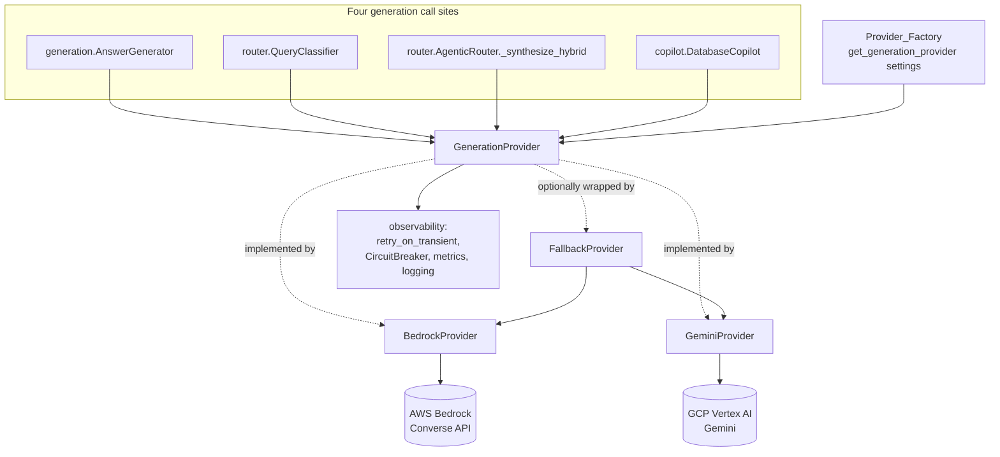

# Design Document

## Overview

This feature replaces the AWS Bedrock generation (text/chat) model with Google Gemini served
through GCP Vertex AI, behind a single backend-agnostic **Generation Provider** abstraction. The
embedding model (`amazon.titan-embed-text-v2:0`) and all other AWS usage (S3, SQS, Secrets Manager,
CloudWatch, Pinecone, PostgreSQL) are unchanged.

Today, four call sites each construct their own `bedrock-runtime` client and call the Bedrock
Converse API directly:

| # | Call site | File | System prompt | Temperature | Max tokens |
|---|-----------|------|---------------|-------------|------------|
| 1 | `BedrockNemotronGenerator.answer` (grounded RAG answer) | `generation.py` | no | 0.1 | `generation_max_tokens` (4096) |
| 2 | `BedrockQueryClassifier.classify` (JSON routing decision) | `router.py` | no | 0.0 | 256 |
| 3 | `AgenticRouter._synthesize_hybrid` (hybrid synthesis) | `router.py` | no | 0.1 | 4096 |
| 4 | `BedrockDatabaseCopilot._call_bedrock` (intent / table / SQL / answer) | `copilot.py` | yes | 0.0 | 2048 |

The design introduces a `GenerationProvider` protocol with two implementations (`BedrockProvider`,
`GeminiProvider`), a `Provider_Factory` that selects the implementation from `Settings.llm_provider`,
and an optional fallback wrapper. All four call sites are refactored to obtain generated text
exclusively through the provider abstraction. Cross-cutting behavior — `@retry_on_transient()`
retries, the shared circuit breaker, per-call read timeouts, `rag_generation_tokens` metrics,
structured logging with trace IDs, response shapes, `evidence_status` semantics, and citation
construction — is preserved across both providers.

### Research notes

- **Vertex AI Python SDK.** Gemini on Vertex AI is invoked through the `google-cloud-aiplatform`
  package (the `vertexai` namespace). The canonical flow is `vertexai.init(project=..., location=...)`,
  then `vertexai.generative_models.GenerativeModel(model_name, system_instruction=...)` and
  `model.generate_content(contents, generation_config=..., generation_config={...})`. Generation
  parameters map cleanly: `temperature` → `GenerationConfig.temperature`, Bedrock `maxTokens` →
  `GenerationConfig.max_output_tokens`. The system prompt maps to the model's `system_instruction`
  (set at model construction), keeping it structurally separate from the user content — matching the
  Copilot's existing system/user split. Content rephrased for compliance with licensing restrictions.
- **Token usage.** Vertex responses expose `usage_metadata` with `prompt_token_count`,
  `candidates_token_count`, and `total_token_count`. Bedrock Converse exposes `usage` with
  `inputTokens`, `outputTokens`, `totalTokens`. To keep existing dashboards working, the
  `GeminiProvider` normalizes Vertex counts onto the **same `token_type` label values** the Bedrock
  path already emits (`inputTokens`, `outputTokens`, `totalTokens`).
- **Transient errors.** Vertex/`google-api-core` raise typed exceptions for retryable conditions:
  `ServiceUnavailable` (503), `TooManyRequests`/`ResourceExhausted` (429), `DeadlineExceeded` (504),
  `InternalServerError` (500), plus transport-level `ConnectionError`/`TimeoutError`. These are the
  Gemini analogues of the `BotoCoreError`/connection/timeout set the Bedrock path already treats as
  retryable.
- **Authentication.** The SDK authenticates with Application Default Credentials (ADC). Setting
  `GOOGLE_APPLICATION_CREDENTIALS` to a service-account JSON key file selects explicit credentials;
  when unset, ADC resolution (workload identity, metadata server, gcloud login) applies. Per steering
  rules, this value flows through `Settings` rather than direct `os.environ` access.

## Architecture



### Key design decisions

1. **New module `rag_system/llm_provider.py`.** Per `structure.md`, generation-backend logic belongs
   in its own module rather than being scattered across `generation.py`, `router.py`, and
   `copilot.py`. The new module holds the protocol, the request/result data types, both provider
   implementations, the factory, and the fallback wrapper.

2. **Single `generate()` operation.** The abstraction exposes one method taking a
   `GenerationRequest` and returning a `GenerationResult`. This covers all four call sites — including
   the Copilot's system-prompt case — without leaking backend-specific concepts (Converse `messages`,
   Vertex `contents`).

3. **Resilience lives in the provider, not the call sites.** Each provider applies
   `@retry_on_transient()` (with a provider-appropriate retryable-exception set) and routes through a
   named `CircuitBreaker` (`"bedrock"` / `"gemini"`). This preserves the existing pattern from
   `generation.py` while ensuring Gemini gets identical resilience. Call sites stop owning retry and
   circuit logic.

4. **Metric/field-name parity over value parity.** The `GeminiProvider` reuses the exact metric name
   (`rag_generation_tokens`) and label keys (`model_id`, `token_type`) and normalizes Vertex token
   names to the Bedrock `token_type` values, so existing dashboards keep working unchanged.

5. **Factory + optional fallback decorator.** `get_generation_provider(settings)` returns the
   configured provider. When `llm_provider == "gemini"` and `LLM_FALLBACK_TO_BEDROCK` is true, it
   returns a `FallbackProvider` wrapping the Gemini primary and a Bedrock secondary. The decorator
   pattern keeps fallback orthogonal to each provider's own logic.

6. **Lazy, settings-injected construction.** Following the existing DI convention, providers take
   `Settings` in their constructor and are built behind the cached `get_*` factories in `api.py`.
   Heavy SDK imports (`vertexai`) happen inside the provider so the rest of the app imports cleanly
   even when the Vertex library is absent.

## Components and Interfaces

### 1. `GenerationProvider` protocol (`llm_provider.py`)

```python
class GenerationProvider(Protocol):
    name: str  # circuit-breaker / metric key, e.g. "bedrock" | "gemini"

    def generate(self, request: GenerationRequest) -> GenerationResult: ...

    def readiness_check(self) -> None:
        """Verify client construction & configuration WITHOUT invoking the model.
        Raise on misconfiguration."""
```

- `generate()` is the single text-generation operation (Req 1.1). It accepts an optional system
  prompt as a distinct field (Req 1.4) and always returns token usage on success (Req 1.5).
- `readiness_check()` backs the `/ready` probe (Req 9) and must not call the model.

### 2. `BedrockProvider` (`llm_provider.py`)

Wraps the current Bedrock Converse logic extracted from the four call sites.

```python
class BedrockProvider:
    name = "bedrock"

    def __init__(self, settings: Settings):
        self._client = settings.boto3_session().client(
            "bedrock-runtime", config=settings.bedrock_botocore_config()
        )
        self._model_id = settings.bedrock_model_id
        self._cb_threshold = settings.circuit_failure_threshold
        self._cb_recovery = settings.circuit_recovery_timeout_s

    def generate(self, request: GenerationRequest) -> GenerationResult:
        # circuit-protected wrapper around _generate_inner (same pattern as today)
        ...

    @retry_on_transient()
    def _generate_inner(self, request: GenerationRequest) -> GenerationResult:
        kwargs = {
            "modelId": self._model_id,
            "messages": [{"role": "user", "content": [{"text": request.user_prompt}]}],
            "inferenceConfig": {
                "temperature": request.temperature,
                "maxTokens": request.max_output_tokens,
            },
        }
        if request.system_prompt:
            kwargs["system"] = [{"text": request.system_prompt}]
        response = self._client.converse(**kwargs)
        text = response["output"]["message"]["content"][0]["text"]
        return GenerationResult(text=text, usage=response.get("usage", {}))

    def readiness_check(self) -> None:
        # constructs client only (no model call) — mirrors current probe_bedrock
        self._settings.boto3_session().client(
            "bedrock-runtime", config=self._settings.bedrock_botocore_config()
        )
```

Read-timeout is enforced via `settings.bedrock_botocore_config()` (unchanged). Behavior is identical
to the pre-existing Bedrock implementation (Req 8.1).

### 3. `GeminiProvider` (`llm_provider.py`)

```python
class GeminiProvider:
    name = "gemini"

    def __init__(self, settings: Settings):
        self._settings = settings
        self._model_id = settings.gemini_model_id
        self._project = settings.gcp_project_id
        self._location = settings.gcp_location
        self._read_timeout_s = settings.gemini_read_timeout_s
        self._cb_threshold = settings.circuit_failure_threshold
        self._cb_recovery = settings.circuit_recovery_timeout_s
        self._initialized = False  # lazy vertexai.init

    def generate(self, request: GenerationRequest) -> GenerationResult:
        # circuit-protected wrapper around _generate_inner
        ...

    @retry_on_transient(retryable_exceptions=_GEMINI_TRANSIENT_ERRORS)
    def _generate_inner(self, request: GenerationRequest) -> GenerationResult:
        model = self._build_model(system_instruction=request.system_prompt)
        config = GenerationConfig(
            temperature=request.temperature,
            max_output_tokens=request.max_output_tokens,
        )
        response = model.generate_content(
            request.user_prompt,
            generation_config=config,
            request_options={"timeout": self._read_timeout_s},
        )
        return GenerationResult(text=response.text, usage=_normalize_usage(response.usage_metadata))

    def readiness_check(self) -> None:
        # import lib (Req 10.4), validate project (Req 3.6), vertexai.init — no model call
        ...
```

Design points:
- **Import guard (Req 10.4):** `import vertexai` happens lazily; an `ImportError` is re-raised as a
  descriptive `RuntimeError` instructing the operator to install the Vertex client.
- **Auth (Req 3.4 / 3.6):** `vertexai.init(project, location)` relies on ADC; `GOOGLE_APPLICATION_CREDENTIALS`
  is honored by the SDK when set. If `llm_provider == "gemini"` and `gcp_project_id` is missing,
  `readiness_check()`/construction raises a descriptive configuration error naming the missing setting.
- **Mapping (Req 4):** `temperature` and `max_output_tokens` map onto `GenerationConfig`; the system
  prompt maps onto `system_instruction` (separate from the user prompt); when no system prompt is
  given, the model is built without `system_instruction` and invoked with the user prompt only.
- **Timeout (Req 6.3 / 7.5):** `request_options={"timeout": gemini_read_timeout_s}` bounds each call;
  a timeout surfaces as a transient error.
- **Usage (Req 6.4):** `_normalize_usage` maps Vertex counts to `{"inputTokens", "outputTokens",
  "totalTokens"}` so the `rag_generation_tokens` emission matches the Bedrock path.

### 4. `FallbackProvider` (`llm_provider.py`)

```python
class FallbackProvider:
    name = "gemini"  # primary identity for metrics/circuit

    def __init__(self, primary: GenerationProvider, secondary: GenerationProvider):
        self._primary = primary
        self._secondary = secondary

    def generate(self, request: GenerationRequest) -> GenerationResult:
        try:
            return self._primary.generate(request)
        except CircuitOpenError:
            raise
        except _TransientError:
            raise  # transient already retried by primary; do not mask
        except Exception:
            metrics.increment("rag_generation_provider_fallback_total",
                              {"from": self._primary.name, "to": self._secondary.name})
            logger.warning("Provider fallback: %s -> %s", self._primary.name, self._secondary.name,
                           extra={"model_id": ..., "trace_id": get_trace_id()})
            return self._secondary.generate(request)

    def readiness_check(self) -> None:
        self._primary.readiness_check()
```

Fallback fires only on **non-transient** failure after the primary's retries are exhausted
(Req 8.3, 8.5), and records both a metric and a structured log entry (Req 8.4).

### 5. `Provider_Factory` (`llm_provider.py`)

```python
def get_generation_provider(settings: Settings) -> GenerationProvider:
    if settings.llm_provider == "gemini":
        primary = GeminiProvider(settings)
        if settings.llm_fallback_to_bedrock:
            return FallbackProvider(primary, BedrockProvider(settings))
        return primary
    return BedrockProvider(settings)  # "bedrock"
```

`settings.llm_provider` is validated to be `bedrock` or `gemini` at load time (Req 2.4, 2.5).

### 6. Call-site refactors

Each call site receives a `GenerationProvider` (constructed via the factory) and builds a
`GenerationRequest` instead of calling Converse directly (Req 1.6):

- **`generation.py` — `AnswerGenerator`** (renamed from `BedrockNemotronGenerator`, keeping a
  backward-compatible alias): builds the grounded prompt, calls
  `provider.generate(GenerationRequest(user_prompt=prompt, temperature=0.1, max_output_tokens=max_tokens))`,
  then emits `rag_generation_tokens` from `result.usage` exactly as today. Citation construction and
  `evidence_status` are untouched (Req 5.1, 5.5).
- **`router.py` — `QueryClassifier`**: `GenerationRequest(user_prompt=prompt, temperature=0.0,
  max_output_tokens=256)`; routing JSON parsed by the existing `_parse_routing_response`
  (Req 5.2).
- **`router.py` — `_synthesize_hybrid`**: `GenerationRequest(user_prompt=prompt, temperature=0.1,
  max_output_tokens=4096)`.
- **`copilot.py` — `DatabaseCopilot`**: `GenerationRequest(user_prompt=user_prompt,
  system_prompt=system_prompt, temperature=0.0, max_output_tokens=2048)` for intent/table/SQL/answer
  generation (Req 1.4); `CopilotQueryResponse` shape unchanged (Req 5.3).

The circuit-breaker block currently inside `generation.py` moves into the providers, so each call
site is reduced to: build request → `provider.generate(request)` → use `result.text`.

### 7. Readiness probe (`api.py`, Req 9)

`probe_bedrock` is replaced by a provider-agnostic `probe_generation_provider` that resolves the
active provider via the factory and calls `provider.readiness_check()` under the existing
`readiness_probe_timeout_s` budget. On failure the dependency key in the `/ready` payload is
`generation` (identifying the failing dependency, Req 9.3), and the endpoint returns 503 as it does
for any failing probe.

### 8. Dependencies & packaging (Req 10)

- `pyproject.toml`: add `google-cloud-aiplatform>=1.60.0` (pinned minimum) to `dependencies`.
- `.env.example`: document `LLM_PROVIDER`, `GEMINI_MODEL_ID`, `GCP_PROJECT_ID`, `GCP_LOCATION`,
  `GOOGLE_APPLICATION_CREDENTIALS`, `LLM_FALLBACK_TO_BEDROCK` with placeholder values.
- `Dockerfile`: no special step needed beyond installing the project (the new dep installs with the
  package); verify the import succeeds at build time.

## Data Models

New provider-agnostic data types (in `llm_provider.py`), kept deliberately small so both backends map
onto them:

```python
@dataclass(frozen=True)
class GenerationRequest:
    user_prompt: str
    system_prompt: str | None = None
    temperature: float = 0.1
    max_output_tokens: int = 4096

@dataclass(frozen=True)
class GenerationResult:
    text: str
    usage: dict[str, int]   # token_type -> count, e.g. {"inputTokens": .., "outputTokens": .., "totalTokens": ..}
```

New `Settings` fields (`config.py`), all declared with `Field(..., alias="ENV_NAME")` and never read
from `os.environ` directly (Req 2.6):

| Field | Alias | Type | Default | Notes |
|-------|-------|------|---------|-------|
| `llm_provider` | `LLM_PROVIDER` | `Literal["bedrock","gemini"]` | `"bedrock"` | Invalid value rejected at load (Req 2.1, 2.2, 2.5) |
| `gemini_model_id` | `GEMINI_MODEL_ID` | `str` | `"gemini-1.5-pro"` | Used verbatim as Vertex model name (Req 2.3) |
| `gcp_project_id` | `GCP_PROJECT_ID` | `str \| None` | `None` | Required when provider is gemini (Req 3.1, 3.6) |
| `gcp_location` | `GCP_LOCATION` | `str` | `"us-central1"` | Documented Vertex region (Req 3.2) |
| `google_application_credentials` | `GOOGLE_APPLICATION_CREDENTIALS` | `str \| None` | `None` | SA JSON key path; `repr=False` (Req 3.3, 3.5) |
| `llm_fallback_to_bedrock` | `LLM_FALLBACK_TO_BEDROCK` | `bool` | `False` | Enables fallback wrapper (Req 8.2) |
| `gemini_read_timeout_s` | `GEMINI_READ_TIMEOUT_S` | `int` | `90` | Per-call read timeout (Req 6.3) |

`llm_provider` is validated with a Pydantic `Literal`/field validator so an out-of-range value raises
a descriptive error at `Settings` load (Req 2.5). Existing Secrets Manager loading
(`model_post_init`) already maps any secret keyed by alias onto these fields, so
`GOOGLE_APPLICATION_CREDENTIALS` (or its contents) can be delivered via Secrets Manager without code
changes (Req 3.7).

Existing response models (`QueryResponse`, `RoutingDecision`, `CopilotQueryResponse`,
`UnifiedQueryResponse`) are **unchanged** — provider swapping must not alter response shapes
(Req 5.1–5.3).

## Correctness Properties

*A property is a characteristic or behavior that should hold true across all valid executions of a
system — essentially, a formal statement about what the system should do. Properties serve as the
bridge between human-readable specifications and machine-verifiable correctness guarantees.*

The prework classified most configuration, packaging, and infrastructure-wiring criteria as
EXAMPLE/SMOKE/INTEGRATION (covered in the Testing Strategy). The criteria that express universal
behavior — request mapping, response-shape parity, error classification, retry/circuit lifecycle,
and fallback — are captured below as property-based tests. After reflection, overlapping criteria
were consolidated (e.g. 1.5+6.4 into one usage property; 6.1+6.2+7.1+7.2+7.5 into one
retry/circuit property; the mapping criteria 1.4+4.1–4.5 into one mapping property) so each property
provides unique validation value.

### Property 1: Gemini request-to-Vertex mapping

*For any* `GenerationRequest`, the `GeminiProvider` invokes Vertex AI with the request's temperature
and maximum output tokens applied to the generation configuration, with the system prompt supplied as
a separate system instruction when (and only when) one is present, with the user prompt unchanged and
never containing the system prompt text, and returns the generated text as a plain string.

**Validates: Requirements 1.4, 4.1, 4.2, 4.3, 4.4, 4.5**

### Property 2: Successful generation always reports token usage

*For any* successful generation through either provider, the `GenerationResult` contains a non-empty
token-usage mapping, and the call site records those counts to the `rag_generation_tokens` metric
labelled with the active `model_id` and `token_type`.

**Validates: Requirements 1.5, 6.4**

### Property 3: Response-shape parity across providers

*For any* given inputs (retrieval hits, classifier output, or copilot rows) and identical generated
text, the RAG path (`QueryResponse`), the classifier (`RoutingDecision`), and the Copilot path
(`CopilotQueryResponse`) produce responses whose field sets and types are identical regardless of
whether the `BedrockProvider` or `GeminiProvider` produced the text.

**Validates: Requirements 5.1, 5.2, 5.3, 8.1, 11.4**

### Property 4: Grounding and citations depend only on evidence

*For any* set of retrieval hits and query results, the assigned `evidence_status` and the constructed
citations are a function of the evidence alone and are identical regardless of which
Generation_Provider produced the generated text.

**Validates: Requirements 5.4, 5.5**

### Property 5: Transient failures are retried and open the circuit

*For any* transient error (connection failure, timeout, throttling/rate-limit, or temporary
unavailability) raised by a provider call, the retry layer retries it; and *for any* sequence of
failures that reaches the configured failure threshold, the circuit breaker opens so that subsequent
calls fail fast with `CircuitOpenError` without invoking the model.

**Validates: Requirements 6.1, 6.2, 7.1, 7.2, 7.5, 11.3**

### Property 6: Non-transient failures are not retried

*For any* non-transient error raised by a provider call, the provider makes a single attempt and
propagates the error without retrying.

**Validates: Requirements 7.4**

### Property 7: Fallback fires only when enabled

*For any* non-transient provider failure that occurs after retries are exhausted: when
`LLM_FALLBACK_TO_BEDROCK` is true and the active provider is Gemini, the same `GenerationRequest` is
attempted through the `BedrockProvider` and a fallback metric and structured log entry are emitted;
when it is false, the failure propagates and the `BedrockProvider` is never invoked.

**Validates: Requirements 8.3, 8.4, 8.5**

### Property 8: Invalid provider configuration is rejected at load

*For any* `LLM_PROVIDER` value other than `bedrock` or `gemini`, constructing `Settings` raises a
descriptive validation error at load time.

**Validates: Requirements 2.5**

## Error Handling

The provider abstraction centralizes generation error handling so behavior is consistent across
backends.

**Transient errors (retryable).** Classified per provider and fed to `@retry_on_transient()`:
- Bedrock: existing set — `ConnectionError`, `TimeoutError`, `botocore` `BotoCoreError` (and
  throttling surfaced through it).
- Gemini (`_GEMINI_TRANSIENT_ERRORS`): `google.api_core.exceptions.ServiceUnavailable` (503),
  `TooManyRequests`/`ResourceExhausted` (429), `DeadlineExceeded` (504), `InternalServerError` (500),
  plus transport-level `ConnectionError`/`TimeoutError`. A per-call read-timeout breach maps to this
  set (Req 7.5).

**Circuit breaking.** Each provider routes through a named `CircuitBreaker` (`"bedrock"`/`"gemini"`)
using `circuit_failure_threshold` and `circuit_recovery_timeout_s`. When open, calls raise
`CircuitOpenError` immediately. The API layer already converts `CircuitOpenError` to **HTTP 503** in
all four endpoints (`/ask`, `/query`, `/copilot/query`) regardless of any earlier status (Req 7.3) —
this behavior is preserved and not duplicated.

**Non-transient errors.** Propagated without retry (Req 7.4). When fallback is enabled they trigger
the `FallbackProvider` path; otherwise they bubble up to the API layer, which maps `RuntimeError`/
`FileNotFoundError` to 503 and `SqlValidationError` to 400 as today.

**Configuration errors.**
- Invalid `LLM_PROVIDER` → descriptive validation error at `Settings` load (Req 2.5).
- `gemini` selected with missing `GCP_PROJECT_ID` → descriptive `RuntimeError` naming the missing
  setting, raised during provider construction / readiness check (Req 3.6).
- Vertex client library not importable while Gemini is selected → descriptive `RuntimeError`
  instructing the operator to install `google-cloud-aiplatform` (Req 10.4).

**Readiness failures.** A failing `readiness_check()` is reported under the `generation` dependency
key in `/ready` with the underlying error string, and the endpoint returns 503 (Req 9.3). The probe
runs under `readiness_probe_timeout_s` (Req 9.4).

## Testing Strategy

Property-based testing IS appropriate here: the provider abstraction, mapping, parity, and
error-classification logic are pure/mockable functions with large input spaces and universal
invariants. Infrastructure concerns (Vertex/Bedrock SDK behavior, Secrets Manager, container build)
are covered by example/integration/smoke tests instead.

### Property-based tests

- Library: **Hypothesis** (Python). Each property test runs **minimum 100 iterations**
  (`@settings(max_examples=100)`).
- Each test is tagged with a comment: `# Feature: gemini-generation-provider, Property {n}: {text}`.
- Each correctness property (1–8) is implemented by a **single** property-based test.
- All provider calls are mocked — **no external AWS or GCP calls occur** (Req 11.1). The Vertex
  `GenerativeModel` and the boto3 `bedrock-runtime` client are replaced with fakes that capture
  invocation kwargs (for mapping/parity) or raise injected exceptions (for error properties).
- Generators: random prompts (incl. unicode/empty/large), random temperatures and token limits,
  random retrieval-hit sets and copilot row sets, and parametrized exception types drawn from the
  transient vs. non-transient sets.

### Example / unit tests

- Provider interface contract (1.1), Bedrock/Gemini implementation wiring (1.2, 1.3), call sites use
  the abstraction only (1.6).
- Settings fields & defaults: `LLM_PROVIDER` accepted values + default bedrock (2.1, 2.2),
  `GEMINI_MODEL_ID` verbatim (2.3), factory selection over both values incl. fallback wrapper
  (2.4, 11.2), `GCP_*` fields and defaults (3.1, 3.2, 3.3), ADC when path absent (3.4), `repr=False`
  on credential fields (3.5), missing-project error (3.6), fallback default false (8.2).
- Mapping/observability wiring: read-timeout value passed (6.3), logs include model_id + trace_id
  (6.5), identical metric/field names across providers (6.6).
- Error/edge scenarios: `CircuitOpenError` → 503 (7.3), Vertex import failure → descriptive error
  (10.4).
- Readiness: gemini/bedrock probe behavior without model calls (9.1, 9.2), failure → 503 identifying
  `generation` (9.3), probe timeout applied (9.4).

### Integration / smoke tests

- Secrets Manager delivery of GCP credentials via existing loader (3.7) — mocked Secrets Manager.
- Packaging/config smoke checks: `pyproject.toml` declares `google-cloud-aiplatform` with a pinned
  minimum (10.1), `.env.example` documents the new keys (10.2), container import check in CI (10.3).
- Optional live smoke test (skipped by default, gated on real GCP credentials) doing a single tiny
  Gemini generation to validate end-to-end auth — never part of the property suite.

### Regression coverage

Existing tests (`test_generation.py`, `test_router.py`, `test_copilot.py`, `test_api_smoke.py`,
`test_request_timeouts.py`) must continue to pass unchanged with `LLM_PROVIDER=bedrock`, confirming
the Bedrock path is behavior-preserving (Req 8.1).
