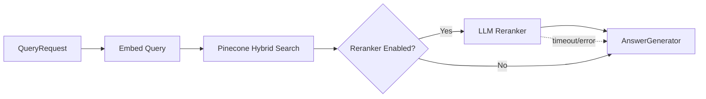
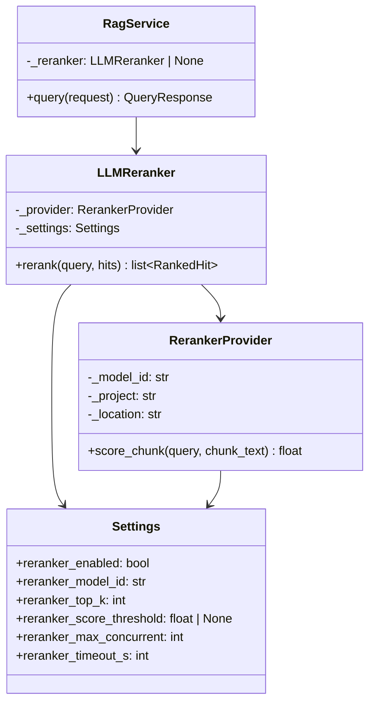

# Design Document: LLM Reranker

## Overview

This design introduces an LLM-based reranking stage into the RAG query pipeline. After Pinecone hybrid search retrieves candidate chunks, a dedicated `LLMReranker` component scores each chunk's relevance to the user query using Gemini 3.5 Flash on GCP Vertex AI. The scored chunks are reordered by descending relevance score, optionally filtered by a minimum threshold and top-K limit, then passed to the `AnswerGenerator`.

The reranker is **opt-in** (disabled by default) and integrates into `RagService.query()` between the retrieval and generation stages. When enabled, it improves answer quality by reducing noise from weakly-relevant retrieval results. When disabled or when it fails, the pipeline falls back to the original retrieval order seamlessly.

### Design Decisions

1. **Pointwise scoring** (one LLM call per chunk) rather than listwise ranking. This enables concurrent scoring, independent failure handling per chunk, and simpler prompt engineering. The tradeoff is higher total API calls, mitigated by concurrency and the relatively small candidate set (typically 10-60 chunks).

2. **Separate provider class** (`RerankerProvider`) rather than reusing `GeminiProvider`. The reranker has different concerns: short structured output (a single float), different timeout/retry characteristics, its own circuit breaker, and a distinct prompt template. Keeping it separate avoids coupling answer generation settings to scoring settings.

3. **Sync execution with ThreadPoolExecutor** for concurrent chunk scoring, consistent with the existing sync query path. The reranker uses `concurrent.futures.ThreadPoolExecutor` bounded by `reranker_max_concurrent`.

4. **Graceful degradation**: Individual chunk failures result in a 0.0 score (chunk is deprioritized but not lost). Total operation timeout or circuit breaker open causes full fallback to unreranked results.

## Architecture

### Pipeline Flow (with Reranker)



### Component Relationships



## Components and Interfaces

### 1. `RerankerProvider` (new class in `reranker.py`)

Handles Vertex AI SDK initialization, circuit breaker, retry logic, and response parsing for chunk scoring. Follows the same structural pattern as `GeminiProvider` but is purpose-built for single-score extraction.

```python
class RerankerProvider:
    name: str = "reranker"

    def __init__(self, settings: Settings) -> None: ...
    def score_chunk(self, query: str, chunk_text: str) -> float: ...
    def readiness_check(self) -> None: ...
```

**Responsibilities:**
- Lazy Vertex AI SDK initialization (same pattern as `GeminiProvider._ensure_initialized`)
- Build scoring prompt from query + chunk text
- Call Gemini 3.5 Flash with low temperature (0.0) and minimal max_tokens (16)
- Parse response to extract a float in [0.0, 1.0]
- Circuit breaker integration via `get_circuit_breaker("reranker", ...)`
- Retry on transient errors via `@retry_on_transient(retryable_exceptions=_GEMINI_TRANSIENT_ERRORS, max_retries=3)`

### 2. `LLMReranker` (new class in `reranker.py`)

Orchestrates concurrent scoring of all candidate chunks, applies filtering and top-K selection, and emits observability signals.

```python
class LLMReranker:
    def __init__(self, settings: Settings) -> None: ...
    def rerank(self, query: str, hits: list[RetrievalHit]) -> list[RankedHit]: ...
```

**Responsibilities:**
- Skip LLM calls when input list is empty
- Score chunks concurrently using `ThreadPoolExecutor(max_workers=reranker_max_concurrent)`
- Process in sequential batches of `reranker_max_concurrent` size
- Handle per-chunk failures (assign 0.0 score, log warning)
- Apply score threshold filter (if configured)
- Apply top-K limit
- Sort by descending `rerank_score`
- Emit metrics and structured logs
- Enforce overall timeout via `concurrent.futures.wait(timeout=...)`

### 3. `RagService` Integration (modification to `service.py`)

- Add lazy-init `_reranker` property (same double-check locking pattern)
- In `query()`, after retrieval and before generation, conditionally invoke `self.reranker.rerank()`
- Wrap reranker call in try/except: on failure or timeout, log and fall back to original hits
- Check circuit breaker state before attempting rerank; if open, skip entirely

### 4. `Settings` Extension (modification to `config.py`)

New fields added to the `Settings` class:

```python
# -- Reranker ------------------------------------------------------------------
reranker_enabled: bool = Field(default=False, alias="RAG_RERANKER_ENABLED")
reranker_model_id: str = Field(default="gemini-3.5-flash", alias="RAG_RERANKER_MODEL_ID", max_length=128)
reranker_top_k: int = Field(default=10, alias="RAG_RERANKER_TOP_K", ge=1, le=100)
reranker_score_threshold: float | None = Field(default=None, alias="RAG_RERANKER_SCORE_THRESHOLD", ge=0.0, le=1.0)
reranker_max_concurrent: int = Field(default=5, alias="RAG_RERANKER_MAX_CONCURRENT", ge=1, le=50)
reranker_timeout_s: int = Field(default=30, alias="RAG_RERANKER_TIMEOUT_S", ge=1, le=300)
```

### 5. `RankedHit` Model (new model in `models.py`)

```python
class RankedHit(BaseModel):
    chunk: Chunk
    score: float          # Original retrieval score
    source: str           # Original source (e.g., "pinecone")
    rerank_score: float   # LLM-assigned relevance score [0.0, 1.0]
```

Extends `RetrievalHit` semantics by adding `rerank_score` while preserving all original data. The `AnswerGenerator.answer()` signature accepts `list[RetrievalHit]`; since `RankedHit` is a subclass-compatible model (same fields plus `rerank_score`), it can be passed directly or converted.

**Design choice**: Rather than subclassing `RetrievalHit` (which would couple models), `RankedHit` is a standalone model with the same base fields plus `rerank_score`. The reranker returns `list[RankedHit]`; `RagService` converts them back to `list[RetrievalHit]` when passing to `AnswerGenerator` (which only needs `chunk`, `score`, `source`), preserving the existing interface contract.

## Data Models

### Scoring Prompt Template

```
You are a relevance scoring assistant. Rate how relevant the following text passage is to the given query.

Query: {query}

Passage: {chunk_text}

Respond with ONLY a decimal number between 0.0 and 1.0, where:
- 0.0 means completely irrelevant
- 1.0 means perfectly relevant

Score:
```

**Model configuration:**
- Temperature: 0.0 (deterministic scoring)
- Max output tokens: 16 (only need a single number)
- Model: configurable via `reranker_model_id` (default: `gemini-3.5-flash`)

### Data Flow

```
Input:  list[RetrievalHit]  (from Pinecone, scored by vector similarity)
                │
                ▼
        ┌─────────────────────┐
        │  Concurrent Scoring  │  → each chunk gets rerank_score ∈ [0.0, 1.0]
        └─────────────────────┘
                │
                ▼
        ┌─────────────────────┐
        │  Threshold Filter    │  → remove chunks below reranker_score_threshold
        └─────────────────────┘
                │
                ▼
        ┌─────────────────────┐
        │  Top-K Selection     │  → keep at most reranker_top_k chunks
        └─────────────────────┘
                │
                ▼
Output: list[RankedHit]  (sorted desc by rerank_score)
```

### Configuration Validation

| Field | Type | Default | Constraints |
|-------|------|---------|-------------|
| `reranker_enabled` | bool | `False` | — |
| `reranker_model_id` | str | `"gemini-3.5-flash"` | max_length=128 |
| `reranker_top_k` | int | `10` | 1 ≤ x ≤ 100 |
| `reranker_score_threshold` | float \| None | `None` | 0.0 ≤ x ≤ 1.0 when set |
| `reranker_max_concurrent` | int | `5` | 1 ≤ x ≤ 50 |
| `reranker_timeout_s` | int | `30` | 1 ≤ x ≤ 300 |


## Correctness Properties

*A property is a characteristic or behavior that should hold true across all valid executions of a system — essentially, a formal statement about what the system should do. Properties serve as the bridge between human-readable specifications and machine-verifiable correctness guarantees.*

### Property 1: Score Bound Invariant

*For any* query and any list of RetrievalHit objects processed by the reranker, every `rerank_score` in the output list SHALL be a float in the range [0.0, 1.0] inclusive.

**Validates: Requirements 1.2**

### Property 2: Data Preservation

*For any* list of RetrievalHit objects processed by the reranker, every output RankedHit SHALL contain the same `chunk` (content, metadata, id, document_id), `score` (original retrieval score), and `source` as the corresponding input RetrievalHit.

**Validates: Requirements 1.4**

### Property 3: Output Size, Ordering, and Threshold Filtering

*For any* list of RetrievalHit objects, any valid `reranker_top_k` (1–100), and any optional `reranker_score_threshold` (0.0–1.0), the reranker output SHALL satisfy all of:
1. No output chunk has `rerank_score` below `reranker_score_threshold` (when threshold is set)
2. Output length equals `min(reranker_top_k, count_of_chunks_passing_threshold)`
3. Output is sorted in descending order by `rerank_score`

**Validates: Requirements 1.1, 2.1, 2.2, 2.3**

### Property 4: Graceful Fallback Preserves Original Hits

*For any* list of RetrievalHit objects, if the reranker raises an exception during processing, the RagService SHALL pass the original unreranked hits to the AnswerGenerator with their order, content, and scores unchanged.

**Validates: Requirements 3.4**

### Property 5: Failure Yields Zero Score

*For any* chunk whose scoring request either exhausts all retries or receives a non-parseable LLM response (text that cannot be converted to a float in [0.0, 1.0]), the reranker SHALL assign that chunk a `rerank_score` of 0.0.

**Validates: Requirements 5.2, 5.3**

### Property 6: Concurrency Bound

*For any* list of RetrievalHit objects and any valid `reranker_max_concurrent` setting (1–50), the number of in-flight LLM scoring calls at any point in time SHALL never exceed `reranker_max_concurrent`.

**Validates: Requirements 7.1**

### Property 7: Pointwise Scoring — One Call Per Chunk

*For any* non-empty list of N RetrievalHit objects, the reranker SHALL make exactly N LLM scoring calls (one per chunk).

**Validates: Requirements 7.2**

### Property 8: Fault Isolation Within Batch

*For any* concurrent batch of chunk scoring calls where a subset of calls fail, all non-failed calls in that batch SHALL complete successfully and return valid `rerank_score` values.

**Validates: Requirements 7.4**

## Error Handling

### Per-Chunk Scoring Failures

| Failure Mode | Behavior | Score Assigned |
|---|---|---|
| Transient error (ConnectionError, TimeoutError, HTTP 429/5xx) | Retry up to 3 attempts with exponential backoff (1s base) | 0.0 if all retries exhausted |
| Non-parseable response (not a valid float in [0.0, 1.0]) | Log warning with raw response content, no retry | 0.0 |
| Unexpected exception | Log error, do not retry | 0.0 |

### Operation-Level Failures

| Failure Mode | Behavior | Pipeline Effect |
|---|---|---|
| Total timeout exceeded (`reranker_timeout_s`) | Cancel remaining futures, log warning | Fall back to original unreranked hits |
| Circuit breaker OPEN | Skip reranker entirely (no API calls) | Fall back to original unreranked hits |
| Unhandled exception from `LLMReranker.rerank()` | Caught by `RagService.query()`, log error | Fall back to original unreranked hits |

### Circuit Breaker Configuration

- **Name**: `"reranker"`
- **Failure threshold**: 5 consecutive failures (uses global `circuit_failure_threshold` setting)
- **Recovery timeout**: 30 seconds (uses global `circuit_recovery_timeout_s` setting)
- **Scope**: Covers individual chunk scoring calls. Each failed `score_chunk()` call (after retries exhausted) counts as one circuit failure.

### Fallback Metrics

When fallback occurs, the reranker increments `rag_reranker_fallback_total` with a `reason` label:
- `"timeout"` — total operation exceeded `reranker_timeout_s`
- `"error"` — unhandled exception in rerank logic
- `"circuit_open"` — circuit breaker was open when rerank was attempted

## Testing Strategy

### Property-Based Tests (PBT)

The reranker's core logic (scoring, filtering, ordering, concurrency) is well-suited to property-based testing because:
- Input varies meaningfully (different chunk lists, scores, thresholds, top_k values)
- Properties are universal invariants that must hold for ALL valid inputs
- Pure logic can be tested with mocked LLM responses (no external dependencies)

**Library**: [Hypothesis](https://hypothesis.readthedocs.io/) (Python's standard PBT library)

**Configuration**: Minimum 100 iterations per property test

**Tag format**: Each property test includes a comment:
```python
# Feature: llm-reranker, Property {N}: {property_text}
```

**Properties to implement**:
1. Score bound invariant — generate random chunk lists, mock LLM with random valid/invalid responses
2. Data preservation — generate random RetrievalHit lists, verify original fields preserved
3. Output size/ordering/threshold — generate random lists, top_k, threshold combinations
4. Graceful fallback — generate random hits, force reranker exception, verify passthrough
5. Failure yields zero — generate random non-parseable strings, verify 0.0 assignment
6. Concurrency bound — generate lists larger than max_concurrent, track peak concurrency
7. One call per chunk — generate lists of varying sizes, count mock invocations
8. Fault isolation — generate batches with random failure patterns, verify survivors

### Unit Tests (Example-Based)

- **Configuration validation**: Test each Settings field with valid defaults, boundary values, and invalid values
- **Empty input handling**: Verify empty list → empty list with no LLM calls
- **Pipeline integration (enabled)**: Mock reranker, verify `RagService.query()` calls it
- **Pipeline integration (disabled)**: Verify reranker skipped when `reranker_enabled=False`
- **Scoring prompt construction**: Verify prompt template is correctly formatted with query and chunk text
- **Response parsing**: Test parsing of valid floats, boundary values (0.0, 1.0), and edge cases

### Integration Tests

- **Retry behavior**: Mock Gemini to fail N times then succeed, verify retry count and backoff
- **Circuit breaker**: Trigger threshold failures, verify circuit opens and calls fail fast
- **Timeout handling**: Mock slow LLM responses, verify timeout triggers fallback
- **Batch processing**: Verify sequential batch execution when input > max_concurrent
- **End-to-end pipeline**: With mocked Vertex AI, run full query() and verify reranked results reach AnswerGenerator

### Observability Tests

- Verify `rag_reranker_duration_ms` metric emitted on success
- Verify `rag_reranker_input_count` and `rag_reranker_output_count` metrics
- Verify `rag_reranker_fallback_total` counter with correct reason labels
- Verify `rag_reranker_top_score` metric emitted on success
- Verify structured log fields (top/min/avg scores) on successful rerank
