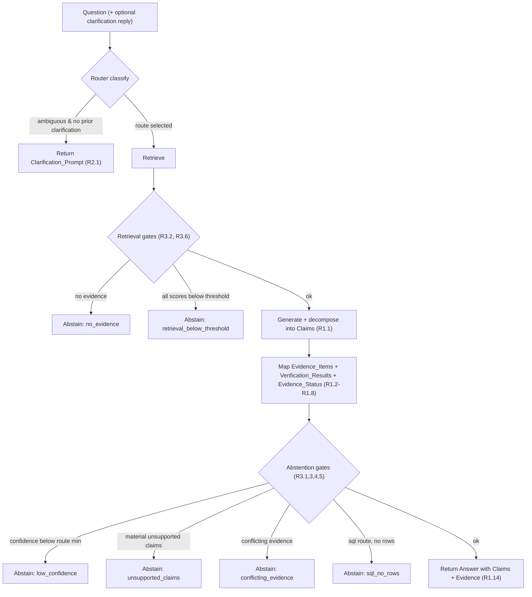

# Design Document

## Overview

This feature adds a suite of trust, evaluation, and observability enhancements to the existing RAG product. It is intentionally additive: it layers new capabilities onto the current Python backend (`src/rag_system`) and React + TypeScript frontend (`frontendkimchi/src`) without rewriting the ingestion, retrieval, routing, generation, or tracing pipelines that already work.

The enhancements group into three themes that map onto the requirement priorities:

- **Answer trustworthiness** — claim-level evidence mapping (R1), ambiguity clarification (R2), and evidence-based abstention (R3). These change what the answer path returns so users can verify each factual claim, are asked one focused question when a query is ambiguous, and are told when the system lacks evidence instead of being given a guess.
- **Operability at scale** — full corpus inventory (R4), document version control (R5), feedback review inbox (R6), and versioned AI configuration (R9). These let an operator manage the entire backend corpus (not just what a single browser uploaded), recover from bad ingestions, triage negative feedback, and reproduce exactly which configuration produced any answer.
- **Measurable, improvable quality** — multi-method evaluation (R7), replay and compare lab (R8), trace investigator (R10), and knowledge gap map (R11). These make AI quality something an operator can measure, experiment with, diagnose, and prioritize.

### Design principles

1. **Reuse the existing seams.** The backend already has clean module boundaries (`retrieval`, `rerank`, `router`, `generation`, `confidence`, `evaluation`, `observability_tracing`, `storage`, `service`) and a single typed FastAPI surface in `api.py`. New behavior is added inside those modules and exposed through new `api.py` endpoints, keeping the router/service orchestration model intact.
2. **S3 is the system of record for domain artifacts; Postgres for traces/logs.** Documents, versions, feedback, evaluation results, AI configuration versions, corpus snapshots, and replay runs persist as JSON artifacts in the existing `S3ArtifactStore` (mirroring how documents, query traces, and conversations already persist), using the same optimistic-concurrency (`put_json_conditional` / ETag) pattern where concurrent writers contend. Execution traces and logs continue to live in the Postgres stores under `observability_tracing`.
3. **Fail closed on trust.** The generation path already "fails closed" (unverifiable prose gets no citations). Claim mapping and abstention extend that stance: an answer with material unsupported claims becomes an abstention rather than a confidently wrong answer.
4. **Immutability where reproducibility matters.** AI configuration versions and corpus snapshots are immutable once created, so replay and comparison are reproducible. New versions are appended; rollback is an activation pointer change plus an audit event, never a mutation.
5. **Recommendations, never silent automation.** The trace investigator and knowledge gap map only recommend; they never mutate configuration or corpus without an explicit operator action.

### Research notes informing the design

- The current `generation.py` produces a single `QueryResponse` with a flat `citations` list and a coarse `evidence_status` (`grounded` / `partially_grounded` / `insufficient_evidence`). Claim-level mapping (R1) introduces a finer structure *below* the answer while preserving the existing fields for backward compatibility, so existing clients keep working.
- `confidence.py` already computes a deterministic numeric `confidence_score` in `[0,1]` from explainable signals, and `config.py` exposes threshold knobs. Abstention (R3) reuses that score plus new per-route threshold settings rather than inventing a new confidence mechanism.
- The router (`router.py`) already classifies queries via an LLM into `rag` / `database` / `hybrid`. Ambiguity classification (R2) is added as an additional outcome of the same classification stage.
- The `observability_tracing` platform already records `Trace` objects with spans, attributes, and route, persisted off the request path by flush workers. Versioned AI configuration (R9) attaches a configuration-version identifier to each trace, and the trace investigator (R10) reads recorded traces — both build on the existing trace store rather than a new telemetry pipeline.
- The frontend already funnels all network access through `api/client.ts` with typed response shapes in `api/types.ts`, and pages under `pages/` compose components under `components/`. New pages/panels follow the same structure and testing conventions (Vitest + Testing Library + MSW).

## Architecture

### System context

```mermaid
graph TB
    subgraph Frontend["Frontend_App (frontendkimchi/src)"]
        AnswerUI["Answer + Claim/Evidence UI"]
        ClarifyUI["Clarification UI"]
        DocsUI["Documents / Corpus Inventory + Versions"]
        FeedbackUI["Feedback Inbox"]
        EvalUI["Evaluation Dashboard"]
        ReplayUI["Replay & Compare Lab"]
        ConfigUI["AI Configuration History"]
        ObsUI["Observability: Trace Investigator"]
        GapUI["Knowledge Gap Map"]
    end

    subgraph API["Backend_API (api.py)"]
        AskEP["/ask, /ask/stream"]
        ClarifyEP["/ask/clarify"]
        CorpusEP["/corpus (paginated)"]
        VersionEP["/documents/{id}/versions"]
        FeedbackEP["/feedback"]
        EvalEP["/evaluation"]
        ReplayEP["/replays"]
        ConfigEP["/ai-config"]
        DiagEP["/traces/{id}/diagnose"]
        GapEP["/knowledge-gap-map"]
    end

    subgraph Services["Backend services (src/rag_system)"]
        Router["Router_Service"]
        Gen["Generation_Service + Claim mapping"]
        Conf["Confidence_Service"]
        Retr["Retrieval_Service"]
        Eval["Evaluation_Service"]
        Corpus["Corpus/Version Service"]
        FB["Feedback Service"]
        Replay["Replay Service + worker"]
        Config["AI Config Service"]
        Trace["Tracing_Service + Investigator"]
        Gap["Knowledge Gap Service"]
    end

    subgraph Stores["Persistence"]
        S3[("S3ArtifactStore (JSON artifacts)")]
        PG[("Postgres trace/log stores")]
        Vec[("Pinecone vector index")]
    end

    Frontend -->|apiClient| API
    API --> Services
    Gen --> Conf
    Router --> Gen
    Router --> Retr
    Services --> S3
    Trace --> PG
    Retr --> Vec
    Replay --> Vec
```



### Authorization and roles

Every new operator-facing capability (R4 corpus admin, R5 version restore, R6 feedback inbox and its actions, R7 evaluation runs, R8 replay + corpus-snapshot endpoints, R9 AI-config change/history/rollback/approve, R10 trace diagnose, R11 knowledge-gap generation) must be gated to an **Operator** (per the requirements glossary). The existing auth layer has no notion of a privileged user — `UserRecord`/`UserPublic` in `src/rag_system/auth/models.py` carry no role — so this design introduces a minimal, additive operator model rather than a full RBAC subsystem:

- **`is_operator: bool` (default `False`)** is added to `UserRecord` and surfaced on `UserPublic` (so the frontend can show/hide operator-only navigation). It defaults to `False`, so every existing and newly registered user is a non-operator unless explicitly elevated. `UserRecord.to_public()` copies the flag.
- **Bootstrapping via an allow-list.** A new configured setting `operator_emails` (a set/list of normalized email addresses) seeds the first operators: at authentication time, a user whose email is in `operator_emails` is treated as an operator (the resolved `is_operator` is the stored flag **OR** allow-list membership). This bootstraps operators without a migration or an admin UI. *A full RBAC/roles table can replace the allow-list later without changing endpoint contracts — the `require_operator` dependency below is the single seam.*
- **`require_operator` FastAPI dependency.** A new dependency in the auth layer resolves the authenticated user (reusing the existing bearer/token dependency), then asserts operator status. A non-operator is rejected with **`403 operator_required`**; an unauthenticated caller continues to get the existing `401`. It is applied to **all operator-only endpoints**: corpus admin actions, document version restore (`POST /documents/{id}/versions/{version}/restore`), the feedback inbox and its actions (`GET /feedback`, `/feedback/{id}/classify|promote|resolve`), evaluation runs, all replay endpoints (`POST /replays`, `POST /replays/{id}/cancel`, `GET /replays/{id}`), corpus snapshots (`POST /corpus-snapshots`, `GET /corpus-snapshots`), AI-config change/history/rollback/approve, trace diagnosis (`POST /traces/{id}/diagnose`), and knowledge-gap generation (`POST /knowledge-gap-map`).
- **Non-operator corpus listing is unaffected.** `GET /corpus` remains available to any authenticated user and stays **owner-scoped** for non-operators (R4.3, already specified below); it does *not* use `require_operator`. Only the corpus *admin* actions (restore, snapshot creation) are operator-gated.

This keeps authorization in one place, fails closed (default non-operator, explicit `403`), and leaves the door open to a richer role model later.

### Answer path (R1, R2, R3) control flow

The unified answer path gains three decision points around the existing classify → route → retrieve → generate flow:



A clarification reply that references a valid, unexpired `clarification_id` re-enters this flow with the combined question, scoped to the clarification's document scope, and this time the ambiguous branch is disabled (R2.7, R2.8): if still unresolved it abstains rather than clarifying again.

#### Streaming must not leak retractable answer content (R3, R1)

`/ask/stream` already streams and owns its own trace, but streaming interacts dangerously with abstention: once an answer token is emitted it cannot be un-said, yet the abstention gates (R3.1–R3.6) and claim-verification (R1) run *after* generation. To preserve R3.7 (an abstention carries **no** answer content) even under streaming, the stream must **not** emit answer tokens that a later gate could retract. Concretely:

- The stream emits **progress/status events for pipeline stages** (`classify`, `retrieve`, `generate`, `verify`) so the UI can show liveness, but it **holds answer content** — it does not forward generated tokens to the client — until the abstention gates *and* claim-verification have been evaluated.
- The stream ends with exactly **one terminal event** carrying exactly one of: (a) the answer with its claims/evidence (R1.14), (b) a `Clarification_Prompt` (R2), or (c) an `Abstention_Response` (R3.7, no answer content).
- Because answer content is buffered behind the gates, an abstention decision reached post-generation still yields a terminal abstention event with no leaked tokens, keeping streamed and non-streamed responses semantically identical.

### AI configuration resolution (R9.1)

Every answer path (router, retriever, reranker, SQL path, and generation) resolves its behavior from the **currently active** `AI_Configuration_Version` rather than from ad-hoc settings, via a new **`AIConfigResolver`** component. AI configuration is treated as a **settings bundle**, not a single prompt:

- `AIConfigResolver.resolve(config_id)` loads the active `AIConfigurationVersion` (from the `AIConfigurationIndex.active_version_id`) and applies its settings across the pipeline: **prompt**, **model**, **output schema**, **router threshold**, **retrieval settings**, and **reranker configuration**. Each stage reads its slice of the resolved bundle so a single active version governs the whole answer.
- The **resolved version's `version_id` is exactly what the `Tracing_Service` stamps on the trace** (`ai_configuration_version_id`, R9.1). "Unresolved" (R9.2) means the resolver could not load an active version; the trace then records the `unresolved` indicator and retains all other data.
- **Default / bootstrap active config.** When no active version exists yet for a config (fresh install), the resolver falls back to a seeded default `AIConfigurationVersion` (built from the existing `config.py` defaults: `gemini_model_id`, current retrieval/reranker settings, router threshold) and persists it as the initial active version, so there is always a resolvable version to stamp.

### Persistence layout (S3 keys)

New artifact keys follow the existing `storage.py` key-function convention (one JSON object per key, read/written through `S3ArtifactStore`):

| Concept | Key pattern | Concurrency |
|---|---|---|
| Document version manifest | `documents/{document_id}/versions/{version}.json` | create-only (`if_none_match`) |
| Document version index (ordered list + active pointer) | `documents/{document_id}/versions/index.json` | ETag CAS |
| Ingestion events | `documents/{document_id}/ingestions/{ingestion_id}.json` | create-only |
| Clarification record | `clarifications/{clarification_id}.json` | create-only |
| Feedback item (extends existing) | `queries/{trace_id}/feedback/{feedback_id}.json` | ETag CAS on review |
| Feedback inbox index | `feedback_index/negative.jsonl` (append log) | ETag CAS |
| Evaluation set | `evaluation/sets/{set_id}/cases/{case_id}.json` | create/ETag CAS |
| Evaluation run results | `evaluation/runs/{run_id}/results.json` | create-only |
| AI configuration version | `ai_config/{config_id}/versions/{version_id}.json` | create-only |
| AI configuration index (history + active + activation events) | `ai_config/{config_id}/index.json` | ETag CAS |
| Corpus snapshot | `corpus_snapshots/{corpus_snapshot_id}.json` | create-only |
| SQL result fixture | `corpus_snapshots/{corpus_snapshot_id}/sql/{fixture_id}.json` | create-only |
| Replay run | `replays/{replay_run_id}.json` | ETag CAS on state transitions |
| Knowledge gap map (cached generation) | `knowledge_gap/{generated_at}.json` | create-only |

Create-only writes give immutability for free (a second write to the same key fails the `if_none_match` precondition), which is exactly the guarantee R8/R9 require for snapshots and configuration versions.

### Asynchronous work

Replay runs (R8) and knowledge-gap-map generation (R11) are potentially long. Replay runs use the existing SQS-backed queue/worker pattern (mirroring `queue.py` / `worker.py` for document ingestion): `POST /replays` enqueues and returns immediately with a `queued` run; a worker transitions it `running` → `completed`/`failed`. Cancellation flips a stored flag the worker checks. This keeps the request path non-blocking exactly as R8.2 requires.

## Components and Interfaces

### R1 — Claim-Level Evidence Mapping

**Backend (`generation.py` + new `claims.py`)**

- `GroundedAnswerGenerator.answer()` is extended to, after producing the prose answer and validated citations, call a new `ClaimMapper` that:
  - Decomposes the answer text into `Claim` objects, each with a stable `claim_id`, an `answer_span` (`start`/`end`, zero-based, start inclusive/end exclusive), and one factual statement.
  - Associates 0–100 `EvidenceItem`s per claim (drawn from the retrieved hits already in scope). Each `EvidenceItem` is discriminated by `kind`: a **`document`** item carries an exact quote, `source_start`/`source_end` offsets, `document_id`, and `document_version`; a **`database`** item carries the source `table`, the `row_fields` values, the `sql`/query id and (nullable) `sql_result_fixture_id` it was drawn from, and the `row_index`. This lets a database row fit the model naturally without forcing document-only fields.
  - Records a `VerificationResult` (`entails` / `does_not_entail` / `undetermined`) per (claim, evidence) pair, **plus a `coverage` signal (`full` / `partial` / `none`)** capturing how much of the claim that pair covers (optionally the covered sub-claim indices). The coverage signal is what lets `classify_evidence_status` distinguish `supported` from `partially_supported` (see below).
  - Derives exactly one `EvidenceStatus` per claim from those verification results using the pure function `classify_evidence_status(...)` (see Correctness Properties).
- Decomposition failure returns the answer with an empty claims list and a `claim_decomposition_failed` flag (R1.9), never raising.
- `claim_id` stability (R1): claim ids are derived deterministically from `(trace_id, claim_index)` so re-reading the same stored answer yields identical ids.

**Mechanisms (how decomposition and verification actually work)**

- **Claim decomposition (R1.1) is LLM-based** via the existing generation model (Gemini `gemini-3.5-flash` on Vertex AI). The model is prompted to return, for the answer text, a list of factual statements each with the answer-text span (`start`/`end`) it covers. The `claim_index` is the position of each statement in that returned list, and `claim_id` is derived deterministically from `(trace_id, claim_index)` (e.g. a stable hash), giving reproducible ids across reads without persisting a counter. If the model call fails, times out, or returns unparseable output, the mapper yields an **empty claims list plus `claim_decomposition_failed = true`** (R1.9) rather than raising.
- **Verification / entailment (R1.3–R1.8) is LLM-based** via the same generation model (`gemini-3.5-flash`) using a **structured entailment prompt**: for each `(claim, evidence)` pair the model returns a `VerificationResult` (`entails` / `does_not_entail` / `undetermined`) **and a `coverage` value (`full` / `partial` / `none`)** — and optionally the indices of the claim sub-parts it covers. Coverage is what makes `partially_supported` derivable: the bare `entails`/`does_not_entail`/`undetermined` result cannot by itself distinguish "this item proves the whole claim" from "this item proves only part of it". `classify_evidence_status` therefore uses coverage as follows:
  - **`supported`** — some associated item has `Verification_Result == entails` **and** `coverage == full`.
  - **`partially_supported`** — one or more `entails` items cover only sub-parts (`coverage == partial`) and **no** single item is `full`.
  - **`unsupported`** — zero evidence items, or every associated item is `does_not_entail`.
  - **`verification_unavailable`** — every associated item is `undetermined`.

  Any model error, timeout, or low-confidence/unparseable response for a pair yields `undetermined` with `coverage == none` (never a raise), which flows through `classify_evidence_status` — so a claim whose every pair is `undetermined` becomes `verification_unavailable` (R1.8).
- Both steps are made **deterministic in tests** by stubbing the model outputs (see Testing Strategy), so `classify_evidence_status` and the abstention gates are verified without live model calls.

**API**

- `UnifiedQueryResponse` / `QueryResponse` gain a `claims: list[Claim]` field and a `claim_decomposition_failed: bool`. Existing `citations` and `evidence_status` fields are retained (backward compatible). Each `Claim` embeds its `evidence_items` and per-claim `evidence_status` (R1.14).

**Frontend (`components/answer/`)**

- New `ClaimList` renders each claim inline with a status indicator that is **distinct per status and not color-only** (icon + text label + shape), satisfying R1.10/R1.13 accessibility. Statuses map to four visually distinct markers for `supported`, `partially_supported`, `unsupported`, `verification_unavailable`.
- Selecting a `supported`/`partially_supported` claim opens an `EvidencePanel` showing each evidence item's quote/row values, source document, and version (R1.11). Evidence fetch/render failure shows an "evidence unavailable" notice while preserving the answer and claims (R1.12).

### R2 — Ambiguity Clarification

**Backend (`router.py` + new `clarification.py`)**

- The classifier gains an `ambiguous` outcome (and, for scope ambiguity, a `scope_ambiguous` signal, R2.9). `AgenticRouter.query()` checks: if classified ambiguous and this turn is not already a clarification reply, it creates a `ClarificationRecord` and returns a `ClarificationPrompt` instead of routing (R2.1, R2.2).
- `ClarificationRecord` (stored create-only) binds `clarification_id` (unguessable, `secrets.token_urlsafe`) to `conversation_turn_id`, `document_scope`, `original_question`, and `clarification_expiry`.
- New endpoint `POST /ask/clarify` accepts `{ clarification_id, reply }`. It validates existence, expiry, and non-empty reply, then re-runs the answer path with the combined question scoped to the record's `document_scope`, with the ambiguous branch disabled so at most one clarification is ever issued per original question (R2.7). If still unresolved → abstention (R2.8).

**API**

- `ClarificationPrompt` response shape: `{ clarification_question, clarification_id, conversation_turn_id, clarification_expiry, document_scope }`.
- Errors: invalid/expired id → 400 `clarification_invalid_or_expired` (R2.5); empty reply → 400 `clarification_reply_required` (R2.6).

**Frontend**

- The answer view detects a `ClarificationPrompt` payload and renders `ClarificationCard` with the question and a reply input; submitting calls `/ask/clarify`. Expired/invalid responses surface an inline error and let the user restart.

### R3 — Evidence-Based Abstention

**Backend (`generation.py`, `router.py`, new `abstention.py`)**

- A pure `evaluate_abstention(...)` function centralizes the six triggers and returns an optional `AbstentionResponse` with exactly one `reason_code`:
  - `low_confidence` — `confidence_score < route_min_confidence[route]` (R3.1).
  - `no_evidence` — retrieval returned nothing (R3.2).
  - `retrieval_below_threshold` — every retrieval score `< retrieval_score_threshold` (R3.6).
  - `unsupported_claims` — one or more *material* claims have `unsupported` status (R3.3). **"Material" is defined concretely: every decomposed factual `Claim` is material by default**, because decomposition (R1.1) already extracts only factual statements. This trigger therefore fires when **any** claim has `Evidence_Status == unsupported`. The materiality predicate is configurable (a future settings hook can exclude classes of claims), but the default treats all factual claims as material.
  - `conflicting_evidence` — the retrieved evidence contains a contradiction (R3.4). **"Conflicting evidence" is defined concretely: a claim has conflicting evidence when it has at least one associated `Evidence_Item` with `Verification_Result == entails` AND at least one with `Verification_Result == does_not_entail`, where the two items come from *different sources* (different `document_id`) — i.e. contradictory support for the same claim.** This condition is detected during the verification step (R1.3) as evidence statuses are assigned, and surfaced to `evaluate_abstention`.
  - `sql_no_rows` — SQL route returned no applicable rows (R3.5).
- Precedence is fixed and deterministic (retrieval gates evaluated pre-generation; claim/confidence gates post-generation) so exactly one reason code is chosen.
- An `AbstentionResponse` carries no answer content, claims, or evidence (R3.7) and a `missing_information` description of 1–1000 chars (R3.8).
- New route-scoped thresholds added to `config.py`: `route_min_confidence` (per route) and `retrieval_score_threshold`.

**Frontend**

- The answer view renders `AbstentionNotice` showing the `missing_information` description and never an answer (R3.9). If the description is missing, a default insufficient-evidence notice is shown (R3.10). The `reason_code` is surfaced for operator transparency.

### R4 — Full Corpus Inventory

**Backend (`service.py` + new `corpus.py`)**

- New `GET /corpus` endpoint (distinct from the legacy `GET /documents`) returning a **cursor-paginated** page of `DocumentRecord`s including `owner`.
- Authorization scoping: operators see the complete backend corpus regardless of uploading browser/client (R4.2); non-operators see only authorized documents (R4.3). **Non-operator authorization is owner-based: a non-operator sees only Documents whose `owner` equals their authenticated identity; operators see the full corpus.** Scoping is applied in the service using the authenticated user from `auth` before pagination, so the owner filter and the cursor window compose consistently.
- Cursor is an opaque, **HMAC-signed** base64 token encoding the sort key + last id, so it is stable across pages and rejects tampering (R4.6). **The signature is HMAC-SHA256 over the cursor payload keyed by a new `pagination_signing_key` config secret; the signature is verified on decode, and any tampered, truncated, or otherwise invalid token is rejected with `invalid_cursor`** (rather than being trusted or silently reset). Page size clamped to configured max (R4.4); `next_cursor` is null on the final page.
- Sorting by `name` / `owner` / `date` with direction, applied consistently across pages (R4.7). Filtering by `status` / `owner` / `date` / `active version` (R4.8). Case-insensitive metadata search, 1–200 chars (R4.9); >200 chars → 400 `search_term_too_long` (R4.14).

**Frontend (`pages/DocumentsPage.tsx`)**

- Replaces browser-local document state with server pagination: renders each returned document independent of local state (R4.10), "load more"/next-cursor navigation, empty-state message (R4.13), and an error state that retains previously displayed documents on failure (R4.12).

### R5 — Document Version Control

**Backend (`service.py` extended)**

- The existing ingestion already stamps a content-hash `version` and flips `active_version` atomically on success. R5 formalizes this into first-class `DocumentVersion` and `IngestionEvent` records:
  - Successful ingestion creates a `DocumentVersion`, records a successful `IngestionEvent`, and sets it active (R5.1, R5.2).
  - Failed ingestion creates no version, leaves `active_version` unchanged, and records a failed `IngestionEvent` (R5.3).
  - Invariant: at most one active version per document; exactly one for a non-deleted document with ≥1 indexed version (R5.4). Enforced through the version index CAS write.
  - All version source content is retained, including superseded/non-active (R5.5).
- `GET /documents/{id}/versions` returns versions + ingestion events ordered by ingestion timestamp, newest first (R5.7).
- `POST /documents/{id}/versions/{version}/restore` (R5.8–R5.11): if vectors still exist, flip active; if cleaned up, re-index from retained source then flip active; unknown version → 404 `version_not_found` with active unchanged; all prior versions retained.
- Retrieval uses the active version (R5.6) — already the current behavior via `_active_version_for`.

**Frontend (`components/documents/VersionHistory.tsx`)**

- A version-history panel per document listing versions/events newest-first with a restore action and confirmation.

### R6 — Feedback Review Inbox

**Backend (`service.py` + new `feedback.py`)**

- `QueryFeedbackRecord` is extended with `review_status` (`unreviewed`/`reviewed`/`resolved`), `failure_category`, `reviewed_by`, `reviewed_at`. Full context (expected answer, confidence, route, retrieved chunks, SQL) is assembled by joining the feedback with its `QueryTraceRecord` on read.
- **Missing-trace handling (R6):** if the joined `QueryTraceRecord` is absent or has expired out of the trace store, the `Feedback_Item` is **still returned** with empty context fields (`expected_answer`, `confidence`, `route`, `sql` empty and `retrieved_chunks` an empty list) — identical to the absent-field behavior of R6.3 — rather than being dropped from the inbox. The rating, comment, and `review_status` carried on the feedback record itself are always returned.
- `GET /feedback` returns a cursor-paginated page of **negative-rating** feedback (rating 1–2), reverse-chronological, empty collection when none (R6.1), with full context per item (R6.2) and empty values for absent SQL/comment/expected-answer (R6.3). Filterable by `review_status` (R6.4).
- `POST /feedback/{id}/classify` validates the category against the six allowed values (R6.10 rejects others), persists it, records reviewer + timestamp, sets status `reviewed`, replacing any prior category (R6.5).
- `POST /feedback/{id}/promote` creates a `BenchmarkCase` from a reviewed item that has an expected answer (R6.6); missing expected answer → error (R6.7); already promoted → error, no duplicate (R6.11).
- `POST /feedback/{id}/resolve` sets status `resolved` while keeping it in the inbox, filterable (R6.8).

**Frontend (`pages/FeedbackInboxPage.tsx`)**

- Lists each item with full context (R6.9), a `review_status` filter, classify/resolve/promote actions, and pagination.

### R7 — Multi-Method Evaluation System

**Backend (`evaluation.py` extended)**

- The existing deterministic `GoldenCase`/`evaluate_response` becomes the **deterministic method** producing per-check `pass`/`fail` for citation presence, each required fact, and evidence-status correctness (R7.1).
- New `retrieval_metrics.py`: when a `BenchmarkCase` carries `Relevance_Labels`, compute recall@k, precision@k, and MRR@k at configured depth against those labels (R7.2); skip entirely when labels absent (R7.9).
- New `llm_judge.py`: when LLM scoring enabled, produce faithfulness and relevance scores in `[0.0, 1.0]` (R7.3), on a scheduled interval (R7.6), excluded from CI pass/fail (R7.6). A 60s per-case timeout records an error indication in place of scores while retaining deterministic + retrieval results (R7.8).

**Judge model (R7.3, R7.6, R7.8).** The LLM-as-judge uses **`gemini-3.1-pro` via Vertex AI (GCP only — there is no Bedrock chat path)**, reusing the existing Vertex client and credentials (`gcp_project_id` / `gcp_location` / `GOOGLE_APPLICATION_CREDENTIALS`). The judge is deliberately a **different, higher tier** than the generation model (`gemini-3.5-flash`): using a distinct model to score the generator's output mitigates self-evaluation bias. New config settings govern it:
  - `llm_judge_model_id` (default `"gemini-3.1-pro"`).
  - `llm_judge_thinking_budget` — a **bounded** default of `4096` tokens. It is **not** `0` because `gemini-3.1-pro` is a thinking model and needs a reasoning budget to score well; it is tunable and **must be sized to fit inside the per-case timeout**.
  - `llm_judge_read_timeout_s` (default `55`) — deliberately **shorter** than the fixed 60s per-case judge timeout so the case timeout is the outer bound.

  **Timeout reconciliation.** The existing generation client default `gemini_read_timeout_s` (90s) *exceeds* the R7.8 60s per-case judge timeout, so the judge cannot reuse it. The judge therefore uses its own shorter read timeout (~55s) together with a bounded thinking budget; the fixed **60s per-case timeout still wraps the whole judge call**, and on breach the case's `LLMJudgeScores.error` is recorded while deterministic and retrieval results are retained (R7.8).
- The evaluation set must contain ≥1 human-reviewed case (R7.4); enforced at set-validation time.
- Any deterministic `fail` fails the CI run (R7.5). Results record deterministic outcomes, retrieval metrics, and LLM scores per case (R7.7).

**Frontend (`pages/EvaluationPage.tsx`)** — dashboard of run results by method.

### R8 — Replay and Compare Lab

**Backend (new `replay.py` + queue/worker)**

- `POST /replays` validates: approved `ai_configuration_version_id` whose prompt/model are drawn from an approved version (R8.3), retrieval params in range (max passages 1–100, min score 0.00–1.00), and existing `corpus_snapshot_id`; missing/out-of-range/unknown → 400 naming the invalid setting (R8.4). On success creates a `queued` run and returns its id without blocking (R8.2).
- Worker transitions `queued` → `running`, executes the question under the resolved config against the referenced snapshot (R8.5). **Snapshot-scoped retrieval:** the worker retrieves **only against the `(document_id, document_version)` pairs in the referenced `CorpusSnapshot.manifest`** — not the corpus's current active versions — so a replay reproduces exactly the corpus state the snapshot captured, independent of any ingestion/restore that happened since.
- **SQL-route replay uses fixtures, never live data (R8.6).** `SqlResultFixture` is keyed by **`(corpus_snapshot_id, normalized_sql_hash)`** — the SQL string normalized (whitespace/case/trailing-semicolon folded) and hashed. The SQL-route replay computes the same key from the query it would run and **looks up the fixture by that key**; a **missing fixture fails the run** (state `failed`, `failure_reason` naming the missing fixture) rather than falling back to a live query.
- Success → `completed` recording answer, evidence (the discriminated `EvidenceItem` shape — `document` and/or `database` items), route, retrieval scores (0.00–1.00), latency ms, token usage (prompt/completion), and cost (R8.7). Failure/timeout → `failed` with reason and **no partial results** (R8.8).
- **Cancel — `POST /replays/{id}/cancel` (operator-only).** Sets `cancel_requested = true` and transitions a `queued` or `running` run to `cancelled` with **no results** (R8.9); the worker checks the flag at stage boundaries and stops. Cancelling a run already in a terminal state (`completed`/`failed`/`cancelled`) is a no-op.
- `GET /replays/{id}` returns current state (R8.10). All replay endpoints (`POST /replays`, `POST /replays/{id}/cancel`, `GET /replays/{id}`) are **operator-only** (`require_operator`).

**Cost computation (R8.7).** Cost is derived from token usage using a **static per-model token pricing map** in config, `model_pricing`, mapping each model id to prompt/completion USD per 1K tokens. It carries entries for `gemini-3.5-flash` and `gemini-3.1-pro` and is configurable. The run cost is computed as:

  `cost = prompt_tokens / 1000 * price_in + completion_tokens / 1000 * price_out`

  using the pricing entry for the model recorded on the run's `AI_Configuration_Version`. A model absent from the map contributes `0.0` (and is logged), so an unpriced model never fails the run.

**Corpus snapshot creation and listing (R8).** New endpoint **`POST /corpus-snapshots` (operator-only)** captures the current active-version manifest of the corpus — `manifest: list[(document_id, document_version)]` — optionally scoped to a subset of documents, and returns a `corpus_snapshot_id`. Snapshots are **immutable / create-only** (written with `if_none_match`, per the persistence layout), so a snapshot referenced by a replay is reproducible. The same create flow may also capture `SqlResultFixture`s (stored under the snapshot key prefix, keyed by `(corpus_snapshot_id, normalized_sql_hash)`) so SQL-route replays have historical rows to reproduce (R8.6). New endpoint **`GET /corpus-snapshots` (operator-only)** lists existing snapshots (id + `created_at` + manifest size) so an operator can pick one when initiating a replay.

**Approved-version requirement (R8.3, R9).** A `Replay_Run` requires an **approved** `AI_Configuration_Version`; approval is granted through the AI-config approval workflow described under R9 (`POST /ai-config/{id}/versions/{version_id}/approve`). `POST /replays` rejects any run whose referenced version is not `approved`, or whose prompt/model are not drawn from an approved version, with `approved_configuration_required` (R8.3).

**Frontend (`pages/ReplayLabPage.tsx`)** — initiate runs, poll state, and a `ComparisonView` showing two completed runs side by side across answer/evidence/route/scores/latency/tokens/cost (R8.11).

### R9 — Versioned AI Configuration

**Backend (new `ai_config.py`, integrated with `observability_tracing`)**

- `AIConfigurationVersion` is immutable, storing prompt, model, output schema, router threshold, retrieval settings, reranker configuration, and a 1–500 char change description.
- The `Tracing_Service` records the producing `ai_configuration_version_id` (and its resolved settings) on each trace (R9.1); if unresolvable it records an `unresolved` indicator and retains all other trace data (R9.2). Sensitive values are redacted before writing to the trace (R9.11).
- `PUT /ai-config/{id}` with a valid 1–500 char description creates a new version (R9.3); empty/too long → reject, no new version, active unchanged, error (R9.4).
- `GET /ai-config/{id}/history` returns versions + descriptions reverse-chronologically (R9.5); empty history when none (R9.6). Versions are immutable (R9.7).
- `POST /ai-config/{id}/rollback` to an existing version sets it active and records an `ActivationEvent` (operator, previous, selected, timestamp, reason) (R9.8); unknown version → active unchanged + error (R9.9); all prior versions retained (R9.10).

**Approval workflow (R8.3, R9).** New endpoint **`POST /ai-config/{id}/versions/{version_id}/approve` (operator-only)** sets the target version's `approved = true` and records the approving operator and approval timestamp (`approver`, `approved_at`). Approval does not mutate the version's governed settings (prompt/model/etc. remain immutable per R9.7) — it only flips the approval flag and stamps the approver, so the immutability round-trip of the governed content is preserved. **Replay (R8.1, R8.3) requires an approved version**: an un-approved (or unknown) version referenced by a replay is rejected with `approved_configuration_required`; approving an unknown `version_id` returns `configuration_version_not_found`.

**Redaction policy (R9.11).** Before an `AI_Configuration_Version` is written into a trace, redaction replaces the value of **any config field whose key matches a sensitive pattern** (`api_key`, `secret`, `token`, `credential`, `password`, matched case-insensitively as substrings) with the literal `"***REDACTED***"`. Redaction also descends into the embedded `retrieval_settings` and `reranker_config` maps and redacts any credentials nested there. Redaction is applied to a copy so the stored version itself is unchanged; only the trace-facing projection is redacted, guaranteeing no secret appears in a trace.

**Frontend (`components/observability/AIConfigHistory.tsx`)** — history view with rollback + reason capture.

### R10 — AI Trace Investigator

**Backend (new `trace_investigator.py` under `observability_tracing` or `copilot`-style service)**

- `POST /traces/{id}/diagnose`: loads the recorded trace; if not recorded → 404 `trace_not_found`, no diagnosis (R10.2). Analyzes recorded route, retrieval scores, rerank order, and generation outcome (R10.1).
- Returns a cause description referencing ≥1 analyzed element (R10.3). If no cause determined → description saying so + zero recommendations (R10.4). If cause found → 1–10 recommended changes, each referencing the AI configuration or the corpus (R10.5).
- Recommendations are advisory only (R10.6) and applying nothing without explicit operator action (R10.7) — the endpoint returns recommendations; no mutation endpoints are invoked by it.

**Engine (R10).** Diagnosis is **LLM-based** and, like the judge, uses the higher-tier thinking model **`gemini-3.1-pro` via Vertex AI**, configured through a dedicated `trace_investigator_model_id` (default `"gemini-3.1-pro"`) so it can be tuned independently of the judge. Because it is a thinking model, it is given a **bounded `trace_investigator_thinking_budget`** and its **own read timeout** (`trace_investigator_read_timeout_s`, defaulting shorter than the generation client's 90s) rather than reusing `gemini_read_timeout_s`. The engine reads the recorded trace (route, retrieval scores, rerank order, generation outcome) and returns a structured `TraceDiagnosis` (cause + recommendations); it is **read-only** and invokes no mutation endpoints. Tests stub the model output so cause/recommendation shaping is verified deterministically.

**Frontend (`components/observability/TraceInvestigator.tsx`)** — a "Diagnose" action on a trace showing cause + recommendations as read-only suggestions.

### R11 — Knowledge Gap Map

**Backend (new `knowledge_gap.py`)**

- `POST /knowledge-gap-map` (or `GET` with generation) clusters eligible query outcomes — low-confidence (below threshold), unanswered (abstained), negatively rated — into ≤ configured max topics (R11.1), assigning each topic a coverage-quality level and contributing-question count (R11.2). Recommends missing topics/source types, documents needing re-ingestion, suggested golden benchmark cases, and frequently requested topics (R11.4). Generation failure → error `knowledge_gap_generation_failed` (R11.5).
- Eligible outcomes are sourced by scanning stored query traces + feedback.

**Clustering engine (R11.1, R11.2).** Clustering is **embedding-based**, reusing the existing Titan embeddings (`amazon.titan-embed-text-v2:0` on Bedrock) — the same embedding path already used for ingestion/retrieval — to embed each eligible outcome's question, then grouping the embeddings into topics **bounded by the configured maximum number of topics** (`knowledge_gap_max_topics`, default 25). Only outcomes eligible under R11.1 are clustered.
- **Coverage-quality (`poor` / `fair` / `good`)** is computed from **aggregate cluster signals** — the cluster's average answer confidence and its negative-feedback ratio — via defined thresholds: `good` when average confidence is high and the negative-feedback ratio is low; `poor` when average confidence is low or the negative-feedback ratio is high; `fair` otherwise. These threshold constants are configurable.
- **Topic labels** (the human-readable topic string) are produced by **LLM summarization using the generation model `gemini-3.5-flash`** over each cluster's representative questions; label generation is stubbable in tests.
- Generation runs only when eligible outcomes meet the configured minimum (`knowledge_gap_min_eligible_outcomes`, default 20); below it the frontend shows the insufficient-outcomes notice (R11.6).

**Frontend (`pages/KnowledgeGapMapPage.tsx`)** — renders topics with coverage-quality + counts (R11.3); when eligible outcomes are below the configured minimum, shows a notice stating the minimum and that more accumulated outcomes are required (R11.6).

## Data Models

New Pydantic models live in `models.py` (application-level) with execution-trace additions in `observability_tracing/models.py`. TypeScript mirrors go in `api/types.ts`.

### Claims and evidence (R1)

```python
class VerificationResult(StrEnum):
    entails = "entails"
    does_not_entail = "does_not_entail"
    undetermined = "undetermined"

class EvidenceCoverage(StrEnum):        # how much of the claim the pair covers (R1.5)
    full = "full"
    partial = "partial"
    none = "none"

class EvidenceStatus(StrEnum):
    supported = "supported"
    partially_supported = "partially_supported"
    unsupported = "unsupported"
    verification_unavailable = "verification_unavailable"

class AnswerSpan(BaseModel):
    start: int = Field(ge=0)   # zero-based, inclusive
    end: int = Field(ge=0)     # zero-based, exclusive; end >= start

class EvidenceItem(BaseModel):
    # Discriminated by `kind` so a document passage and a database row both fit
    # naturally; document fields are optional because a `database` item has none.
    kind: Literal["document", "database"]
    verification_result: VerificationResult
    coverage: EvidenceCoverage = EvidenceCoverage.none  # drives partial support (R1.5)
    covered_subclaims: list[int] = Field(default_factory=list)  # optional sub-claim indices

    # kind == "document"
    quote: str | None = None
    source_start: int | None = None
    source_end: int | None = None
    document_id: str | None = None
    document_version: str | None = None

    # kind == "database"
    table: str | None = None
    row_fields: dict[str, Any] | None = None
    sql: str | None = None
    sql_query_id: str | None = None
    sql_result_fixture_id: str | None = None   # nullable (live/unfixtured rows)
    row_index: int | None = None

    @model_validator(mode="after")
    def _check_kind_fields(self) -> "EvidenceItem":
        # document → requires quote + offsets + document_id + document_version;
        # database → requires table + row_fields (+ sql/query id + row_index).
        if self.kind == "document":
            if self.quote is None or self.document_id is None or self.document_version is None:
                raise ValueError("document evidence requires quote, document_id, document_version")
        else:  # database
            if self.table is None or self.row_fields is None:
                raise ValueError("database evidence requires table and row_fields")
        return self

class Claim(BaseModel):
    claim_id: str
    text: str
    answer_span: AnswerSpan
    evidence_items: list[EvidenceItem] = Field(default_factory=list)  # 0..100
    evidence_status: EvidenceStatus
```

`QueryResponse` / `UnifiedQueryResponse` gain `claims: list[Claim]` and `claim_decomposition_failed: bool = False`.

### Clarification (R2)

```python
class ClarificationRecord(BaseModel):
    clarification_id: str
    conversation_turn_id: str
    original_question: str
    document_scope: list[str] | None
    clarification_expiry: str  # ISO-8601 UTC

class ClarificationPrompt(BaseModel):
    clarification_question: str
    clarification_id: str
    conversation_turn_id: str
    clarification_expiry: str
    document_scope: list[str] | None
```

### Abstention (R3)

```python
class ReasonCode(StrEnum):
    low_confidence = "low_confidence"
    no_evidence = "no_evidence"
    unsupported_claims = "unsupported_claims"
    conflicting_evidence = "conflicting_evidence"
    sql_no_rows = "sql_no_rows"
    retrieval_below_threshold = "retrieval_below_threshold"

class AbstentionResponse(BaseModel):
    reason_code: ReasonCode
    missing_information: str = Field(min_length=1, max_length=1000)
    trace_id: str
    # no answer / claims / evidence fields
```

### Corpus & versions (R4, R5)

```python
class DocumentRecord(BaseModel):  # extended
    ...                            # existing fields
    owner: str | None = None       # R4.11

class DocumentVersion(BaseModel):
    document_id: str
    version: str
    created_at: str
    indexed: bool
    vectors_present: bool
    source_retained: bool = True   # R5.5

class IngestionEvent(BaseModel):
    ingestion_id: str
    document_id: str
    version: str
    status: Literal["succeeded", "failed"]
    timestamp: str
    error: str | None = None

class DocumentVersionIndex(BaseModel):
    document_id: str
    active_version: str | None       # at most one (R5.4)
    versions: list[DocumentVersion]

class CorpusPage(BaseModel):
    documents: list[DocumentRecord]
    next_cursor: str | None          # null on final page (R4.4)
```

### Feedback (R6)

```python
class ReviewStatus(StrEnum):
    unreviewed = "unreviewed"
    reviewed = "reviewed"
    resolved = "resolved"

class FailureCategory(StrEnum):
    missing_knowledge = "Missing knowledge"
    retrieval_failure = "Retrieval failure"
    wrong_route = "Wrong route"
    unsupported_answer = "Unsupported answer"
    sql_problem = "SQL problem"
    ambiguous_question = "Ambiguous question"

class FeedbackReviewRecord(QueryFeedbackRecord):  # extends existing
    review_status: ReviewStatus = ReviewStatus.unreviewed
    failure_category: FailureCategory | None = None
    reviewed_by: str | None = None
    reviewed_at: str | None = None
    promoted_case_id: str | None = None   # de-dup guard (R6.11)

class FeedbackContext(BaseModel):
    feedback: FeedbackReviewRecord
    expected_answer: str | None
    confidence: str | None
    route: str | None
    retrieved_chunks: list[QueryTraceHit]
    sql: str | None
```

### Evaluation (R7)

```python
class RelevanceLabels(BaseModel):
    relevant_chunk_ids: list[str] = Field(default_factory=list)
    relevant_document_ids: list[str] = Field(default_factory=list)
    human_judgments: dict[str, float] = Field(default_factory=dict)

class BenchmarkCase(GoldenCase):  # extends existing GoldenCase
    relevance_labels: RelevanceLabels | None = None
    human_reviewed: bool = False

class DeterministicCheck(BaseModel):
    name: str
    outcome: Literal["pass", "fail"]

class RetrievalMetrics(BaseModel):
    recall_at_k: float
    precision_at_k: float
    mrr_at_k: float
    depth: int

class LLMJudgeScores(BaseModel):
    faithfulness: float | None = Field(default=None, ge=0.0, le=1.0)
    relevance: float | None = Field(default=None, ge=0.0, le=1.0)
    error: str | None = None   # set on timeout (R7.8)

class BenchmarkResult(BaseModel):
    case_id: str
    deterministic_checks: list[DeterministicCheck]
    retrieval_metrics: RetrievalMetrics | None = None  # None when no labels (R7.9)
    llm_judge: LLMJudgeScores | None = None
```

### Replay & snapshots (R8)

```python
class ReplayRunState(StrEnum):
    queued = "queued"; running = "running"; completed = "completed"
    failed = "failed"; cancelled = "cancelled"

class ReplayRetrievalParams(BaseModel):
    max_passages: int = Field(ge=1, le=100)
    min_score: float = Field(ge=0.0, le=1.0)

class ReplayRunRequest(BaseModel):
    question: str = Field(min_length=1)
    ai_configuration_version_id: str
    retrieval_params: ReplayRetrievalParams
    corpus_snapshot_id: str

class ReplayRunResult(BaseModel):
    answer: str
    evidence: list[EvidenceItem]
    route: str
    retrieval_scores: list[float]  # each 0.00..1.00
    latency_ms: float
    prompt_tokens: int
    completion_tokens: int
    cost: float

class ReplayRun(BaseModel):
    replay_run_id: str
    state: ReplayRunState
    request: ReplayRunRequest
    result: ReplayRunResult | None = None   # only when completed
    failure_reason: str | None = None
    cancel_requested: bool = False

class CorpusSnapshot(BaseModel):
    corpus_snapshot_id: str
    created_at: str
    manifest: list[tuple[str, str]]  # (document_id, document_version) — immutable

class SqlResultFixture(BaseModel):
    fixture_id: str
    corpus_snapshot_id: str
    sql: str
    normalized_sql_hash: str   # key = (corpus_snapshot_id, normalized_sql_hash); lookup on replay (R8.6)
    rows: list[dict[str, Any]]
```

### AI configuration (R9)

```python
class AIConfigurationVersion(BaseModel):
    config_id: str
    version_id: str
    prompt: str
    model: str
    output_schema: dict[str, Any]
    router_threshold: float
    retrieval_settings: dict[str, Any]
    reranker_config: dict[str, Any]
    change_description: str = Field(min_length=1, max_length=500)
    created_at: str
    approved: bool = False
    approver: str | None = None      # operator who approved (R8.3, R9)
    approved_at: str | None = None   # ISO-8601 UTC approval timestamp

class ActivationEvent(BaseModel):
    operator: str
    previous_version_id: str | None
    selected_version_id: str
    timestamp: str
    reason: str

class AIConfigurationIndex(BaseModel):
    config_id: str
    active_version_id: str | None
    versions: list[str]              # version ids, append-only
    activation_events: list[ActivationEvent]
```

**Redaction (R9.11).** The trace-facing projection of an `AIConfigurationVersion` is produced by a pure `redact_config(version)` helper that replaces the value of any field whose key matches a sensitive pattern (`api_key`, `secret`, `token`, `credential`, `password`, case-insensitive substring), including credentials nested inside `retrieval_settings` and `reranker_config`, with `"***REDACTED***"`. It operates on a copy, so the stored `AIConfigurationVersion` is never mutated (immutability, R9.7).

**Cost / pricing (R8.7).** `ReplayRunResult.cost` is computed from `prompt_tokens` / `completion_tokens` and a static config pricing map, `model_pricing: dict[str, ModelPrice]`, where `ModelPrice` holds `prompt_usd_per_1k` and `completion_usd_per_1k`. The map carries entries for `gemini-3.5-flash` and `gemini-3.1-pro` and is configurable; a model absent from the map contributes `0.0`.

### Trace investigator & knowledge gap (R10, R11)

```python
class Recommendation(BaseModel):
    target: Literal["ai_configuration", "corpus"]
    description: str

class TraceDiagnosis(BaseModel):
    trace_id: str
    cause_description: str
    analyzed_elements: list[Literal["route", "retrieval_scores", "rerank_order", "generation_outcome"]]
    recommendations: list[Recommendation]  # 0 when no cause, else 1..10

class KnowledgeGapTopic(BaseModel):
    topic: str
    coverage_quality: Literal["poor", "fair", "good"]
    contributing_question_count: int

class KnowledgeGapMap(BaseModel):
    topics: list[KnowledgeGapTopic]        # <= configured max
    recommended_missing_topics: list[str]
    documents_needing_reingestion: list[str]
    suggested_benchmark_cases: list[str]
    frequently_requested_topics: list[str]
    eligible_outcome_count: int
    configured_minimum: int
```

### Enriched query trace / outcome record (R6, R7, R8, R10, R11 backbone)

Several features read the *same* per-query record: feedback context (R6.2), evaluation, replay comparison, trace diagnosis (R10.1), and knowledge-gap eligibility (R11). The existing `QueryTraceRecord` (in `src/rag_system/models.py`) already carries `retrieved_hits: list[QueryTraceHit]`, `latency_ms`, `route`, `evidence_status`, `confidence`/`confidence_score`, `citations`, and `model_ids`, but it **lacks** the fields these new features need. This design extends `QueryTraceRecord` (or, equivalently, a `QueryOutcome` projection built from it) with the missing fields — additively, so existing readers are unaffected:

```python
class QueryTraceRecord(BaseModel):   # extended additively
    ...                                       # existing fields retained
    sql: str | None = None                    # SQL-route query text (R6.2, R10.1)
    # retrieved_hits: list[QueryTraceHit]      # ALREADY EXISTS — retrieved-chunk hits (R6.2, R10.1)
    claims: list[Claim] = Field(default_factory=list)          # claims/evidence summary (R1, R10.1)
    claim_evidence_summary: dict[str, int] = Field(default_factory=dict)  # counts per Evidence_Status
    ai_configuration_version_id: str | None = None            # producing config version (R9.1); None => unresolved (R9.2)
    # latency_ms: float | None                 # ALREADY EXISTS (R8.7 comparison)
    cost: float | None = None                 # computed answer cost (R8.7-style, for comparison)
    abstention_reason_code: ReasonCode | None = None          # set when the turn abstained (R3, R11 eligibility)
    is_clarification: bool = False            # true when the turn returned a Clarification_Prompt (R2)
```

- **Feedback context (R6.2)** is assembled by joining a `Feedback_Item` with this record on `trace_id`, reading `sql`, `retrieved_hits`, `route`, `confidence`, and expected/answer fields. As already specified under R6, when the joined record is **absent or expired**, the `Feedback_Item` is still returned with **empty context fields** (empty `sql`/comment/expected-answer, empty `retrieved_chunks`) rather than dropped.
- **Evaluation** and **replay comparison** read `latency_ms`, `cost`, token usage, `retrieved_hits`, and `claims`/`evidence_status` for measurement and side-by-side diffs.
- **Trace diagnosis (R10.1)** reads `route`, retrieval scores (from `retrieved_hits`), rerank order, and the generation outcome (`claims`/`evidence_status`/`abstention_reason_code`) from this record.
- **Knowledge-gap eligibility (R11)** scans these records for low-confidence (`confidence_score` below threshold), unanswered (`abstention_reason_code` set), or negatively rated (joined feedback) outcomes.

### Configuration settings (additions to `config.py`)

All settings below are added to `Settings` in `config.py` and are **tunable** (env-overridable via the existing alias mechanism). The generation model (`gemini_model_id`, default `gemini-3.5-flash`) and Vertex/GCP credentials already exist; the models below reuse the existing Vertex client and AWS/Bedrock clients — no new provider is introduced. Generation (`gemini-3.5-flash`) and the judge/investigator (`gemini-3.1-pro`) are deliberately **different tiers**.

| Setting | Default | Purpose / requirement |
|---|---|---|
| `llm_judge_model_id` | `"gemini-3.1-pro"` | LLM-as-judge model, Vertex AI (GCP only) — R7 |
| `llm_judge_thinking_budget` | `4096` (bounded, **not** 0) | Thinking budget for the judge (a thinking model); sized to fit the 60s per-case timeout — R7.8 |
| `llm_judge_read_timeout_s` | `55` | Judge read timeout, deliberately `< 60s` per-case timeout — R7.8 |
| `llm_judge_per_case_timeout_s` | `60` (fixed by R7.8) | Outer per-case judge timeout; on breach records `LLMJudgeScores.error` — R7.8 |
| `llm_judge_schedule_interval_hours` | `24` (nightly) | Scheduled LLM-judge report interval — R7.6 |
| `trace_investigator_model_id` | `"gemini-3.1-pro"` | Trace investigator model, Vertex AI — R10 |
| `trace_investigator_thinking_budget` | `4096` (bounded) | Thinking budget for the investigator (a thinking model) — R10 |
| `trace_investigator_read_timeout_s` | `55` | Investigator read timeout (shorter than `gemini_read_timeout_s`) — R10 |
| `route_min_confidence` | `0.5` per route (`rag`/`database`/`hybrid`) | Minimum confidence per route below which abstain `low_confidence` — R3.1 |
| `retrieval_score_threshold` | `0.3` | Below-threshold retrieval gate — R3.6 |
| `corpus_page_size` | `50` (max `100`) | Corpus listing page size / clamp — R4.4 |
| `retrieval_metric_depth_k` | `10` | Depth `k` for recall/precision/MRR — R7.2 |
| `clarification_expiry_minutes` | `30` | Clarification validity window — R2.2 |
| `knowledge_gap_max_topics` | `25` | Max clustered topics — R11.1 |
| `knowledge_gap_min_eligible_outcomes` | `20` | Minimum eligible outcomes to generate — R11.6 |
| `replay_job_timeout_s` | `300` | Replay job timeout; breach → `failed` — R8.8 |
| `pagination_signing_key` | (secret, required for cursors) | HMAC-SHA256 key for corpus cursor signing — R4.6 |
| `model_pricing` | map incl. `gemini-3.5-flash`, `gemini-3.1-pro` | Per-model prompt/completion USD per 1K tokens for replay cost — R8.7 |
| `operator_emails` | (empty set) | Allow-list of emails bootstrapped as Operators; resolved `is_operator` = stored flag OR allow-list membership — R4, operator model |

## Correctness Properties

*A property is a characteristic or behavior that should hold true across all valid executions of a system — essentially, a formal statement about what the system should do. Properties serve as the bridge between human-readable specifications and machine-verifiable correctness guarantees.*

The properties below are derived from the acceptance-criteria prework. Redundant criteria were consolidated (see the Property Reflection in the prework) so each property provides unique validation value. Backend properties are implemented with pytest + Hypothesis; frontend properties with Vitest + Testing Library + MSW. Each property is run with a minimum of 100 generated iterations.

### Property 1: Claim structure is well-formed

*For any* Answer produced with a non-empty Claims list, every Claim carries a stable `claim_id`, exactly one `Answer_Span` whose offsets satisfy `0 <= start <= end <= len(answer)` (zero-based, start inclusive, end exclusive), and exactly one `Evidence_Status` drawn from {`supported`, `partially_supported`, `unsupported`, `verification_unavailable`}; and re-reading the same stored Answer yields identical `claim_id`s.

**Validates: Requirements 1.1, 1.14**

### Property 2: Evidence items are well-formed and bounded

*For any* Claim, the number of associated `Evidence_Item`s is between 0 and 100 inclusive, and every `Evidence_Item` is well-formed for its `kind`: a `document` item carries an exact quote, its source start/end offsets, and a source `document_id` and `document_version`; a `database` item carries a source table and row field values (and, when reproduced from a fixture, its `sql_result_fixture_id` and row index). Every `Evidence_Item` carries a `Verification_Result` in {`entails`, `does_not_entail`, `undetermined`} and a `coverage` in {`full`, `partial`, `none`}.

**Validates: Requirements 1.2, 1.3**

### Property 3: Evidence status is correctly derived from verification results

*For any* Claim and any set of associated `Evidence_Item`s with arbitrary `Verification_Result`s and entailment coverage, `classify_evidence_status` assigns exactly one `Evidence_Status` such that: it is `supported` when some `entails` item entails the whole claim; `partially_supported` when only sub-parts are entailed and no single item entails the whole claim; `unsupported` when there are zero evidence items or every item is `does_not_entail`; and `verification_unavailable` when every item is `undetermined`.

**Validates: Requirements 1.4, 1.5, 1.6, 1.7, 1.8**

### Property 4: Evidence status indicators render distinctly without relying on color

*For any* `Evidence_Status` value, the Frontend_App renders a status indicator that is distinct from those of the other three statuses and conveys the status through a non-color channel (text label or accessible name), so `unsupported` and `verification_unavailable` are distinguishable from `supported` and `partially_supported`.

**Validates: Requirements 1.10, 1.13**

### Property 5: Clarification prompts are well-formed and unguessable

*For any* question the Router_Service classifies as ambiguous (with no prior clarification for the turn), the returned `Clarification_Prompt` contains exactly one clarification question, a unique unguessable `clarification_id`, the originating `Conversation_Turn_ID`, a `Clarification_Expiry`, and the associated document scope, and no Answer is returned.

**Validates: Requirements 2.2**

### Property 6: Clarification replies are scoped to their clarification record

*For any* valid, unexpired `clarification_id` and any non-empty reply, the Backend_API processes the original question combined with the reply scoped to exactly the `document_scope` stored on that clarification record.

**Validates: Requirements 2.4**

### Property 7: Invalid or expired clarification replies are rejected

*For any* reply that references an unknown `clarification_id` or one whose `Clarification_Expiry` has passed, the Backend_API rejects the reply with an invalid-or-expired error; and *for any* reply string that is empty or whitespace-only against a valid `clarification_id`, the Backend_API rejects it with a reply-required error.

**Validates: Requirements 2.5, 2.6**

### Property 8: At most one clarification, then abstention

*For any* single original question, the Backend_API issues at most one `Clarification_Prompt`; and if the question remains ambiguous after that one clarification, it returns an `Abstention_Response` and never a further `Clarification_Prompt`.

**Validates: Requirements 2.7, 2.8**

### Property 9: Abstention selects exactly the correct reason code

*For any* answer-path state, `evaluate_abstention` returns at most one `Abstention_Response` carrying exactly one `reason_code`, and that code matches the triggered condition under the fixed precedence: `no_evidence` (no retrieved evidence), `retrieval_below_threshold` (all retrieval scores below threshold), `sql_no_rows` (SQL route, no applicable rows), `low_confidence` (confidence below the route minimum), `unsupported_claims` (a material claim is `unsupported`), or `conflicting_evidence` (retrieved evidence conflicts).

**Validates: Requirements 3.1, 3.2, 3.3, 3.4, 3.5, 3.6**

### Property 10: Abstention responses carry no answer content and a bounded description

*For any* `Abstention_Response`, the response contains no Answer content, Claims, or Evidence_Items, includes exactly one `reason_code`, and includes a missing-information description whose length is between 1 and 1000 characters inclusive.

**Validates: Requirements 3.7, 3.8**

### Property 11: Corpus listing scoping by role

*For any* Corpus of Documents uploaded by arbitrary browsers/clients, an authenticated Operator's paginated listing returns every backend Document, while an authenticated non-operator's listing returns only Documents that user is authorized to access.

**Validates: Requirements 4.2, 4.3**

### Property 12: Cursor pagination partitions the corpus exactly once

*For any* Corpus and configured page size, paging through the listing with successive `next_cursor` values yields each Document exactly once with no duplicates or gaps, every page contains no more than the configured page size, and the final page returns a null `next_cursor`.

**Validates: Requirements 4.4, 4.5**

### Property 13: Sort and filter are consistent across pages

*For any* Corpus, selected sort field (`name`/`owner`/`date`) and direction, the concatenation of all pages is globally ordered by that field and direction; and *for any* applied filter (`status`/`owner`/`date`/`active version`) or case-insensitive search term (1–200 chars), every returned Document satisfies the filter or contains the term, and every listed Document includes its owner.

**Validates: Requirements 4.7, 4.8, 4.9, 4.11**

### Property 14: Invalid cursor is rejected

*For any* cursor value that is malformed or does not identify a valid position, the Backend_API rejects the listing request with an invalid-cursor error and returns no listing page.

**Validates: Requirements 4.6**

### Property 15: Ingestion outcome determines version and event records

*For any* successful Document ingestion, exactly one new `Document_Version` is created, a succeeded `Ingestion_Event` is recorded, and that version becomes the `Active_Version`; and *for any* failed ingestion, no new `Document_Version` is created, the `Active_Version` is unchanged, and a failed `Ingestion_Event` is recorded.

**Validates: Requirements 5.1, 5.2, 5.3**

### Property 16: Document version invariants hold across operation sequences

*For any* sequence of ingest/fail/restore/delete operations on a Document, at most one `Active_Version` exists at all times, exactly one `Active_Version` exists for a non-deleted Document with at least one successfully indexed version, and the source content of every version (including superseded and non-active versions) is retained.

**Validates: Requirements 5.4, 5.5**

### Property 17: History ordering and retrieval use the active version

*For any* Document, the returned history lists its `Document_Version`s and `Ingestion_Event`s ordered by ingestion timestamp most-recent-first, and the Retrieval_Service retrieves passages using the Document's `Active_Version`.

**Validates: Requirements 5.6, 5.7**

### Property 18: Restore preserves prior versions and activates the target

*For any* Document and any existing previous `Document_Version`, restoring that version sets it as the `Active_Version` and retains all prior versions; and *for any* restore of a version that does not exist for the Document, the `Active_Version` is left unchanged and a version-not-found error is returned.

**Validates: Requirements 5.8, 5.10, 5.11**

### Property 19: Feedback inbox returns exactly the negative-rating items, paginated and filtered

*For any* collection of `Feedback_Item`s with arbitrary ratings and review statuses, the inbox returns exactly the items with a `Negative_Rating` (rating 1 or 2) in reverse-chronological order, partitioned across pages with a `next_cursor`, an empty collection when none are negative, and when filtered by a `Review_Status` returns only items whose status matches.

**Validates: Requirements 6.1, 6.4**

### Property 20: Feedback context is complete with empty values for absent fields

*For any* returned `Feedback_Item`, the response includes rating, comment, expected answer, confidence, route, retrieved chunks, SQL, and `Review_Status`, and returns an empty value for each of SQL, comment, or expected answer that is absent.

**Validates: Requirements 6.2, 6.3**

### Property 21: Classification round-trips and transitions state

*For any* `Feedback_Item` and any valid `Failure_Category`, classifying persists that category so it is returned on subsequent reads, records the classifying Operator and review timestamp, sets `Review_Status` to `reviewed`, and replaces any previously assigned category; and *for any* value that is not one of the six defined categories, the classification is rejected, the stored category is unchanged, and an error is returned.

**Validates: Requirements 6.5, 6.10**

### Property 22: Promotion is guarded and idempotent

*For any* reviewed `Feedback_Item` with an expected answer, promotion creates exactly one `Benchmark_Case` derived from its question and expected answer; promoting an item with no expected answer returns an error and creates no case; and promoting an already-promoted item returns an error and creates no duplicate `Benchmark_Case`.

**Validates: Requirements 6.6, 6.7, 6.11**

### Property 23: Resolving keeps the item in the inbox

*For any* reviewed `Feedback_Item`, marking it resolved sets its `Review_Status` to `resolved` and the item continues to be returned in the inbox and is filterable by `Review_Status`.

**Validates: Requirements 6.8**

### Property 24: Deterministic checks and CI status

*For any* `Benchmark_Case` and Answer, each deterministic check (citation presence, each required fact, evidence-status correctness) produces a `pass` or `fail` outcome; and *for any* set of case results, the continuous-integration run reports a failing status if and only if at least one deterministic check produced `fail`, independent of any LLM_Judge scores.

**Validates: Requirements 7.1, 7.5, 7.6**

### Property 25: Retrieval metrics are gated on relevance labels and well-formed

*For any* `Benchmark_Case` that carries `Relevance_Labels`, the Evaluation_Service computes recall, precision, and mean reciprocal rank at the configured depth, each within `[0.0, 1.0]` and matching a reference computation against those labels; and *for any* `Benchmark_Case` without `Relevance_Labels`, no retrieval metrics are computed.

**Validates: Requirements 7.2, 7.9**

### Property 26: LLM judge scores are bounded and evaluation results round-trip

*For any* evaluated `Benchmark_Case` with LLM scoring enabled, the recorded `LLM_Judge` faithfulness and relevance scores are each within `[0.0, 1.0]` inclusive, and serializing then deserializing a `BenchmarkResult` (deterministic outcomes, retrieval metrics, and LLM scores) preserves all recorded fields.

**Validates: Requirements 7.3, 7.7**

### Property 27: Replay acceptance and queued creation

*For any* Replay_Run request with an approved `AI_Configuration_Version` and retrieval parameters within range (max passages 1–100, min score 0.00–1.00) and an existing `corpus_snapshot_id`, the Backend_API creates the run in the `queued` state and returns a run identifier without waiting for completion.

**Validates: Requirements 8.1, 8.2**

### Property 28: Replay rejects invalid or unapproved configuration

*For any* Replay_Run request that references a non-approved `AI_Configuration_Version` (or a prompt/model not drawn from an approved version), omits a required setting, specifies a value outside its permitted range, or references a non-existent `corpus_snapshot_id`, the Backend_API rejects the run without executing it and returns an error identifying the invalid setting.

**Validates: Requirements 8.3, 8.4**

### Property 29: Replay run lifecycle records results only on success

*For any* Replay_Run, beginning execution transitions it `queued` → `running`; successful completion transitions it to `completed` and records the answer, evidence, route, retrieval scores (each in `[0.00, 1.00]`), latency in ms, prompt/completion token counts, and cost; failure or timeout transitions it to `failed` with a recorded reason and no partial results; cancellation from `queued` or `running` transitions it to `cancelled` with no results; and a status request returns the run's current state.

**Validates: Requirements 8.5, 8.7, 8.8, 8.9, 8.10**

### Property 30: SQL-route replay uses historical fixtures, not live data

*For any* Replay_Run that uses the SQL route, execution reproduces database results from the associated database snapshot or stored `SQL_Result_Fixture` and never queries current data.

**Validates: Requirements 8.6**

### Property 31: Traces record the producing configuration version with secrets redacted

*For any* Trace the Tracing_Service records, the Trace carries the producing `AI_Configuration_Version` identifier and its prompt, model, output schema, router threshold, retrieval settings, and reranker configuration, with all sensitive configuration values redacted so no secret appears in the Trace.

**Validates: Requirements 9.1, 9.11**

### Property 32: AI configuration change validation

*For any* change with a description of 1–500 characters, the Backend_API creates a new `AI_Configuration_Version` storing that description; and *for any* change whose description is empty or exceeds 500 characters, the Backend_API rejects it, creates no new version, leaves the active version unchanged, and returns an error.

**Validates: Requirements 9.3, 9.4**

### Property 33: AI configuration versions are immutable and history is ordered

*For any* created `AI_Configuration_Version`, no subsequent operation modifies it, and serializing then deserializing it preserves it exactly; and the history returns all versions with their change descriptions in reverse-chronological order.

**Validates: Requirements 9.5, 9.7**

### Property 34: Rollback activates the target, audits it, and retains all versions

*For any* rollback to an existing previous `AI_Configuration_Version`, the Backend_API sets it as the active configuration, records an `Activation_Event` capturing the acting Operator, previous and selected versions, timestamp, and reason, and retains all prior versions; and *for any* rollback to a non-existent version, the active configuration is unchanged and a not-found error is returned.

**Validates: Requirements 9.8, 9.9, 9.10**

### Property 35: Diagnosis output is consistent with cause determination

*For any* diagnosis of a recorded Trace: when a cause is identified, the cause description references at least one of the analyzed elements (route, retrieval scores, rerank order, generation outcome) and the diagnosis returns between 1 and 10 recommended changes, each referencing the `AI_Configuration` or the `Corpus`; and when no cause is determined, the diagnosis indicates so and returns zero recommended changes.

**Validates: Requirements 10.1, 10.3, 10.4, 10.5**

### Property 36: Diagnosis of an unrecorded trace errors and never mutates

*For any* diagnosis request referencing a Trace that is not recorded, the Trace_Investigator performs no diagnosis and returns a trace-not-found error; and *for any* diagnosis, no change is applied to the `AI_Configuration` or `Corpus` (the stores are unchanged).

**Validates: Requirements 10.2, 10.7**

### Property 37: Knowledge gap clustering is bounded and topics are well-formed

*For any* set of eligible query outcomes (low-confidence, unanswered/abstained, or negatively rated), the generated `Knowledge_Gap_Map` clusters only those eligible outcomes into no more than the configured maximum number of topics, and assigns each topic a coverage-quality level and a non-negative contributing-question count.

**Validates: Requirements 11.1, 11.2**

### Property 38: Knowledge gap map includes all recommendation categories

*For any* successfully generated `Knowledge_Gap_Map`, the map includes recommended missing topics or source types, documents needing re-ingestion, suggested golden `Benchmark_Case`s, and frequently requested topics, and each rendered topic displays its coverage-quality level and contributing-question count.

**Validates: Requirements 11.3, 11.4**

## Error Handling

Error handling follows the existing conventions in `api.py` (FastAPI `HTTPException` with a `detail`) and the frontend `ApiError`/`NetworkError`/`TimeoutError` classes in `api/client.ts`. New failures map to structured, machine-readable codes so the frontend can branch and display precise messaging.

### Backend

| Condition | Status | Detail / code | Requirement |
|---|---|---|---|
| Claim decomposition fails | 200 (answer returned) | `claim_decomposition_failed: true`, empty claims | 1.9 |
| Invalid/expired clarification id | 400 | `clarification_invalid_or_expired` | 2.5 |
| Empty/whitespace clarification reply | 400 | `clarification_reply_required` | 2.6 |
| Abstention (all six triggers) | 200 (abstention payload) | `AbstentionResponse` with one `reason_code` | 3.1–3.8 |
| Malformed/invalid corpus cursor | 400 | `invalid_cursor` | 4.6 |
| Search term > 200 chars | 400 | `search_term_too_long` | 4.14 |
| Corpus listing backend failure | 5xx | generic; frontend retains prior docs | 4.12 |
| Restore of unknown version | 404 | `version_not_found`, active unchanged | 5.10 |
| Invalid failure category | 400 | `invalid_failure_category`, stored category unchanged | 6.10 |
| Promote without expected answer | 400 | `expected_answer_required` | 6.7 |
| Promote already-promoted item | 409 | `already_in_evaluation_set` | 6.11 |
| LLM judge timeout (60s) | n/a (recorded) | `LLMJudgeScores.error`, deterministic/retrieval retained | 7.8 |
| Operator-only endpoint called by non-operator | 403 | `operator_required` (corpus admin/restore, feedback inbox+actions, evaluation runs, replay endpoints, corpus-snapshots, ai-config change/history/rollback/approve, trace diagnose, knowledge-gap generation) | R4, R5, R6, R7, R8, R9, R10, R11 |
| Replay: unapproved config | 400 | `approved_configuration_required` | 8.3 |
| Replay: missing/out-of-range/unknown setting | 400 | error names the invalid setting | 8.4 |
| Replay: SQL route with no matching fixture | n/a (recorded) | state `failed`, `failure_reason` names missing fixture key `(corpus_snapshot_id, normalized_sql_hash)`; no live query | 8.6 |
| Replay: execution failure/timeout | n/a (recorded) | state `failed`, `failure_reason`, no partial result | 8.8 |
| Replay: cancel (`POST /replays/{id}/cancel`) | 200 | `cancel_requested` set; `queued`/`running` → `cancelled`, no results; terminal-state cancel is a no-op | 8.9 |
| Corpus snapshot listing (`GET /corpus-snapshots`): non-operator | 403 | `operator_required` | 8.1 |
| Corpus snapshot create: document(s) in scope not found | 400 | `document_not_found` (no snapshot created) | 8.1 |
| Corpus snapshot create: non-operator | 403 | `operator_required` | 8.1 |
| AI config: invalid change description | 400 | `change_description_required` (1–500 chars) | 9.4 |
| AI config: approve unknown version | 404 | `configuration_version_not_found` | 8.3, 9 |
| AI config: approve by non-operator | 403 | `operator_required` | 8.3, 9 |
| AI config: rollback unknown version | 404 | `configuration_version_not_found`, active unchanged | 9.9 |
| Unresolvable config on trace | n/a (recorded) | `unresolved` config indicator, other data retained | 9.2 |
| Diagnose unrecorded trace | 404 | `trace_not_found`, no diagnosis | 10.2 |
| Knowledge gap generation failure | 500 | `knowledge_gap_generation_failed` | 11.5 |

**Concurrency errors.** All CAS writes (version index, feedback review, AI config index, replay state) may raise `PreconditionFailed` when a concurrent writer wins. The handler reloads current state and re-evaluates (retrying a bounded number of times, mirroring `_MAX_RECORD_CAS_ATTEMPTS` in `service.py`) so invariants like "at most one active version" and "no duplicate promotion" are preserved under contention.

**Authorization errors.** The `require_operator` dependency fails closed: an unauthenticated caller gets the existing `401`, and an authenticated non-operator calling any operator-only endpoint gets `403 operator_required` with no side effect. Because operator status is resolved as `UserRecord.is_operator` **OR** `operator_emails` allow-list membership, a bootstrapped operator email is authorized even before its stored flag is set. Non-operator `GET /corpus` is unaffected and stays owner-scoped (R4.3).

**Fail-closed on trust.** Consistent with the existing generation path, any failure to *verify* evidence downgrades trust rather than inflating it: unverifiable claims become `verification_unavailable` or `unsupported`, and material unsupported claims trigger abstention rather than returning a confident answer.

### Frontend

- The answer view branches on payload type (`answer` vs `clarification` vs `abstention`) and renders the corresponding component. Abstention with no description falls back to a default insufficient-evidence notice (R3.10).
- Evidence fetch failure shows an inline "evidence unavailable" notice while preserving the answer and claims (R1.12).
- Corpus/feedback/replay list failures show an error while retaining previously displayed data (R4.12), using the existing toast + retained-state pattern.
- Empty result sets render dedicated empty-state messages (R4.13), and the knowledge gap map renders an insufficient-outcomes notice stating the configured minimum (R11.6).

## Testing Strategy

Per the project testing steering, all new backend behavior is covered by pytest/Hypothesis under `tests/`, and all new frontend behavior by Vitest + Testing Library + MSW colocated `*.test.ts(x)` files. The relevant suite is run and must pass before any implementation task is reported complete.

### Property-based testing (backend)

PBT **is** appropriate for this feature: much of the new logic is pure and input-varying (claim/evidence-status derivation, abstention reason-code selection, cursor pagination, version invariants, evaluation metrics, snapshot/config immutability round-trips). Each of the 38 correctness properties above is implemented as a **single** Hypothesis property test.

- Use Hypothesis (already a project dependency, per the extensive `test_*_properties.py` suite and `.hypothesis/` cache).
- Do not hand-roll generators for logic already covered — reuse/extend the existing strategies where present.
- Minimum 100 iterations per property (Hypothesis default `max_examples` raised where needed).
- Each property test carries a tag comment referencing its design property, in the format:
  `# Feature: rag-trust-and-observability, Property {number}: {property_text}`
- Round-trip properties are mandatory for all new serialization/parsing: `Claim`/`EvidenceItem`, `CorpusSnapshot` (immutable manifest), `AIConfigurationVersion`, `ReplayRun`/`ReplayRunResult`, `BenchmarkResult`, and the `DocumentVersionIndex`. These follow the existing `test_*_round_trip_properties.py` pattern.
- Generators must cover the edge cases flagged in the prework: empty evidence lists, all-`undetermined` evidence, whitespace-only clarification replies, out-of-range replay params, empty/`>500`-char config descriptions, `>200`-char search terms, and below-minimum knowledge-gap outcome counts.

### Example-based unit tests (backend)

Used for specific scenarios and edge cases that are not universal properties:

- Claim decomposition failure returns empty claims + flag (R1.9).
- Scope-ambiguity clarification wording (R2.9).
- Restore that requires re-indexing from retained source (R5.9).
- Evaluation set validation requiring ≥1 human-reviewed case (R7.4); empty AI config history (R9.6).
- LLM judge timeout recording an error indication (R7.8).
- Knowledge gap generation failure surfacing an error (R11.5).

Mocks/fakes are used for external services (Bedrock/Gemini LLM, Pinecone, Postgres, S3) following the existing test doubles (`tests/conftest.py`, `tests/auth_doubles.py`, `tests/observability_tracing_store_double.py`). LLM-dependent steps (claim decomposition, entailment/verification, LLM judge, trace-investigator diagnosis, knowledge-gap topic labeling) are tested against **stubbed model outputs** so the *logic* is verified deterministically without live calls.

- **Judge / investigator model stubbing.** The judge (`gemini-3.1-pro`) and trace investigator (`gemini-3.1-pro`) are exercised through the same Vertex client seam as generation, with stubbed responses; tests assert the *distinct-tier* wiring (judge/investigator use `llm_judge_model_id` / `trace_investigator_model_id`, not `gemini_model_id`) and that scores/diagnoses are shaped correctly from canned model output.
- **Thinking-model timeout.** The R7.8 path is tested by simulating a judge call that exceeds the fixed 60s per-case timeout (e.g. a stub that sleeps or a patched clock), asserting that `LLMJudgeScores.error` is recorded while deterministic and retrieval results are retained, and that the judge's own shorter read timeout (`llm_judge_read_timeout_s`, ~55s) and bounded thinking budget are configured below the case timeout. The investigator's bounded thinking budget + own read timeout are covered analogously.
- **Redaction** is covered by an example asserting that sensitive-keyed fields (and credentials nested in `retrieval_settings`/`reranker_config`) become `"***REDACTED***"` in the trace projection while the stored version is unchanged (R9.11).
- **Replay cost** is covered by an example asserting `cost = prompt_tokens/1000*price_in + completion_tokens/1000*price_out` from the `model_pricing` entry, including the unpriced-model → `0.0` fallback (R8.7).
- **Approval workflow** is covered by examples: approving flips `approved`/`approver`/`approved_at`; replay against an un-approved version is rejected; approving an unknown version errors (R8.3, R9).
- **Operator authorization** is covered by tests over the `require_operator` dependency: a non-operator hits `403 operator_required` on every operator-only endpoint (corpus admin/restore, feedback inbox+actions, evaluation runs, replay endpoints, corpus-snapshots, ai-config change/history/rollback/approve, trace diagnose, knowledge-gap generation); an operator (via stored `is_operator` **and** via `operator_emails` allow-list membership) is admitted; and non-operator `GET /corpus` stays owner-scoped and is not gated.
- **SQL-evidence round-trip.** The discriminated `EvidenceItem` is covered by a round-trip property over **both** `kind`s (`document` and `database`), asserting the per-kind validator (document requires quote/offsets/`document_id`/`document_version`; database requires `table`/`row_fields`) and that serialize→deserialize preserves the item; `ReplayRunResult.evidence` uses the same shape.
- **Coverage-based partial support.** `classify_evidence_status` is exercised (Property 3) with generated `(Verification_Result, coverage)` combinations, asserting `supported` requires an `entails` + `coverage == full` item, `partially_supported` requires `entails` + `coverage == partial` with no `full` item, and the `unsupported`/`verification_unavailable` cases are unchanged.
- **Config-resolver stamping.** A test asserts `AIConfigResolver.resolve` applies the active version's bundle across the pipeline and that the resolved `version_id` is exactly what the `Tracing_Service` stamps as `ai_configuration_version_id`; an unresolvable config records the `unresolved` indicator while retaining other trace data (R9.1, R9.2); and the bootstrap default is used when no active version exists.
- **Snapshot-scoped retrieval** is covered by a replay-worker test asserting retrieval targets only the `(document_id, document_version)` pairs in the referenced `CorpusSnapshot.manifest`, even after the corpus's active versions have changed since the snapshot.
- **Fixture matching** is covered by tests asserting the SQL-route replay looks up `SqlResultFixture` by `(corpus_snapshot_id, normalized_sql_hash)`, reproduces the fixture rows without any live query, and **fails the run** with a fixture-missing reason when no fixture matches (R8.6).
- **Replay cancel** is covered by tests asserting `POST /replays/{id}/cancel` sets `cancel_requested` and transitions `queued`/`running` → `cancelled` with no results, and is a no-op on terminal states (R8.9).

Frontend streaming behavior — **streaming holds retractable content (R3.7)** — is covered by an MSW-mocked `/ask/stream` test asserting the stream emits stage progress events (`classify`/`retrieve`/`generate`/`verify`) but no answer tokens before the terminal event, and that a post-generation abstention yields a terminal `Abstention_Response` with **no** answer content ever rendered.

### Frontend tests (Vitest + Testing Library + MSW)

- **Property-style render tests** for the four evidence-status indicators being distinct and non-color-only (Property 4), feedback-context completeness (Property 20 rendering side), and knowledge-gap topic rendering (Property 38 rendering side).
- **Behavior/example tests** with MSW-mocked backend responses for: claim selection opening the evidence panel and the evidence-unavailable path (R1.11, R1.12); the clarification flow including expired/invalid id and the post-clarification abstention path (R2.3, R2.5, R2.8); abstention display including `reason_code` and the default-notice fallback (R3.9, R3.10); paginated corpus listing with next-cursor navigation, empty state, and error-retains-previous (R4.10, R4.12, R4.13); the feedback inbox with `review_status` filtering, resolved-item visibility, classify/promote actions (R6.4, R6.8, R6.9); replay run state transitions and the two-run side-by-side comparison (R8.11); and the knowledge-gap insufficient-outcomes notice (R11.6).

### Integration and smoke tests

Non-property concerns use a small number of representative examples rather than PBT:

- **Integration**: end-to-end answer path producing claims + abstention through `api.py` against fakes; replay worker executing a queued run to completion against a snapshot; trace investigator reading a recorded trace from the trace store. These extend the existing `tests/test_rag_flow_integration.py` and `tests/test_integration_postgres.py` patterns.
- **Smoke**: new endpoints are reachable and wired (route registration, auth dependency present), following `tests/test_observability_startup.py`.
- **Scheduling** for the LLM judge (R7.6 interval) and knowledge-gap generation are verified with 1–2 representative examples, not repeated iterations, since their behavior does not vary meaningfully with input.
