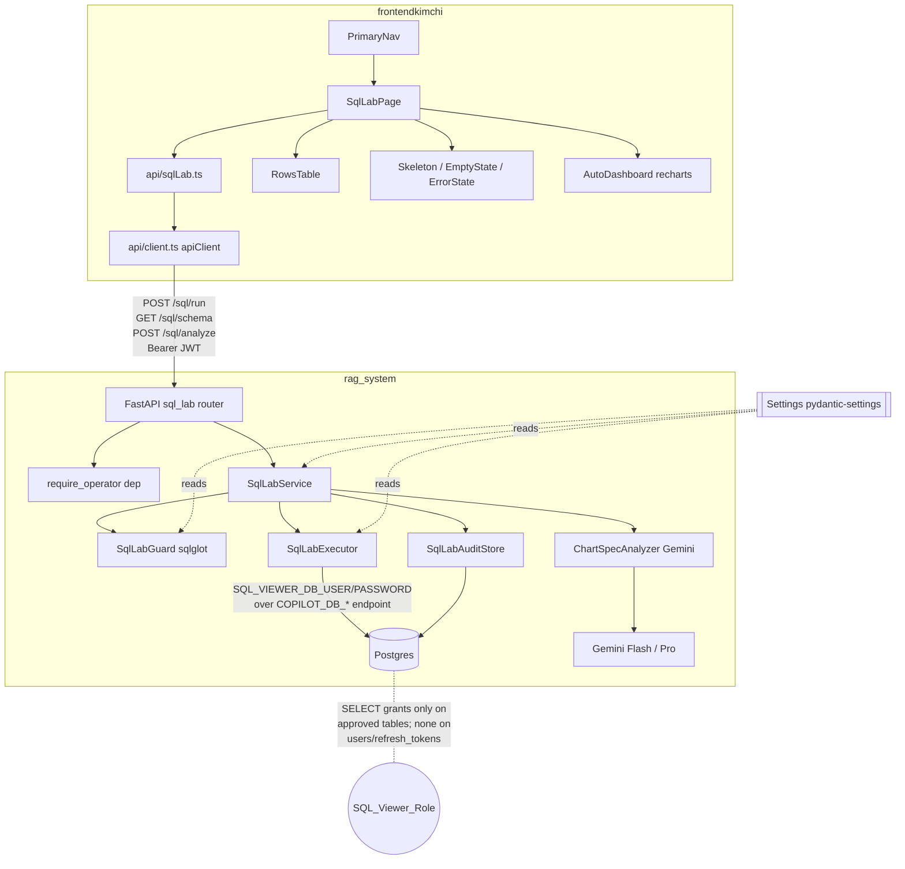

# Design Document

## Overview

SQL Lab (Data Explorer) adds an operator-only, read-only SQL exploration tab to
the RAG Console. It lets the internal team run ad-hoc read-only `SELECT`
statements against the operational Postgres instance and view results in a
table, replacing the pgAdmin workflow, and optionally renders an AI-generated
dashboard that summarizes a result set **without ever fabricating numbers**.

The design is grounded in three existing subsystems that it reuses verbatim
rather than reinventing:

1. **`rag_system.config.Settings`** (pydantic-settings) — the single place
   environment variables are read. SQL Lab adds `SQL_VIEWER_DB_*`, `SQL_LAB_ROW_LIMIT`,
   and `SQL_LAB_STATEMENT_TIMEOUT_MS` fields following the existing alias +
   `field_validator` convention already used for `copilot_*`, `trace_*`, and
   `corpus_page_size`.
2. **`rag_system.copilot.PostgresCopilotExecutor`** — the psycopg transaction
   pattern (`SET TRANSACTION READ ONLY`, transaction-local `statement_timeout`
   via `set_config(..., true)`, `fetchmany`, `rollback`). SQL Lab introduces a
   sibling `SqlLabExecutor` that follows this pattern exactly but authenticates
   with the dedicated `SQL_VIEWER_DB_USER`/`SQL_VIEWER_DB_PASSWORD` credentials.
3. **`rag_system.auth`** — the JWT bearer subsystem. SQL Lab routes reuse the
   `require_operator` FastAPI dependency exactly as `/replays`, `/feedback`, and
   `/evaluation` do.

On the frontend, SQL Lab adds a `SqlLabPage` under `frontendkimchi/src/pages/`
and a typed `frontendkimchi/src/api/sqlLab.ts` module funneling through the
existing `apiClient`. It reuses `PrimaryNav`, `RowsTable`, `Skeleton`,
`EmptyState`, `ErrorState`, and the already-installed `recharts` library.

### Security stance

The **dedicated read-only Postgres role (`SQL_Viewer_Role`) is the primary
security boundary.** It is provisioned with `SELECT` grants only on explicitly
approved, non-sensitive tables and holds **no** privilege on `users` or
`refresh_tokens` (which store bcrypt hashes and refresh tokens). Even a query
that slips past every application check cannot read a table the role cannot
read, nor write anything, because the database itself refuses. The
`sqlglot`-based `SQL_Guard` is a **secondary guardrail** that catches obvious
mistakes and injection attempts before they reach the database — it is a
usability and defense-in-depth layer, never the lock.

### Vertical slicing

The feature ships in slices, each an independently shippable increment:

- **Slice 1 (MVP):** Requirements 1–6 — viewer role + config, role scoping,
  SQL guard, `POST /sql/run`, tab + query UI, honest states.
- **Slice 2:** Requirement 7 — schema sidebar.
- **Slice 3:** Requirement 8 — audit logging.
- **Slice 4:** Requirements 9–10 — AI auto-dashboard endpoint + rendering.
- **Slice 5 (optional):** Requirement 11 — CSV export, query history, CTE support.

This design covers all slices so that later increments build on stable
contracts, but the implementation order follows the slices.

## Architecture



### Request lifecycle for `POST /sql/run`

```mermaid
sequenceDiagram
    participant UI as SqlLabPage
    participant API as sql_lab router
    participant Auth as require_operator
    participant Svc as SqlLabService
    participant Guard as SqlLabGuard
    participant Exec as SqlLabExecutor
    participant Audit as SqlLabAuditStore

    UI->>API: POST /sql/run {sql}
    API->>Auth: validate JWT + operator
    Auth-->>API: 401 / 403 on failure (no execution)
    API->>Svc: run(sql, user)
    Svc->>Guard: validate(sql)
    alt guard rejects
        Guard-->>Svc: SqlLabValidationError
        Svc->>Audit: record(rejection)   %% Slice 3
        Svc-->>API: 400 guard rejection
    else guard allows
        Svc->>Exec: execute(sql)
        Note over Exec: SET TRANSACTION READ ONLY;\nset_config('statement_timeout', ms, true);\nfetchmany(row_limit+1); rollback
        alt timeout / db error
            Exec-->>Svc: TimeoutError / DbError
            Svc->>Audit: record(error)     %% Slice 3
            Svc-->>API: 400/504 error
        else success
            Exec-->>Svc: rows, durationMs
            Svc->>Audit: record(success)   %% Slice 3
            Svc-->>API: Result_Set
        end
    end
    API-->>UI: Result_Set / error detail
```

### Key architectural decisions

| Decision | Rationale |
| --- | --- |
| Separate `SqlLabExecutor` rather than reusing `PostgresCopilotExecutor` | The copilot executor reads `COPILOT_DB_USER`/`PASSWORD` and clamps with `copilot_max_rows`. SQL Lab must authenticate with the *viewer* credentials and use its own row limit/timeout. The transaction body is copied verbatim so behavior stays identical. |
| Fetch `Row_Limit + 1` rows, then trim | Fetching one extra row is the standard way to detect truncation without a second `COUNT(*)` round-trip. If `len(fetched) > Row_Limit`, set `truncated = true` and return the first `Row_Limit`. |
| Guard is fail-closed and independent of the copilot guard | `CopilotSqlGuard` requires an aggregate and rejects `SELECT *`; SQL Lab must *allow* `SELECT *` and plain detail queries. A distinct `SqlLabGuard` reuses the shared `_strip_sql_comments` helper but applies SQL-Lab-specific rules (single SELECT, no CTE in v1, no writes/DDL). |
| Reuse `require_operator` verbatim | Matches every other operator-only route; a non-operator gets `403 operator_required`, an unauthenticated caller gets `401`, before any handler logic runs. |
| Chart_Spec carries declarative aggregation instructions, not numbers | The model only *names* columns and picks operations from a bounded set (`sum`, `count`, `avg`, `min`, `max`, group-by); it emits **no precomputed numeric values**. The frontend computes every displayed aggregate locally from the actual returned rows. Any KPI/chart referencing an unknown column or a disallowed op is omitted and marked uncomputable. This preserves the anti-hallucination guarantee — the model never emits a number, so it can never fabricate one — while still letting it summarize data it only saw a 20-row sample of. |
| Analyzer bypasses the shared `TextLLM.generate` interface | `TextLLM.generate` (`rag_system/llm.py`) accepts only `(prompt, temperature, max_tokens, thinking_budget)` — it exposes no `response_schema`/`response_mime_type` for schema-constrained structured output (R9.4/R9.5) and no per-call model override to switch Flash↔Pro per request (R9.8/R9.9). Rather than widen that interface for one caller, `ChartSpecAnalyzer` owns a small dedicated `google-genai` client that passes a `GenerateContentConfig` with `response_mime_type="application/json"` + `response_schema`, an explicit model id per mode, and a 60s `HttpOptions` timeout (R9.10). |
| Settings is the only env reader | All SQL Lab config flows through `Settings`; handlers never call `os.environ`. Missing viewer credentials surface as a keyed error at execution time, not a crash. |

## Components and Interfaces

### Backend

#### `Settings` additions (`rag_system/config.py`)

```python
# --- SQL Lab (operator-only read-only data explorer) ---
sql_viewer_db_user: str | None = Field(default=None, alias="SQL_VIEWER_DB_USER")
sql_viewer_db_password: str | None = Field(default=None, alias="SQL_VIEWER_DB_PASSWORD")
sql_lab_row_limit: int = Field(default=100, alias="SQL_LAB_ROW_LIMIT")
sql_lab_statement_timeout_ms: int = Field(default=10_000, alias="SQL_LAB_STATEMENT_TIMEOUT_MS")
# Comma-separated denylist; defaults cover the auth tables.
sql_lab_sensitive_tables: str = Field(
    default="users,refresh_tokens", alias="SQL_LAB_SENSITIVE_TABLES"
)
# Auto-dashboard analysis model ids (Slice 4). Defaults follow the repo's
# existing conventions: generation → Flash, reasoning/judge → Pro.
sql_lab_analysis_model_id: str = Field(
    default="gemini-3.5-flash", alias="SQL_LAB_ANALYSIS_MODEL_ID"
)
sql_lab_deep_analysis_model_id: str = Field(
    default="gemini-3.1-pro", alias="SQL_LAB_DEEP_ANALYSIS_MODEL_ID"
)

@field_validator("sql_lab_row_limit")
@classmethod
def _validate_sql_lab_row_limit(cls, value: int) -> int:
    if value < 1 or value > 10_000:
        raise ValueError(
            f"invalid SQL_LAB_ROW_LIMIT {value!r}: must be within 1 and 10000 inclusive"
        )
    return value

@field_validator("sql_lab_statement_timeout_ms")
@classmethod
def _validate_sql_lab_statement_timeout_ms(cls, value: int) -> int:
    if value < 1 or value > 60_000:
        raise ValueError(
            f"invalid SQL_LAB_STATEMENT_TIMEOUT_MS {value!r}: must be within "
            "1 and 60000 inclusive"
        )
    return value
```

The endpoint reuses `copilot_db_host/port/name/sslmode` for the connection
endpoint and only substitutes the user/password. The viewer connection settings
are read via a small property that raises a keyed, value-free error when either
credential is missing:

```python
def require_sql_viewer_credentials(self) -> tuple[str, str]:
    missing = [
        name for name, value in (
            ("SQL_VIEWER_DB_USER", self.sql_viewer_db_user),
            ("SQL_VIEWER_DB_PASSWORD", self.sql_viewer_db_password),
        ) if not value
    ]
    if missing:
        raise SqlLabConfigError(f"Missing SQL Lab configuration: {', '.join(missing)}")
    return self.sql_viewer_db_user, self.sql_viewer_db_password  # type: ignore[return-value]
```

#### `SqlLabGuard` (`rag_system/sql_lab/guard.py`)

Reuses `rag_system.copilot._strip_sql_comments` (string-literal-aware comment
stripping) and `sqlglot` parsing.

```python
class SqlLabValidationError(ValueError):
    """Raised when a submitted statement is not an allowed read-only SELECT."""

class SqlLabGuard:
    def __init__(self, sensitive_tables: frozenset[str], allow_cte: bool = False): ...
    def validate(self, sql: str) -> str:
        """Return the normalized SQL when allowed; raise SqlLabValidationError otherwise.

        Steps (fail-closed):
          1. strip comments (string-literal aware); reject if empty/whitespace.
          2. sqlglot.parse; reject on parse error, naming the parse failure.
          3. reject if != 1 statement (ignoring one optional trailing ';').
          4. reject if root is not exp.Select.
          5. reject any forbidden node anywhere in the tree: Insert/Update/
             Delete/Merge/Drop/Create/Alter/Command (COPY/GRANT/REVOKE/SET/
             VACUUM/...); name the disallowed operation.
          6. reject exp.With (CTE) in v1, naming the WITH clause.
          7. reject if any referenced table is on the sensitive denylist.
          8. SELECT and SELECT * are both allowed.
        """
```

The message always identifies the specific rejection reason (disallowed
operation, multiple statements, WITH clause, parse failure, empty input, or
sensitive-table reference). Slice 5 flips `allow_cte=True` and instead recurses
the parsed tree, rejecting any data-modifying node at any depth while allowing a
read-only `WITH`.

#### `SqlLabExecutor` (`rag_system/sql_lab/executor.py`)

```python
class SqlLabExecutor:
    def __init__(self, settings: Settings): ...
    def execute(self, sql: str) -> ExecutionResult:
        """Run an approved statement using the copilot transaction pattern.

        Mirrors PostgresCopilotExecutor exactly except for credentials and limits:
          conn = psycopg.connect(host/port/dbname/sslmode from COPILOT_DB_*,
                                 user=SQL_VIEWER_DB_USER, password=SQL_VIEWER_DB_PASSWORD,
                                 row_factory=dict_row)
          conn.execute("SET TRANSACTION READ ONLY")
          conn.execute("SELECT set_config('statement_timeout', %s, true)", (str(timeout_ms),))
          cur = conn.execute(sql)
          fetched = cur.fetchmany(row_limit + 1)   # +1 detects truncation
          conn.rollback()
        Raises SqlLabConfigError (missing creds), SqlLabConnectionError
        (connect failed), SqlLabTimeoutError (statement_timeout hit), or
        SqlLabExecutionError (other db error, carrying the db message).
        durationMs is measured around the fetch with time.perf_counter.
        """
```

`ExecutionResult` carries `columns`, `rows`, `row_count`, `duration_ms`, and
`truncated` — the service copies the submitted `sql` onto the response.

#### `SqlLabService` (`rag_system/sql_lab/service.py`)

Orchestrates guard → execute → audit and shapes the `Result_Set`. Owns the
truncation logic (trim `Row_Limit + 1` down to `Row_Limit`, set `truncated`).

#### `SqlLabAuditStore` (`rag_system/sql_lab/audit_store.py`, Slice 3)

Follows the psycopg style of `PostgresLogStore`/`PostgresTraceStore` and the
`COPILOT_DB_*` connection settings (writing as the copilot role, which *does*
have insert privilege on the audit table — distinct from the read-only viewer
role). Persists exactly one record per request outcome (success / error /
rejection) with user identity, submitted SQL (truncated to 10000 chars), UTC
timestamp, duration, row count, and outcome.

#### `ChartSpecAnalyzer` (`rag_system/sql_lab/analyzer.py`, Slice 4)

Builds a compact prompt from column names, inferred types, row count, and a
sample of at most 20 rows; requests **structured output constrained by the
`ChartSpec` response schema**; validates the returned object against the schema
before returning.

**Why the analyzer does not use `build_text_llm`/`TextLLM.generate`.** The
shared `TextLLM.generate` interface (`rag_system/llm.py`) accepts only
`(prompt, *, temperature, max_tokens, thinking_budget)`. It exposes **no
`response_schema`/`response_mime_type` parameter** (so it cannot request
schema-constrained structured JSON, required by R9.4/R9.5) and **no per-call
model override** (the `GeminiTextLLM` model id is fixed at construction from
`gemini_model_id`, so it cannot switch between Flash and Pro per request, required
by R9.8/R9.9). Rather than widen that interface for a single caller, the analyzer
owns a small dedicated Gemini structured-output client that calls the
`google-genai` SDK directly:

```python
class ChartSpecAnalyzer:
    def __init__(self, settings: Settings) -> None:
        from google import genai
        from google.genai import types
        self._types = types
        # 60s HTTP budget enforced at the client level → maps to the R9.10 error path.
        self._client = genai.Client(
            vertexai=True,
            project=settings.gcp_project_id,
            location=settings.gcp_location,
            http_options=types.HttpOptions(timeout=60_000),  # milliseconds
        )
        # Model-id mapping, read from Settings (see below).
        self._flash_model = settings.sql_lab_analysis_model_id       # default mode
        self._pro_model = settings.sql_lab_deep_analysis_model_id     # deep mode

    def analyze(self, result: ResultSet, mode: AnalysisMode = "default") -> ChartSpec:
        model = self._pro_model if mode == "deep" else self._flash_model
        response = self._client.models.generate_content(
            model=model,
            contents=self._build_prompt(result),
            config=self._types.GenerateContentConfig(
                response_mime_type="application/json",
                response_schema=CHART_SPEC_RESPONSE_SCHEMA,  # declarative ChartSpec schema
            ),
        )
        return validate_chart_spec(response.text)  # strict schema validation (R9.5/R9.6)
```

- **Model-id mapping (R9.8/R9.9).** Default analysis mode → the Gemini **Flash**
  model id; deep-analysis mode → the Gemini **Pro** model id. These follow the
  repository's existing config conventions: generation defaults to
  `gemini-3.5-flash` (`gemini_model_id`) and the reasoning/judge models default to
  `gemini-3.1-pro` (`llm_judge_model_id`, `trace_investigator_model_id`). SQL Lab
  adds two aliased Settings fields with those same defaults:
  `sql_lab_analysis_model_id` (default `gemini-3.5-flash`, alias
  `SQL_LAB_ANALYSIS_MODEL_ID`) and `sql_lab_deep_analysis_model_id` (default
  `gemini-3.1-pro`, alias `SQL_LAB_DEEP_ANALYSIS_MODEL_ID`), so the mapping is
  configurable without code changes.
- **60s timeout (R9.10).** The 60-second budget is enforced at the client/HTTP
  level via `HttpOptions(timeout=60_000)`; a slow or unavailable model surfaces as
  a client error that the service maps to the R9.10 "analysis could not be
  completed" error, leaving the source Result_Set unchanged.
- **Schema-constrained output (R9.4/R9.5).** `response_mime_type="application/json"`
  plus `response_schema=CHART_SPEC_RESPONSE_SCHEMA` constrains the model to the
  declarative `ChartSpec` shape (see Data Models); the returned text is then
  re-validated against the strict schema before it is returned to the caller.

#### Routes (`rag_system/sql_lab/router.py`, mounted via `app.include_router`)

| Method & path | Auth | Purpose | Slice |
| --- | --- | --- | --- |
| `POST /sql/run` | `require_operator` | Validate + execute a read-only SELECT; return `Result_Set` | 1 |
| `GET /sql/schema` | `require_operator` | List tables + columns the viewer role can `SELECT` | 2 |
| `POST /sql/analyze` | `require_operator` | Produce a validated `Chart_Spec` for a `Result_Set` | 4 |

Error mapping: `SqlLabValidationError` → `400`; missing config / connection
failure → `400` with a keyed, value-free message; timeout → `504`; other db
error → `400` carrying the db message; auth handled by the dependency
(`401`/`403`).

### Frontend

#### `api/sqlLab.ts`

```typescript
export interface ResultSet {
  columns: string[];
  rows: Record<string, unknown>[];
  rowCount: number;
  durationMs: number;
  sql: string;
  truncated: boolean;
}
export interface RunSqlRequest { sql: string }
export interface SchemaTable { name: string; columns: { name: string; type: string }[] }
export type AnalysisMode = "default" | "deep";

export function runSql(sql: string, signal?: AbortSignal): Promise<ResultSet>;
export function listSchema(signal?: AbortSignal): Promise<SchemaTable[]>;   // Slice 2
export function analyze(result: ResultSet, mode?: AnalysisMode): Promise<ChartSpec>; // Slice 4
```

All calls funnel through `apiClient.postJson`/`get`; `runSql` uses
`TIMEOUT_LONG_MS`, `analyze` uses a 60s timeout matching the backend budget.

#### `pages/SqlLabPage.tsx`

A discriminated `viewState` state machine —
`{kind: "idle" | "loading" | "empty" | "result" | "error"}` — guarantees exactly
one state renders at a time (Skeleton / EmptyState / RowsTable / ErrorState). A
polite `aria-live` region announces begin/success/failure. The Run control is
disabled while a request is in flight and while the editor is empty/whitespace.
On truncated results a persistent banner states the row limit. On error the
submitted SQL is retained in the editor. `AutoDashboard` (Slice 4) renders below
the table and only ever shows aggregates it computes locally from the actual
returned rows (see `computeChartSpecData`), never numbers emitted by the model.

#### `AutoDashboard` and `computeChartSpecData` (Slice 4)

`AutoDashboard` receives the validated `ChartSpec` (declarative column +
operation instructions) and the source `ResultSet`, then renders KPI cards and
1–3 recharts charts from **locally computed** aggregates. The pure helper
`computeChartSpecData(spec, resultSet)` (extracted so it is unit-testable
independent of React) does the work:

- Validates that every referenced column (`kpis[].column`, `charts[].xColumn`,
  `charts[].series[].column`) exists in `ResultSet.columns` and that every `op`
  is in the allowed set (`sum`, `count`, `avg`, `min`, `max`; group-by via
  `xColumn`).
- Computes each KPI value and each series' values locally from the actual
  `ResultSet.rows` using only the declared operation over the referenced column
  (grouping by `xColumn` for charts).
- Omits any KPI or chart that references an unknown column or a disallowed op,
  and marks it **uncomputable** so the UI can indicate it could not be computed
  (R10.4).

Because all numbers are derived from real rows via a bounded operation set, the
dashboard can never display a value the data does not support. When the spec
yields zero computable data points, `AutoDashboard` shows an empty state while
the underlying rows stay visible (R10.8).

#### `PrimaryNav` change

Add `{ to: "/sql-lab", label: "SQL Lab", Icon: Database, operatorOnly: true }`
to `TABS`, and register the route in `App.tsx` alongside the other lazy pages.
It is operator-gated in the nav (matching the backend), keeping it beside
Copilot, Observability, and Documents.

## Data Models

### `Result_Set` (backend `SqlRunResponse` / frontend `ResultSet`)

| Field | Type | Notes |
| --- | --- | --- |
| `columns` | `list[str]` | Column names in select order |
| `rows` | `list[dict[str, Any]]` | At most `Row_Limit` rows |
| `rowCount` | `int` | `len(rows)` actually returned |
| `durationMs` | `int` | Whole-millisecond measured execution time |
| `sql` | `str` | The submitted SQL, echoed back |
| `truncated` | `bool` | True iff the query produced more than `Row_Limit` rows |

### `SqlRunRequest`

| Field | Type | Constraint |
| --- | --- | --- |
| `sql` | `str` | 1–10000 chars; non-whitespace required |

### `SqlLabAuditRecord` (Slice 3)

| Field | Type | Notes |
| --- | --- | --- |
| `id` | `uuid` | Primary key |
| `user_identity` | `str` | From the validated JWT (`sub`/email) |
| `sql` | `str` | Truncated to ≤ 10000 chars |
| `created_at` | `timestamptz` | UTC |
| `duration_ms` | `int \| None` | Null for guard rejections |
| `row_count` | `int \| None` | Present on success |
| `outcome` | `enum` | `success` \| `error` \| `rejected` |
| `error_detail` | `str \| None` | For error/rejection outcomes |

### `Chart_Spec` (Slice 4)

Declarative JSON only — **no HTML/JS/executable content and no precomputed
numbers**. The model names columns present in the Result_Set and picks operations
from a bounded allowed set (`sum`, `count`, `avg`, `min`, `max`, plus optional
group-by); the frontend computes every value locally from the actual rows.
Validated against a strict schema (extra fields rejected).

```jsonc
{
  "kpis": [
    {
      "label": "string",
      "op": "sum" | "count" | "avg" | "min" | "max",   // bounded allowed set
      "column": "string"                                 // must exist in Result_Set.columns
    }
  ],
  "charts": [
    {
      "type": "bar" | "line" | "pie",       // 1..3 charts
      "title": "string",
      "xColumn": "string",                   // group-by column; must exist in columns
      "series": [
        {
          "column": "string",               // must exist in Result_Set.columns
          "op": "sum" | "count" | "avg" | "min" | "max"
        }
      ]
    }
  ],
  "insight": "string (<= 200 chars, optional)"
}
```

No numeric value appears anywhere in the Chart_Spec — only column names and
operations drawn from the bounded set (`sum`, `count`, `avg`, `min`, `max`,
group-by). The frontend `AutoDashboard` computes each KPI and series value
locally from the actual returned rows (see `computeChartSpecData` below); any KPI
or chart that references a column absent from `Result_Set.columns`, or an
operation outside the allowed set, is omitted and marked uncomputable. Because
the model never emits a number, it can never fabricate one.

### `information_schema` listing (Slice 2)

`SchemaTable { name, columns: [{ name, type }] }`, restricted to objects the
viewer role holds a `SELECT` grant on (via `information_schema.role_table_grants`
/ `table_privileges` filtered to the viewer role), so sensitive tables never
appear.

### Provisioning (documentation artifact, R2.7)

A checked-in SQL script documents the exact role creation and grants:

```sql
CREATE ROLE sql_viewer LOGIN PASSWORD :'viewer_password';
REVOKE ALL ON ALL TABLES IN SCHEMA public FROM sql_viewer;
GRANT SELECT ON <approved_table_1>, <approved_table_2>, ... TO sql_viewer;
-- Intentionally NO grant on users, refresh_tokens (Sensitive_Table set).
```

## Correctness Properties

*A property is a characteristic or behavior that should hold true across all
valid executions of a system — essentially, a formal statement about what the
system should do. Properties serve as the bridge between human-readable
specifications and machine-verifiable correctness guarantees.*

The properties below were derived from the acceptance-criteria prework. Purely
infrastructural criteria (Postgres role privilege enforcement — R2.1, R2.2,
R2.3, R2.5, R2.6; live schema listing — R7.1), fixed-sequence or mock-driven
paths (transaction ordering R4.4, timeout/error paths R4.9, R4.13, R8.6, R9.10),
model-selection mappings (R9.8, R9.9), and UI rendering/a11y interactions
(most of R5, R6, R7, R10.1/10.6–10.8, R11.2/11.4/11.5) are covered by
integration, example, and manual tests in the Testing Strategy rather than by
properties.

### Property 1: Comment stripping preserves string literals

*For any* SQL string containing string literals or quoted identifiers that
embed comment markers (`--`, `/* */`), along with real comments, the guard's
comment-stripping step removes only the real comments and preserves the
contents of every string literal and quoted identifier verbatim.

**Validates: Requirements 3.1**

### Property 2: A single read-only SELECT (including `SELECT *`) is allowed

*For any* input that, after comment removal, is exactly one read-only `SELECT`
statement (with or without a star projection, with or without a single trailing
semicolon, and referencing no denylisted table), the guard classifies it as
allowed and returns the normalized SQL.

**Validates: Requirements 3.2, 3.3**

### Property 3: Every non-(single read-only SELECT) input is rejected with a reason

*For any* input that, after comment removal, is not a single read-only `SELECT`
— i.e. it contains a write/data-modifying operation (`INSERT`/`UPDATE`/`DELETE`/
`MERGE`/`TRUNCATE`), a DDL/administrative operation (`CREATE`/`ALTER`/`DROP`/
`GRANT`/`REVOKE`/`COPY`/`SET`/`VACUUM`/any other non-`SELECT` command), more than
one statement (excluding one optional trailing semicolon), a `WITH` clause (in
v1), unparseable text, or is empty/whitespace-only — the guard rejects it with a
message that identifies the specific rejection reason.

**Validates: Requirements 3.4, 3.5, 3.6, 3.7, 3.8, 3.9**

### Property 4: A rejected statement is never executed

*For any* input the guard rejects (for any reason, including empty/whitespace
and guard-disallowed statements), the executor is never invoked and no statement
is run against the database, so database state is left unchanged.

**Validates: Requirements 3.10, 4.11, 4.12**

### Property 5: Denylisted sensitive-table references are rejected before execution

*For any* `SELECT` statement that references at least one denylisted
Sensitive_Table (in any table position or qualifier), the guard rejects the
statement before execution and the executor is never invoked.

**Validates: Requirements 2.4**

### Property 6: Row_Limit and Statement_Timeout config bounds are enforced at startup

*For any* integer value, Settings construction accepts `sql_lab_row_limit` iff it
lies within `[1, 10000]` and accepts `sql_lab_statement_timeout_ms` iff it lies
within `[1, 60000]`; any non-integer or out-of-range value fails construction
with an error naming the offending setting.

**Validates: Requirements 1.7, 1.8, 1.9**

### Property 7: Missing or failed viewer credentials produce a keyed, secret-free error

*For any* combination of present/absent viewer credentials and any secret
values, when execution is attempted with a credential missing or the connection
failing, the surfaced error names the missing configuration key (or indicates a
viewer connection failure) and its text contains none of the provided secret
values.

**Validates: Requirements 1.5, 1.6**

### Property 8: Result_Set shaping enforces the row limit and truncation flag

*For any* list of fetched rows and any Row_Limit `N`, the shaped Result_Set
returns exactly `min(produced, N)` rows, sets `truncated` to true iff the query
produced more than `N` rows, reports `rowCount` equal to the number of returned
rows, echoes the submitted `sql`, exposes `columns`, and reports `durationMs` as
a non-negative integer — regardless of whether the submitted query had its own
`LIMIT`.

**Validates: Requirements 4.5, 4.6, 4.7, 4.8, 4.10**

### Property 9: The SqlLabPage renders exactly one state at a time

*For any* sequence of lifecycle events (submit, success-with-rows,
success-empty, guard-rejection, db-error, timeout, unauthorized/forbidden), the
page's view-state reducer yields exactly one active state — loading, empty,
result, or error — after every event.

**Validates: Requirements 6.6**

### Property 10: Schema listing excludes ungranted and sensitive tables

*For any* set of tables with associated `SELECT` grants and any Sensitive_Table
denylist, the schema-listing filter returns only tables the viewer role holds a
`SELECT` grant on and never returns a table in the sensitive set.

**Validates: Requirements 7.3**

### Property 11: Table selection produces the canonical browse statement

*For any* table name returned by the schema listing, selecting it produces
exactly the editor statement `SELECT * FROM <table> LIMIT 100` with the selected
table's name substituted.

**Validates: Requirements 7.8**

### Property 12: Each request produces exactly one well-formed audit record

*For any* request outcome — success, post-guard execution failure, or guard
rejection — the backend persists exactly one audit record whose user identity
equals the validated JWT identity, whose timestamp is in UTC, whose outcome
matches the actual result, and whose stored SQL is a prefix of the submitted SQL
truncated to at most 10000 characters (with duration and row count present on
success).

**Validates: Requirements 8.1, 8.2, 8.3, 8.4, 8.5**

### Property 13: The analysis payload sends only a bounded sample

*For any* Result_Set, the payload built for the language model contains only
column names, inferred column types, the row count, and a row sample of size
`min(rowCount, 20)` — equal to all rows when `rowCount < 20` — and never
includes rows beyond that sample.

**Validates: Requirements 9.2, 9.3**

### Property 14: Chart_Spec schema validation rejects invalid or non-declarative content

*For any* candidate Chart_Spec object, validation succeeds iff the object
conforms to the strict declarative schema — KPIs and 1–3 charts expressed only as
references to column names plus operations drawn from the bounded allowed set
(`sum`, `count`, `avg`, `min`, `max`, group-by), an optional insight, and **no
precomputed numeric values anywhere** — and fails for any object containing a
numeric data value, HTML, JavaScript, executable content, or fields outside the
schema; a validation failure yields an error and returns no unvalidated content.

**Validates: Requirements 9.5, 9.6, 9.7, 10.2**

### Property 15: The dashboard computes every displayed value locally from the rows

*For any* validated Chart_Spec and its source Result_Set, every numeric value the
AutoDashboard displays is computed locally from the actual returned rows using
only a declared operation (`sum`, `count`, `avg`, `min`, `max`, group-by) over a
column present in `Result_Set.columns`; and any KPI or chart that references a
column absent from the Result_Set or an operation outside the allowed set is
omitted and marked uncomputable.

**Validates: Requirements 10.3, 10.4**

### Property 16: The rendered insight line is bounded

*For any* validated Chart_Spec, the AutoDashboard renders at most one insight
line of at most 200 characters.

**Validates: Requirements 10.5**

### Property 17: CSV export round-trips columns and rows in displayed order

*For any* non-empty Result_Set (including values containing commas, quotes, and
newlines), parsing the exported CSV recovers the column names in displayed order
as the first record, followed by every displayed data row in displayed order,
with values quoted and escaped per standard CSV conventions.

**Validates: Requirements 11.1**

### Property 18: Query history is bounded, newest-first, and evicts the oldest

*For any* sequence of submitted statements, the persisted history contains at
most the 50 most recent entries ordered most-recent-first, with the latest
submission at the front and the oldest entry evicted once the limit is exceeded.

**Validates: Requirements 11.3**

### Property 19: Read-only CTEs are allowed and any nested data-modification is rejected

*For any* single `SELECT` whose `WITH` clause and all nested sub-queries at every
level contain only read-only sub-selects, the guard (with CTE support enabled)
classifies it as allowed; and *for any* parsed statement tree containing a
data-modifying operation at any level, the guard rejects it, refrains from
executing it, and returns a message indicating that data-modifying operations
are not permitted.

**Validates: Requirements 11.6, 11.7**

## Error Handling

| Condition | Backend behavior | Status | Frontend behavior |
| --- | --- | --- | --- |
| Missing JWT | `require_operator` raises before handler | `401` | ErrorState: access restricted to operators (R6.5) |
| Non-operator | `require_operator` → `operator_required` | `403` | ErrorState: access restricted to operators (R6.5) |
| Empty/whitespace SQL | Validation error, no execution | `400` | Client blocks submit and shows "non-empty query required" (R5.4); if server-reached, ErrorState |
| Guard rejection | `SqlLabValidationError`, no execution | `400` | ErrorState with the guard message; editor retains SQL (R6.3) |
| Missing viewer credentials | `SqlLabConfigError` naming the key, no secret | `400` | ErrorState with the keyed message |
| Viewer connection failure | `SqlLabConnectionError`, no secret | `400` | ErrorState |
| Statement timeout | Rollback, `SqlLabTimeoutError` describing the timeout | `504` | ErrorState with the timeout message; editor retains SQL (R6.4) |
| Other DB error | Rollback, `SqlLabExecutionError` carrying the db message | `400` | ErrorState with the message; editor retains SQL (R6.4) |
| Audit persist failure (Slice 3) | Error response; no result rows returned | `500` | ErrorState |
| Chart_Spec invalid / LLM unavailable (Slice 4) | Error; source Result_Set unchanged | `400`/`504` | Dashboard error state; underlying rows stay visible (R10.7) |
| Uncomputable KPI/chart (unknown column or disallowed op) (Slice 4) | n/a (client computes from rows) | n/a | The affected KPI/chart is omitted and marked uncomputable; other computable KPIs/charts and the underlying rows stay visible (R10.4) |
| localStorage failure (Slice 5) | n/a (client) | n/a | Execution completes; "history could not be saved" notice; Result_Set kept (R11.4) |

Principles: the transaction is always rolled back on any execution path
(success or failure), matching the copilot executor. Error messages never
include credential values. On any error the frontend preserves the submitted SQL
so the operator can correct and resubmit.

## Testing Strategy

### Property-based tests

Property-based testing applies to SQL Lab's substantial pure-logic surface
(guard classification, comment stripping, result-set shaping, config validation,
audit-record construction, analysis-payload building, Chart_Spec validation,
local aggregate computation, CSV export, and query-history eviction).

- **Backend (Python):** use **Hypothesis** with `pytest`, matching the existing
  `tests/test_*_property.py` suite. Each property test runs a minimum of 100
  iterations (`@settings(max_examples=...)` ≥ 100) and is tagged with a comment
  in the form `# Feature: sql-lab, Property {n}: {property text}`. Properties 1–8,
  10, 12, 13, 14, 19 are backend tests. Generators must include edge cases called
  out in the prework: comment markers inside string literals, whitespace/comment-
  only inputs, star projections, trailing semicolons, oversized SQL, and boundary
  config values.
- **Frontend (TypeScript):** use **fast-check** with Vitest (add `fast-check` as a
  dev dependency; do not hand-roll generators) for the pure-logic properties that
  live in the client: Property 9 (view-state reducer), Property 11 (statement
  builder), Property 15 (local aggregate computation), Property 16 (insight bound),
  Property 17 (CSV export round-trip), and Property 18 (query-history eviction).
  Each `fc.assert` runs ≥ 100 runs and carries the same `Feature: sql-lab,
  Property {n}` tag. Extracting these as pure functions
  (`sqlLabReducer`, `buildBrowseStatement`, `computeChartSpecData`, `toCsv`,
  `pushHistory`) keeps them unit-testable independent of React.

Each correctness property is implemented by a single property-based test.

### Unit and example tests

- **Backend:** transaction sequence via a spy connection (R4.4: `SET TRANSACTION
  READ ONLY` → `set_config('statement_timeout', ms, true)` → `fetchmany` →
  `rollback`, in order, with rollback always run); timeout and generic-error
  paths with a mock driver (R4.9, R4.13); audit-persist failure (R8.6);
  model-selection mapping for default/deep mode (R9.8, R9.9); LLM
  unavailable/slow (R9.10); route auth via `require_operator` (R4.2, R4.3, R7.2,
  R9.1); SQL length boundary at 10000/10001 (R4.1); env-var wiring for the new
  Settings fields (R1.1, R1.2); connection-parameter assembly (R1.3).
- **Frontend:** React Testing Library for SqlLabPage interactions — Skeleton
  within 200 ms and no prior result during load (R6.1), EmptyState vs ErrorState
  (R6.2), guard/db/auth error rendering with SQL retention (R6.3–R6.5), Run
  disabled while in flight (R5.7), aria-live announcements (R5.9), truncation
  banner (R5.6), RowsTable rendering (R5.5), PrimaryNav tab presence for
  operators (R5.1), schema sidebar render/empty/error (R7.5–R7.7), AutoDashboard
  KPI/chart rendering from locally computed aggregates and associated data tables
  (R10.1, R10.6), uncomputable KPI/chart omission and marking (R10.4), dashboard
  error and empty states (R10.7, R10.8), CSV export block on empty (R11.2), history
  persist-failure notice (R11.4), and history-entry selection replacing the
  editor (R11.5).

### Integration tests

Against a real (or containerized) Postgres with the provisioned viewer role:
the role is denied `users`/`refresh_tokens` and returns zero rows plus an
authorization error (R2.1, R2.2), holds only the documented `SELECT` grants
(R2.3), rejects writes/DDL at the database level (R2.5), returns rows for
approved tables (R2.6), and the schema endpoint lists only granted tables
(R7.1). These verify the primary security boundary end-to-end, complementing the
guard properties that exercise the secondary guardrail.

### Accessibility testing

WCAG 2.2 AA conformance (R5.8, R10.6) is validated with automated axe smoke
checks in the component tests plus manual keyboard-only and 200%-zoom review
with assistive technology, as described in PRODUCT.md. Full conformance requires
manual testing with assistive technologies and expert review.
